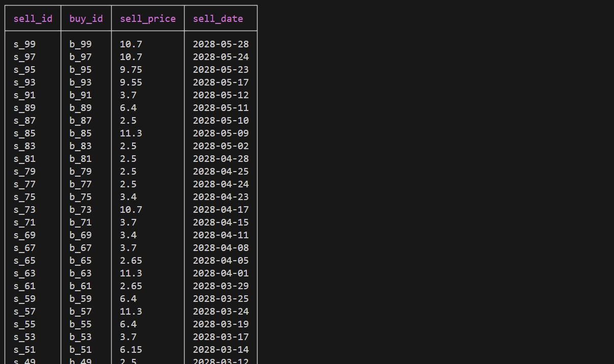
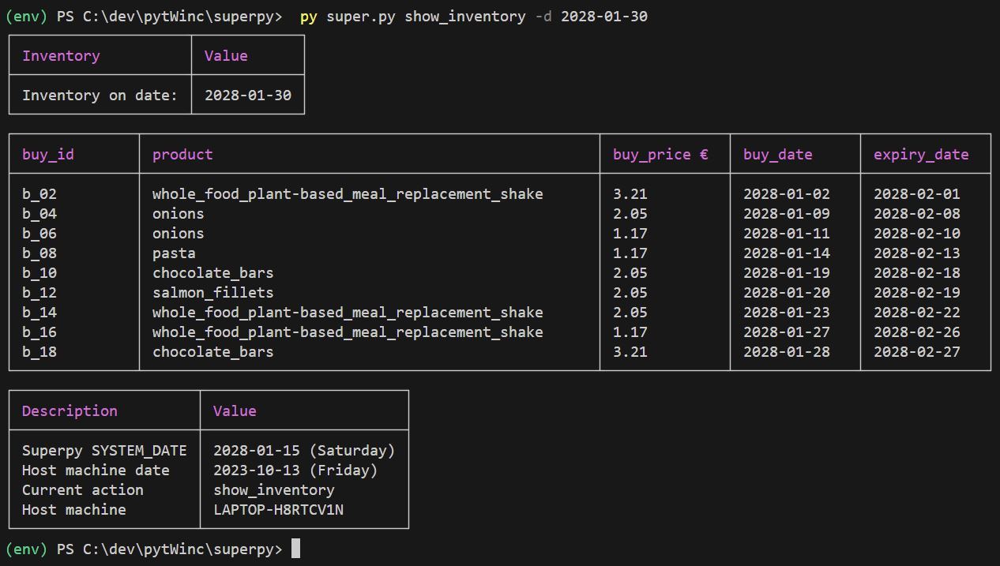

Important !!  
Please read this document in Open Preview: Ctrl+Shift+V, or Right-click 'README_USAGE_GUIDE.md'  
in the vsCode Explorer and then select the first option 'Open Preview'.

## Table of contents
- [Intro](#intro)
- [Argparse commands and arguments](#argparse-commands-and-arguments)
  - [Buy Product](#buy-product)
    - [uc 1: buy date and expiry date in format YYYY-MM-DD](#uc-1-buy-date-and-expiry-date-in-format-yyyy-mm-dd)
    - [uc 2: buy a multi-word product (e.g. full fat milk)](#uc-2-buy-a-multi-word-product-eg-full-fat-milk)
    - [uc 3: buy product using words (e.g. tomorrow, next\_wednesday) as start and end date](#uc-3-buy-product-using-words-eg-tomorrow-next_wednesday-as-start-and-end-date)
    - [uc 4: buy product that does not expire](#uc-4-buy-product-that-does-not-expire)
  - [Create mock data](#create-mock-data)
    - [practical](#practical)
    - [theory](#theory)
    - [setting the arguments](#setting-the-arguments)
  - [Delete](#delete)
  - [Reset system date](#reset-system-date)
  - [Sell Product](#sell-product)
    - [uc 1: sell a product by its name.](#uc-1-sell-a-product-by-its-name)
    - [uc 2: sell a product with a long name with its buy id.](#uc-2-sell-a-product-with-a-long-name-with-its-buy-id)
    - [uc 3: sell an expired product by its product name.](#uc-3-sell-an-expired-product-by-its-product-name)
    - [uc 4: sell a product at a loss (by its product name)](#uc-4-sell-a-product-at-a-loss-by-its-product-name)
    - [uc 5: sell a product that is not in Superpy product range altogether](#uc-5-sell-a-product-that-is-not-in-superpy-product-range-altogether)
    - [uc 6: sell a product that is not in inventory nor list with expired products, but does exist in product range](#uc-6-sell-a-product-that-is-not-in-inventory-nor-list-with-expired-products-but-does-exist-in-product-range)
    - [uc 7: sell a product that has already been sold](#uc-7-sell-a-product-that-has-already-been-sold)
  - [Set system date](#set-system-date)
  - [Show bought.csv](#show-boughtcsv)
  - [Show cost](#show-cost)
  - [Show expired products](#show-expired-products)
  - [Show inventory](#show-inventory)
  - [Show profit](#show-profit)
  - [Show revenue](#show-revenue)
  - [Show sales volume](#show-sales-volume)
  - [Show sold.csv](#show-soldcsv)
  - [Time travel](#time-travel)
- [ADDITIONAL USE CASES](#additional-use-cases)
  - [intro](#intro-1)
  - [UC: show\_system\_date](#uc-show_system_date)
  - [UC: change the management reports' data by travelling through time](#uc-change-the-management-reports-data-by-travelling-through-time)
  - [UC: suffer a considerable loss](#uc-suffer-a-considerable-loss)
  - [UC: make huge profit](#uc-make-huge-profit)
- [DEFINITIONS](#definitions)
  - [argument in argparse](#argument-in-argparse)
  - [command in argparse](#command-in-argparse)
  - [cost](#cost)
  - [date](#date)
  - [default values](#default-values)
  - [expired products](#expired-products)
  - [inventory](#inventory)
  - [logistic task](#logistic-task)
  - [markup](#markup)
  - [optional argument](#optional-argument)
  - [positional argument](#positional-argument)
  - [price range](#price-range)
  - [product range](#product-range)
  - [profit](#profit)
  - [revenue](#revenue)
  - [shelf life](#shelf-life)
  - [start date of current financial year](#start-date-of-current-financial-year)
  - [task](#task)
  - [supporting task](#supporting-task)
  - [system date](#system-date)
  - [task in Superpy](#task-in-superpy)
  - [time interval](#time-interval)
  - [transaction](#transaction)
  - [turnover](#turnover)
  - [upper boundary of time interval](#upper-boundary-of-time-interval)
- [INSTALLATION](#installation)
- [DATA-MODEL](#data-model)
- [TESTING THE APPLICATION IN PYTEST](#testing-the-application-in-pytest)
  - [1of2: run regression testcases:](#1of2-run-regression-testcases)
  - [2of2: create testdata for additional testcases:](#2of2-create-testdata-for-additional-testcases)
- [TROUBLE SHOOTING](#trouble-shooting)
- [FAQ](#faq)
- [SUPPORT](#support)

<br/>

# Intro
[Table of contents](#table-of-contents)

<br/>
Welcome to Superpy. 

As a Superpy-user you can carry out logistic and supporting tasks.
- A logistic task is carried out in Superpy by an argparse sub-parser that is on the following list:
  - buy (a product)
  - sell (a product)
  - show_bought_csv
  - show_cost
  - show_expired products
  - show inventory 
  - show_profit
  - show_revenue
  - show_sales_volume
  - show_sold_csv

- A supporting task is carried out in Superpy by an argparse sub-parser that is on the following list:  
  - create_mock_data 
  - delete 
  - reset_system_date
  - set_system_date
  - show_system_date
  - travel_time

The first chapter, Argparse Commands and Arguments, will explain each of these tasks. 
In the next chapter, Use Cases, practical examples are given of the use of these tasks. 
Meanwhile definitions are provided in chapter 3, Definitions.

Other topics, such as how to install Superpy and how to run the pytest regression testset  
are explained in the subsequent chapters. 


The target audience of this user manual are Winc Academy students.  
Winc students are familiar with python, vsCode 
and running applications via argparse cli.


In addition to this, a comprehensive explanation of all subparsers can be found in the help file:

```python
py super.py -h
```

Or if you just want to know more about the argument(s) of a subparser, e.g.:
```python
py super.py create_mock_data -h
```

<br/>
<br/>


# Argparse commands and arguments
[Table of contents](#table-of-contents)
<br/>


|Nr | Superpy functionality                             | Goal                                                        |
|---|---------------------------------------------------|-------------------------------------------------------------|
|1  | [Buy Product](#buy-product)                       | buy 1 product and add this product to bought.csv            | 
|2  | [Create mock data](#create-mock-data)             | fill bought.csv and sold.csv with mockdata.                 |
|3  | [Delete](#delete)                                 | delete all transaction records in bought.csv and sold.csv   |
|4  | [Reset system date](#reset-system-date)           | reset to current date on device Superpy is running on       |
|5  | [Sell Product](#sell-product)                     | buy 1 product and add this product to bought.csv            |
|6  | [Set system date](#set-system-date)               | set system_date  in system_date.txt                         |
|7  | [Show bought.csv](#show-bought.csv)               | show contents of bought.csv as a table                      |
|8  | [Show cost](#show-cost)                           | calculate and display cost of a time interval               |
|9  | [Show expired products](#show-expired-products)   | calculate and display expired products on a date            | 
|10 | [Show inventory](#show-inventory)                 | calculate and display inventory on a date                   |
|11 | [Show profit](#show-profit)                       | calculate and display profit of a time interval             |
|12 | [Show revenue](#show-revenue)                     | calculate and display revenue of a time interval            |
|13 | [Show sales volume](#show-sales-volume)           | calculate and display sales volume of a time interval       |
|14 | [Show sold.csv](#show-sold.csv)                   | show contents of bought.csv as a table                      |
|15 | [Show system date](#show-system-date)             | show system date from system_date.txt                       |
|16 | [Time_travel] (#time-travel)                      | change the system_date by adding or subtracing a nr of days |

<br/>

-   The Superpy argparse commands and arguments are like little building blocks, pieces of lego   
    with functionality so to speak.  
    Each one of them is explained comprehensively in this chapter, see the  following  table.

    Of each argparse command we  want to know the following:
    1. what does it do? (e.g. buy product, show sales volume, etc.)
    2. how can we use this functionality?

    In the next chapter these pieces of lego will be put together to create workflows,  
    like buying and selling products and then show all kinds of reports about profit,  
    inventory,  expired products, etc. 

<br /> 
<br /> 
<br />

## Buy Product
quick links: 
-  [Table of contents](#table-of-contents)
-  [Argparse commands and arguments](#argparse-commands-and-arguments)
<br/><br/>

Goal: buy product and add to file bought.csv 


### uc 1: buy date and expiry date in format YYYY-MM-DD
quick links: 
-  [Table of contents](#table-of-contents)
-  [Argparse commands and arguments](#argparse-commands-and-arguments)
<br/><br/>
   
   - step 1: create mock data: 

    ```py
        py super.py create_mock_data -lby 2028 -lbm 2 -lbd 1 -lp 5.23 -hp 18.30  -nopro 3 -nopri 3 -ubd 0 -ubm 3 -ubw 0
    ```
    - SYSTEM_DATE becomes '2028-03-17' (on a Friday), because it is automatically set to the middle of this interval.  
    <br/>
    <br/>

   - step 2: buy tacos:
    ```py
        py super.py buy tacos 2.22 -b 2028-02-22 -e 2028-03-23 
    ```
- legenda: 
    - product: tacos  
    - buy price: &euro; 2.22
    - buy_date: 2028-02-22
    - expiry_date: 2028-03-23  

- console output e.g.:
- 

<br/>
<br/>

### uc 2: buy a multi-word product (e.g. full fat milk)
quick links: 
-  [Table of contents](#table-of-contents)
-  [Argparse commands and arguments](#argparse-commands-and-arguments)
<br/><br/>

   - step 1: create mock data: 

    ```py
        py super.py create_mock_data -lby 2028 -lbm 2 -lbd 1 -lp 1.23 -hp 8.30  -nopro 3 -nopri 3 -ubd 0 -ubm 3 -ubw 0
    ```
    - SYSTEM_DATE becomes '2028-03-17' (on a Friday), because it is automatically set to the middle of this interval.  
    <br/>
    <br/>

   - step 2: buy full fat milk:
    ```py
        py super.py buy full_fat_milk 1.25 -e 2028-04-02 
    ```
- legenda: 
    - product: full_fat_milk (with underscores)  
    - buy price: &euro; 1.25
    - buy_date: 2028-03-17, because default is SYSTEM_DATE
    - expiry_date: 2028-04-02  

- console output e.g.:
- 

<br/>
<br/>

### uc 3: buy product using words (e.g. tomorrow, next_wednesday) as start and end date
quick links: 
-  [Table of contents](#table-of-contents)
-  [Argparse commands and arguments](#argparse-commands-and-arguments)
<br/><br/>
  
   - step 1: preparation: 

    ```py
        py super.py delete
        py super.py set_system_date 2028-03-17
    ```
- console output e.g.:
- 
- 
    <br/>
    <br/>

   - step 2: buy bulgur:
    ```py
        py super.py buy bulgur 2.29 -b yesterday -e next_tuesday 
    ```
- legenda:
    - product: bulgur  
    - buy price: &euro; 2.29
    - buy_date: 2028-03-16 equals 'SYSTEM_DATE minus 1 day' 
    - expiry_date: 2028-03-24 equals 'SYSTEM_DATE plus 4 days'   

- console output e.g.:
- 

<br/>
<br/>


### uc 4: buy product that does not expire
quick links: 
-  [Table of contents](#table-of-contents)
-  [Argparse commands and arguments](#argparse-commands-and-arguments)
<br/><br/>
   
   - step 1: create mock data: 

    ```py
        py super.py create_mock_data -lby 2028 -lbm 2 -lbd 1 -lp 1.23 -hp 8.30  -nopro 3 -nopri 3 -ubd 0 -ubm 3 -ubw 0
    ```
    - SYSTEM_DATE becomes '2028-03-17' (on a Friday), because it is automatically set to the middle of this interval.  
    <br/>
    <br/>

   - step 2: buy tacos:
    ```py
        py super.py buy laundry_detergent 7.77
    ```
- legenda: 
    - product: full_fat_milk --> if 2 or more words, then underscore between the words is mandatory.  
    - buy price: &euro; 7.77
    - buy_date: 2028-03-17, because default is SYSTEM_DATE
    - expiry_date: 'does not expire' as default

- console output e.g.:
- 

<br/>
<br/>

- summary:
  - arg1: positional argument product: e.g. apple, potato, full_fat_milk
  - arg2: positional argument price, in &euro;: e.g. 1.24, 0.3, 0.35   
  - arg3: optional argument -buy_date, -b,  with default value system_date 
  - arg4: optional argument -expiry_date, -e, with default value 'does not expire' 
<br/><br/>
- Date values must be entered in format YYYY-MM-DD as either:
  1. e.g. 2029-02-03, 2026-11-22, etc,  
   or:
  2.  as a word (exhaustive list):  
    today, tomorrow, overmorrow, yesterday, next_monday (...) next_sunday.
<br /> 
<br /> 

## Create mock data

quick links: 
-  [Table of contents](#table-of-contents)
-  [Argparse commands and arguments](#argparse-commands-and-arguments)
<br/><br/>

### practical 

Goal: use created mock data in bought.csv and sold.csv to quickly show reports (e.g. show_inventory, show_expired_products,    
    show profit, etc. ).
- All 14 arguments are optional, so you can do this:
    ```py
        py super.py create_mock_data
    ```
- result: bought.csv and sold.csv are filled with mockdata that has been created with default values. 
    <br/>
    <br/>

- Use 1 of the following 2 commands to skim through the generated mock data:
    ```py
        py super.py show_bought_csv
        py super.py show_sold_csv
    ```
    <br/>
    <br/>
- Now you can create all reports in Superpy:
```py
    py super.py show_bought_csv
    py super.py show_cost
    py super.py show_expired_products
    py super.py show_inventory
    py super.py show_profit
    py super.py show_revenue
    py super.py show_sales_volume
    py super.py show_sold_csv
```
<br/>

### theory

This paragraph gives more explanation about the sub-parser create_mock_data.
<br/>
<br/>
Firstly,mock data is created in a time interval (e.g. 2024-02-03 until 2024-04-03 inclusive). The system_date is automatically  
set to the middle of the time interval. Now you can immediately show reports: show_inventory, show_expired_products,    
show profit, etc.
<br/>

Secondly, you can customize the generated mock data by assigning values to the optional arguments:
    - delete_every_nth_row_in_soldcsv
    - highest_price_in_range
    - lowest_price_in_range
    - markup
    - nr_of_products
    - nr_of_prices
    - shelf_life
    - turnover_time
    - upper_boundary_nr_of_months
    - upper_boundary_nr_of_weeks
    - upper_boundary_nr_of_days  
<br/> 

Thirdly, 2 pieces of the mock data are created randomly:
1. the products in the product range. If e.g. number of products, "-nopro" is 8, then 8 products are  
   selected randomly from (...\superpy\data_used_in_superpy\product_list_to_create_product_range.py).
2. the prices in the price range. If e.g. nr of prices, "-nopri" is 12, then 12 prices are created
   randomly between the lower and upper price boundary.  

   So whenever you create mock data, do not expect the exact same products and prices. 

The next paragraph explains how to set the values to the optional arguments, instead of using their default values.
<br/>
<br/>

If you deviate from the default values very often, then you could consider changing the default values themselves.  

* e.g.: suppose you create mock data like this most of the time / very often:
    ```python
        py super.py create_mock_data -denr 3 -highpri 15.50 -lowpri 1.12 -mu 5 -nopri 12 -nopro 18  -sl 15   -upbw 8
    ```
    * legenda: 
      * delete every nth row in sold.csv: 3
      * highest price: 15.50 euro
      * lowest price: 1.12 euro
      * markup: 5
      * nr of prices: 12
      * nr of products: 18
      * shelf life: 15 days
      * upper boundary in weeks: 8

    * The alternative: first change the default values: (...\superpy\super.py --> goto section 'CONFIGURATION'  
        at start of main.py()):
        - DELETE_EVERY_NTH_ROW_IN_SOLDCSV = 3    
        - HIGHEST_PRICE_IN_RANGE = 15.50 euro
        - LOWEST_PRICE_IN_RANGE = 1.12 euro
        - MARKUP = 5
        - NR_OF_PRICES = 20
        - NR_OF_PRODUCTS = 3 
        - SHELF_LIFE = 15 # days
        - UPPER_BOUNDARY_NR_OF_WEEKS = 4  
            <br/>
            Then create mock data with these new default values as follows:
    ```python
        py super.py create_mock_data
    ```
<br/>
<br/>

### setting the arguments
quick links: 
-  [Table of contents](#table-of-contents)
-  [Argparse commands and arguments](#argparse-commands-and-arguments)
<br/><br/>

As described in paragraph 'Practical' above, to create reports, you can make do with the default values, so just do:

```py
    py super.py create_mock_data
```

But if you need specific mock data, then this paragraph explains how to assign the optional arguments with specific values.


1. nr of products: -nopro, -nr_of_products:
    - nr of different products in Superpy.
    - minimum value: 1 
    - maximum value: 50 
    - e.g.1:
  
    ```python
    py super.py create_mock_data -nopro 3
    ```
    - product_range: 3 random products: e.g. 'apple', 'cabbage' and 'beetroot' as input to create mock data
    <br />

    - e.g.2:
    ```python
    py super.py create_mock_data -nopro 22
    ```
    - product_range: 22 random products: e.g. 'coffee' and 'potato' as input to create mock data.

<br />
<br/>

2. nr of prices: -nopri, -nr_of_prices:
    - nr of different prices in Superpy.
    - minimum value: 0.00
    - maximum value: N.A.
    - e.g.1:
  
    ```python
    py super.py create_mock_data -nopri 5
    ```
    - legenda: 3 random prices from interval between lower and upper boundary. E.g. [0.79, 3.31, 5,58, 0.21, 1.23]
    <br />

    - e.g.2:
    ```python
    py super.py create_mock_data -nopri 22
    ```
    - legenda: 3 random prices from interval between lower and upper boundary. E.g. [0.79, 3.31, 5,58, 0.21, 1.23, (...)]

<br />
<br/>

3. lowest price in interval: -lp, -lowest_price_in_interval:
    - minimum value: 0.00
    - maximum value: N.A.
    - e.g.1:
  
    ```python
    py super.py create_mock_data -lp 0.49
    ```
    - legenda: lowest price in the mock data is 0.49 euro.
    <br />

    - e.g.2:
    ```python
    py super.py create_mock_data -lp 6.23
    ```
    - legenda: lowest price in the mock data is 6.23 euro.

<br />
<br/>


4. highest price in interval: -hp, -highest_price_in_interval:
    - minimum value: > 0.00
    - maximum value: N.A.
    - e.g.1:
  
    ```python
    py super.py create_mock_data -hp 5.43
    ```
    - legenda: highest price in the mock data is 5.43 euro.
    <br />

    - e.g.2:
    ```python
    py super.py create_mock_data -hp 16.23
    ```
    - legenda: highest price in the mock data is 16.23 euro.

<br />
<br/>


5. delete_every_nth_row: -denr, -delete_every_nth_row:
    - Purpose: deleting rows makes them expire while time travelling:  
        after creating mock data for bought.csv, a copy is made to create sold.csv.  
        Then rows are deleted from sold.csv (e.g. every 3rd row).  
        By time travelling to the future these bought_products (e.g. every 3rd row) will expire.

    - ex1:
    ```python
    py super.py create_mock_data -denr 3
    ```
    - legenda: delete every 3rd row in sold.csv
    
<br />
<br/>

6. shelf_life: -sl, -shelf_life: 

    - e.g.1:
    ```python
    py super.py create_mock_data -sl 10
    ```
    - shelf_life: 10 days
    - result: a bought product will expire after 10 days.
<br />
<br/>

7. turnover_time: -tt, -turnover_time:

    - e.g.1:
    ```python 
    py super.py create_mock_data -tt 4
    ```
    - turnover_time: 4 days
    - result: a a bought product will be sold after 4 days.
<br />
<br/>

8. markup: -mu, -markup:
    - e.g.1:
    ```python
    py super.py create_mock_data -mu 3
    ```
    - markup: factor 3
    - result: if buy_price in bought.csv is 3 euro, then sell_price will be 9 euro in sold.csv.
<br />
<br/>

9. lower boundary year: -lby, -lower_boundary_year:
    - e.g.1:
    ```python
    py super.py create_mock_data -lby 2024
    ```
    - result: lower boundary year of interval is 2024

<br />
<br/>

10. lower boundary month: -lbm, -lower_boundary_month:
    - e.g.1:
    ```python
    py super.py create_mock_data -lbm 10
    ```
    - result: lower boundary month is October

<br />
<br/>

11. lower boundary day: -lbd, -lower_boundary_day:
    - ex1:
    ```python
    py super.py create_mock_data -lbd 15
    ```
    - result: lower boundary day of interval is the 15th day of  the  month

<br />
<br/>

12. upper boundary month: -ubm, -upper_boundary_month:
    - ex1:
    ```python
    py super.py create_mock_data -ubm 3
    ```
    - result: time interval is 3 months, i.e. lower boundary "plus" 3 months.

<br />
<br/>

13. upper boundary week: -ubw, -upper_boundary_week
    - ex1:
    ```python
    py super.py create_mock_data -ubw 8
    ```
    - result: time interval is 8 weeks, i.e. lower boundary "plus" 8 weeks.

<br />
<br/>

14. upper boundary  day: -ubd, -upper_boundary_dayn:
    - ex1:
    ```python
    py super.py create_mock_data -ubd 7
    ```
    - result: time interval is 7 days, i.e. lower boundary "plus" 7 days.

<br />
<br/>


## Delete

quick links: 
-  [Table of contents](#table-of-contents)
-  [Argparse commands and arguments](#argparse-commands-and-arguments)
<br/><br/>
Goal: delete all transaction records in bought.csv and sold.csv

- ex1: 

```
    py super.py delete 
```

- result: all transaction records in bought.csv and sold.csv have been deleted: 
- console output e.g.:
- 

<br /> 
<br /> 
<br /> 

## Reset system date
quick links: 
-  [Table of contents](#table-of-contents)
-  [Argparse commands and arguments](#argparse-commands-and-arguments)
<br/><br/>
Goal: reset SYSTEM_DATE to current date of hosting device.

- e.g.1: 

```py
    py super.py reset_system_date 
```

- console output e.g.:
-  
<br /> 
<br /> 


## Sell Product
quick links: 
-  [Table of contents](#table-of-contents)
-  [Argparse commands and arguments](#argparse-commands-and-arguments)
<br/><br/>


- summary:
  - arg1: positional argument product: e.g. apple, potato, full_fat_milk
  - arg2: positional argument price, in &euro;: e.g. 1.24, 0.3, 0.35   
  - arg3: optional argument -buy_date, -b,  with default value system_date 
  - arg4: optional argument -expiry_date, -e, with default value 'does not expire' 
<br/><br/>
- Date values must be entered in format YYYY-MM-DD as either:
  1. e.g. 2029-02-03, 2026-11-22, etc,  
   or:
  2.  as a word (exhaustive list):  
    today, tomorrow, overmorrow, yesterday, next_monday (...) next_sunday.
<br /> 
<br /> 


### uc 1: sell a product by its name. 

quick links: 
-  [Table of contents](#table-of-contents)
-  [Argparse commands and arguments](#argparse-commands-and-arguments)
<br/><br/>
   
   - step 1: create mock data: 

    ```py
        py super.py create_mock_data -denr 2 -lby 2028 -lbm 1 -lbd 1 -lp 0.49 -hp 3.29  -nopro 6 -nopri 3 -sl 30 -ubd 0 -ubw 4
    ```
    - SYSTEM_DATE becomes '2028-01-15' (on a Saturday), because it is automatically set to the middle of this interval.  
    <br/>
    <br/>
    - step 2: check the inventory:
    ```py
        py super.py show_inventory -d 2028-01-30
    ```

   - console output e.g.:
   - 

   - step 3: sell a product from the inventory (products different each time you run the code)
    ```py
        py super.py sell quinoa 2.21 -d 2028-01-30
    ```
- legenda: 
    - product: quinoa  
    - sell price: &euro; 2.21
    - sell_date: 2028-01-30

- console output e.g.:
- 

- 

<br/>
<br/>


### uc 2: sell a product with a long name with its buy id. 

quick links: 
-  [Table of contents](#table-of-contents)
-  [Argparse commands and arguments](#argparse-commands-and-arguments)
<br/><br/>
   - reason: typing product names such as Cold_Pressed_Extra_Virgin_Olive_Oil_with_Lemon_and_Garlic or  
        Non_GMO_Gluten_Free_Dairy_Free_Organic_Protein_Powder can be time-consuming.  
        If product name is very long, then sell this product with its buy id (e.g. b_08)
   - step 1: create mock data: 

    ```py
        py super.py create_mock_data -denr 2 -lby 2028 -lbm 1 -lbd 1 -lp 0.49 -hp 3.29  -nopro 6 -nopri 3 -sl 30 -ubd 0 -ubw 4
    ```
    - SYSTEM_DATE becomes '2028-01-15' (on a Saturday), because it is automatically set to the middle of this interval.  
    <br/>
    <br/>
    - step 2: check the inventory:
    ```py
        py super.py show_inventory -d 2028-01-30
    ```

   - console output e.g.:
   - 

   - step 3: sell a product from the inventory (products different each time you run the code)
    ```py
        py super.py sell b_14 3.45 -d 2028-01-23
    ```
- legenda: 
    - product: cold-brewed_unsweetened_nitro_coffee  
    - sell price: &euro; 3.45
    - sell_date: 2028-01-23

- console output e.g.:
- 

- 

<br/>
<br/>


### uc 3: sell an expired product by its product name. 

quick links: 
-  [Table of contents](#table-of-contents)
-  [Argparse commands and arguments](#argparse-commands-and-arguments)
<br/><br/>
   - reason: typing product names such as Cold_Pressed_Extra_Virgin_Olive_Oil_with_Lemon_and_Garlic or  
        Non_GMO_Gluten_Free_Dairy_Free_Organic_Protein_Powder can be time-consuming.  
        If product name is very long, then sell this product with its buy id (e.g. b_08)
   - step 1: create mock data: 

    ```py
        py super.py create_mock_data -denr 2 -lby 2028 -lbm 1 -lbd 1 -lp 0.49 -hp 3.29  -nopro 12 -nopri 10 -sl 30 -ubd 0 -ubm 6
    ```
    - SYSTEM_DATE becomes '2028-04-15' (on a Saturday), because it is automatically set to the middle of this interval.  
    <br/>
    <br/>
    - step 1: check the inventory and the list  with expired products:
    ```py
        py super.py show_inventory 
        py super.py show_expired_products 
    ```
   - date: default value is SYSTEM_DATE for both.
   - console output e.g.:
   - 
   - 


   - step 3: sell a product that is in the list with expired products, but not in the inventory  
        (products different each time you run the code). So here you could  choose oats  or  
        fair_trade_dark_chocolate_coconut_coffee. 
    ```py
        py super.py sell oats 3.45 
    ```
- legenda: 
    - product: oats
    - sell price: &euro; 3.45
    - sell_date: 2028-01-23

- console output e.g.:
- 

- 
- (...plus rest of sold.csv and beneath it bought.csv)

- Remark: If you try to sell a product with a buy id of a product that has expired, then  
    the sale will proceed and you will see a similar warning message as well. 
<br/>
<br/>


### uc 4: sell a product at a loss (by its product name)

quick links: 
-  [Table of contents](#table-of-contents)
-  [Argparse commands and arguments](#argparse-commands-and-arguments)
<br/><br/>
   
   - step 1: create mock data: 

    ```py
        py super.py create_mock_data -denr 2 -lby 2028 -lbm 1 -lbd 1 -lp 0.49 -hp 3.29  -nopro 6 -nopri 3 -sl 30 -ubd 0 -ubw 4
    ```
    - SYSTEM_DATE becomes '2028-01-15' (on a Saturday), because it is automatically set to the middle of this interval.  
    <br/>
    <br/>
    - step 2: check the inventory:
    ```py
        py super.py show_inventory -d 2028-01-30
    ```

   - console output e.g.:
   - 

   - step 3: sell a product from the inventory that is in the list only once (products different each time you run the code)
    ```py
        py super.py sell pasta 0.53 -s 2028-01-20
    ```
- legenda: 
    - product: pasta  
    - sell price: &euro; 0.53
    - sell_date: 2028-01-30

- console output e.g.:
- 

- 

<br/>
<br/>


### uc 5: sell a product that is not in Superpy product range altogether

quick links: 
-  [Table of contents](#table-of-contents)
-  [Argparse commands and arguments](#argparse-commands-and-arguments)
<br/><br/>
   
   - step 1: create mock data: 

    ```py
        py super.py create_mock_data -denr 2 -lby 2028 -lbm 1 -lbd 1 -lp 0.49 -hp 3.29  -nopro 8 -nopri 3 -sl 30 -ubd 0 -ubw 4
    ```
    - SYSTEM_DATE becomes '2028-01-15' (on a Saturday), because it is automatically set to the middle of this interval.  
    <br/>
    <br/>
    - step 2: check the inventory:
    ```py
        py super.py show_bought_csv
    ```

   - console output e.g.:
   - 

   - step 3: sell a product from the inventory that is in the list only once (products different each time you run the code)
    ```py
        py super.py sell Takikomi_gohan 19.73 -s 2028-01-30
    ```
- legenda: 
    - product: Takikomi_gohan --> not in product range: see (...superpy\data_used_in_superpy\product_list_to_create_product_range.py)  
    - sell price: &euro; 19.73
    - sell_date: 2028-01-30

- console output e.g.:
- 

- Remark: If you try to sell a product with a non-existing buy id (e.g. buy_id 1234567891011), then  
    you will see a similar error message. 
<br/>
<br/>


### uc 6: sell a product that is not in inventory nor list with expired products, but does exist in product range

quick links: 
-  [Table of contents](#table-of-contents)
-  [Argparse commands and arguments](#argparse-commands-and-arguments)
<br/><br/>
   
   - step 1: create mock data: 

    ```py
        py super.py create_mock_data -denr 2 -lby 2028 -lbm 1 -lbd 1 -lp 0.49 -hp 3.29  -nopro 8 -nopri 3 -sl 30 -ubd 0 -ubm 8
    ```
    - SYSTEM_DATE becomes '2028-05-16' (on a Saturday), because it is automatically set to the middle of this interval.  
    <br/>
    <br/>
    - step 2: look  for a product that is in bought.csv, but not in the inventory nor in list with expired products:
    ```py
        py super.py show_bought_csv
        py super.py show_inventory
        py super.py show_expired_products
    ```

   - console output e.g.:
   - 
   - 
   - 

   - step 3: In this data e.g. cookies, bulgur or sugar is such a product (products different each time you run the code)
    ```py
        py super.py sell bulgur 5.34 
    ```
- legenda: 
    - product: cheese 
    - sell price: &euro; 7.34
    - sell_date: 2028-05-16, because default value is SYSTEM_DATE

- console output e.g.:
- 


<br/>
<br/>
<!-- next:  -->

### uc 7: sell a product that has already been sold

quick links: 
-  [Table of contents](#table-of-contents)
-  [Argparse commands and arguments](#argparse-commands-and-arguments)
<br/><br/>
   
   - step 1: create mock data: 

    ```py
        py super.py create_mock_data -denr 2 -lby 2028 -lbm 1 -lbd 1 -lp 0.49 -hp 3.29  -nopro 3 -nopri 3 -sl 30 -ubd 0 -ubm 3
    ```
    - SYSTEM_DATE becomes '2028-05-16' (on a Saturday), because it is automatically set to the middle of this interval.  
    <br/>
    <br/>
    
   - console output e.g.:
   - 


   - step 2: select a product that as already been sold. In this data all buy ids with uneven numbers  
        have already been sold. (products different each time you run the code)
   - step 3: Try to sell an already sold product again:
    ```py
        py super.py sell b_03 11.34
    ```
- legenda: 
    - product: cheese 
    - sell price: &euro; 11.34
    - sell_date: 2028-05-16, because default value is SYSTEM_DATE

- console output e.g.:
- 

<br/> 
<br /> 
<br /> 

## Set system date
quick links: 
-  [Table of contents](#table-of-contents)
-  [Argparse commands and arguments](#argparse-commands-and-arguments)
<br/><br/>
Goal: set_system_date_to a specific date in the file system_date.txt 

1. e.g.: 

```py
    py super.py set_system_date 2025-01-14
```

- system_date: 2025-01-01   
- result: 'Superpy system_date is set to date: 2025-01-14'

- console output e.g.:
-  
<br /> 
<br /> 
- variations:
<br/><br/>
  - option 1: save the date!...or well...set the system_date.  
      There are various ways to set and change
      the system_date: 

  ```python
      py super.py set_system_date 2026-09-27
      py super.py set_system_date 2022-10-15
      py super.py set_system_date yesterday
      py super.py set_system_date tomorrow
      py super.py set_system_date next_thursday
  ```
  - option 2: Back to the future! Let's bend time and space  
      and travel to our desired system_date.

  ```python
      py super.py set_system_date 2527-07-14
      py super.py show_system_date
      py super.py time_travel -7
      py super.py show_system_date
      py super.py time_travel 18
      py super.py show_system_date
  ``` 


  - option 3: Back to reality. Reset the system_date to  
      the system_date of your host machine:
  ```python
      py super.py set_system_date 2327-07-04
      py super.py show_system_date
      py super.py reset_system_date
      py super.py show_system_date
  ``` 


  - trick question: what is the problem here?
  ```python
      py super.py set_system_date today
  ```


</br>
</br>
- Date values must be entered in format YYYY-MM-DD as either:
  1. e.g. 2029-02-03, 2026-11-22, etc,  
   or:
  2.  as a word (exhaustive list):  
    today, tomorrow, overmorrow, yesterday, next_monday (...) next_sunday.
<br /> 
<br /> 
<br /> 


## Show bought.csv
quick links: 
-  [Table of contents](#table-of-contents)
-  [Argparse commands and arguments](#argparse-commands-and-arguments)
<br/><br/>

Goal: show all data from bought.csv in the console:

1. step 1: preparation: create mock data: 

    ```py
        py py super.py create_mock_data -lby 2028 -lbm 1 -lbd 1 -lp 5.23 -hp 18.30  -nopro 4 -nopri 4 -ubm 3 
    ```

2. step 2: 
    ```py
        py super.py show_bought_csv
    ```

- console output e.g.:
-  
<br/> 
<br/> 
<br/>

## Show cost

quick links: 
-  [Table of contents](#table-of-contents)
-  [Argparse commands and arguments](#argparse-commands-and-arguments)
<br/><br/>

Goal: show cost in time range between start_date and end_date inclusive


- Preparation for all use cases below: create mock data: 

    ```py
        py super.py create_mock_data -lby 2028 -lbm 2 -lbd 1 -lp 5.23 -hp 18.30  -nopro 40 -nopri 25 -ubd 0 -ubm 3 -ubw 0
    ```
    - SYSTEM_DATE becomes '2028-03-17' (on a Friday), because it is automatically set to the middle of this interval.  
        Advantage: all reports show relevant data.
    <br/>
    <br/>

1. uc: show cost with default values:

    ```py
        py super.py show_cost_csv
    ```
    - start_date: 2028-01-01 --> default value for lower boundary is the start of the  
        financial year. Financial year is January 1st of the year that contains SYSTEM_DATE.  
        reason: often you need to know the cost of the current financial year starting at January 1st.

    - end_date: 2028-03-27 --> equal to SYSTEM_DATE, because SYSTEM_DATE is default value.  
        reason: often you need to know the cost until the SYSTEM_DATE inclusive.  
  
   - console output e.g.:
   -  
   <br /> 
   <br /> 


2. uc: show cost in custom interval: 
    ```py
        py super.py show_cost -sd 2028-02-15 -ed 2028-03-15 
    ```
   -   start_date: 2028-02-15, 
   -   end_date: 2028-03-15
   -   Console output:  e.g.:
   -    
<br /> 
<br/>

3. uc: show cost from  start of financial year up until next Tuesday: 
    ```py
        py super.py show_cost -ed next_tuesday
    ```
   -   start_date: 2028-01-01  --> default is start of the financial that contains the SYSTEM_DATE.   
   -   end_date: 2028-03-21 (Tuesday)
   -    
<br /> 
<br/> 


4. uc: show cost from custom date until  system_date: 
    ```py
        py super.py show_cost -sd 2028-03-01
    ```
   -   start_date: 2023-07-01 
   -   end_date: system_date as default value has value 2028-02-17 
   -   Console output:  e.g.:
   -    
<br /> 
<br/>

5. uc: show cost with custom interval in words:
    ```py
        py super.py show_cost -sd yesterday -ed next_friday
    ```

   -   start_date: 2028-03-16 equals 'SYSTEM_DATE minus 1 day' 
   -   end_date:  2028-03-24 equals 'SYSTEM_DATE plus 4 days' 
   -   Console output:  e.g.:
   -    
<br /> 
<br /> 
<br /> 

## Show expired products
quick links: 
-  [Table of contents](#table-of-contents)
-  [Argparse commands and arguments](#argparse-commands-and-arguments)
<br/><br/>
Goal: calculate expired products on a day in format 'YYYY-MM-DD' (e.g. 2023-09-18)

- Preparation for all use cases below: create mock data: 

    ```py
        py super.py create_mock_data -lby 2028 -lbm 2 -lbd 1 -lp 5.23 -hp 18.30  -nopro 6 -nopri 8 -ubd 0 -ubm 3 -ubw 0
    ```
    - SYSTEM_DATE becomes '2028-03-17' (on a Friday), because it is automatically set to the middle of this interval.  
        Advantage: all reports show relevant data.
    <br/>
    <br/>


1. uc: show expired products with default value:

    ```py
        py super.py show_expired_products 
    ```

    - expiry_date: 2028-03-27 --> because SYSTEM_DATE is default value.  
        reason: often you need to know the expired products on SYSTEM_DATE, in other words: the products  
        that have expired up until today.   
  
   - console output e.g.:
   -  
   <br /> 
   <br /> 


2. uc: show expired products with custom date: 
    ```py
        py super.py show_expired_products -d 2028-04-10 
    ```
   -   expiry_date: 2028-04-10 
   -   Console output:  e.g.:
   -    
<br /> 
<br/>

3. uc: show expired products with custom date in words: 
    ```py
        py super.py show_expired_products -d overmorrow
    ```
   -   expiry_date: date: 2028-02-19  --> SYSTEM_DATE is 2028-02-17, so overmorrow equals 'SYSTEM_DATE plus 2 days'.   
   -    
<br /> 
<br/> 
<br /> 

## Show inventory
quick links: 
-  [Table of contents](#table-of-contents)
-  [Argparse commands and arguments](#argparse-commands-and-arguments)
<br/><br/>
Goal: calculate inventory on a day in format 'YYYY-MM-DD' (e.g. 2023-09-18)


- Preparation for all use cases below: create mock data: 

    ```py
        py super.py create_mock_data -lby 2028 -lbm 2 -lbd 1 -lp 5.23 -hp 18.30  -nopro 26 -nopri 18 -ubd 0 -ubm 3 -ubw 0
    ```
    - SYSTEM_DATE becomes '2028-03-17' (on a Friday), because it is automatically set to the middle of this interval.  
        Advantage: all reports show relevant data.
    <br/>
    <br/>


1. uc: show inventory with default value:

    ```py
        py super.py show_inventory 
    ```

    - date: 2028-03-17 --> because SYSTEM_DATE is default value.  
        reason: often you need to know the inventory on SYSTEM_DATE, in other words: the products  
        that are in stock today.   
  
   - console output e.g.:
   -  
   <br /> 
   <br /> 


2. uc: show inventory with custom date: 
    ```py
        py super.py show_inventory -d 2028-04-10 
    ```
   -   date: 2028-04-10 
   -   Console output:  e.g.:
   -    
<br /> 
<br/>

3. uc: show inventory with custom date in words: 
    ```py
        py super.py show_inventory -d overmorrow
    ```
   -   date: 2028-02-19  --> SYSTEM_DATE is 2028-02-17, so overmorrow equals 'SYSTEM_DATE plus 2 days'.   
   -    
<br /> 
<br/> 
<br /> 


## Show profit

quick links: 
-  [Table of contents](#table-of-contents)
-  [Argparse commands and arguments](#argparse-commands-and-arguments)
<br/><br/>

Goal: show profit in time range between start_date and end_date inclusive


- Preparation for all use cases below: create mock data: 

    ```py
        py super.py create_mock_data -lby 2028 -lbm 2 -lbd 1 -lp 5.23 -hp 18.30  -nopro 40 -nopri 25 -ubd 0 -ubm 3 -ubw 0
    ```
    - SYSTEM_DATE becomes '2028-03-17' (on a Friday), because it is automatically set to the middle of this interval.  
        Advantage: all reports show relevant data.
    <br/>
    <br/>

1. uc: show profit with default values:

    ```py
        py super.py show_profit
    ```
    - start_date: 2028-01-01 --> default value for lower boundary is the start of the  
        financial year. Financial year is January 1st of the year that contains SYSTEM_DATE.  
        reason: often you need to know the profit of the current financial year starting at January 1st.

    - end_date: 2028-03-17 --> equal to SYSTEM_DATE, because SYSTEM_DATE is default value.  
        reason: often you need to know the profit until the SYSTEM_DATE inclusive.  
  
   - console output e.g.:
   -  
   <br /> 
   <br /> 


2. uc: show profit in custom interval: 
    ```py
        py super.py show_profit -sd 2028-02-15 -ed 2028-03-15 
    ```
   -   start_date: 2028-02-15, 
   -   end_date: 2028-03-15
   -   Console output:  e.g.:
   -    
<br /> 
<br/>

3. uc: show profit from  start of financial year up until next Tuesday: 
    ```py
        py super.py show_profit -ed next_tuesday
    ```
   -   start_date: 2028-01-01  --> default is start of the financial that contains the SYSTEM_DATE.   
   -   end_date: 2028-03-21 (Tuesday)
   -    
<br /> 
<br/> 


4. uc: show profit from custom date until  system_date: 
    ```py
        py super.py show_sales_volume -sd 2028-03-01
    ```
   -   start_date: 2023-07-01 
   -   end_date: system_date as default value has value 2028-02-17 
   -   Console output:  e.g.:
   -    
<br /> 
<br/>

5. uc: show profit with custom interval in words:
    ```py
        py super.py show_profit -sd yesterday -ed next_friday
    ```

   -   start_date: 2028-03-16 equals 'SYSTEM_DATE minus 1 day' 
   -   end_date:  2028-03-24 equals 'SYSTEM_DATE plus 4 days' 
   -   Console output:  e.g.:
   -    
<br /> 
<br /> 
<br /> 


## Show revenue

quick links: 
-  [Table of contents](#table-of-contents)
-  [Argparse commands and arguments](#argparse-commands-and-arguments)
<br/><br/>

Goal: show revenue in time range between start_date and end_date inclusive


- Preparation for all use cases below: create mock data: 

    ```py
        py super.py create_mock_data -lby 2028 -lbm 2 -lbd 1 -lp 5.23 -hp 18.30  -nopro 40 -nopri 25 -ubd 0 -ubm 3 -ubw 0
    ```
    - SYSTEM_DATE becomes '2028-03-17' (on a Friday), because it is automatically set to the middle of this interval.  
        Advantage: all reports show relevant data.
    <br/>
    <br/>

1. uc: show revenue with default values:

    ```py
        py super.py show_revenue
    ```
    - start_date: 2028-01-01 --> default value for lower boundary is the start of the  
        financial year. Financial year is January 1st of the year that contains SYSTEM_DATE.  
        reason: often you need to know the revenue of the current financial year starting at January 1st.

    - end_date: 2028-03-17 --> equal to SYSTEM_DATE, because SYSTEM_DATE is default value.  
        reason: often you need to know the revenue until the SYSTEM_DATE inclusive.  
  
   - console output e.g.:
   -  
   <br /> 
   <br /> 


2. uc: show revenue in custom interval: 
    ```py
        py super.py show_revenue -sd 2028-02-15 -ed 2028-03-15 
    ```
   -   start_date: 2028-02-15, 
   -   end_date: 2028-03-15
   -   Console output:  e.g.:
   -    
<br /> 
<br/>

3. uc: show revenue from  start of financial year up until next Tuesday: 
    ```py
        py super.py show_revenue -ed next_tuesday
    ```
   -   start_date: 2028-01-01  --> default is start of the financial that contains the SYSTEM_DATE.   
   -   end_date: 2028-03-21 (Tuesday)
   -    
<br /> 
<br/> 


4. uc: show revenue from custom date until  system_date: 
    ```py
        py super.py show_revenue -sd 2028-03-01
    ```
   -   start_date: 2023-07-01 
   -   end_date: system_date as default value has value 2028-02-17 
   -   Console output:  e.g.:
   -    
<br /> 
<br/>

5. uc: show revenue with custom interval in words:
    ```py
        py super.py show_revenue -sd yesterday -ed next_friday
    ```

   -   start_date: 2028-03-16 equals 'SYSTEM_DATE minus 1 day' 
   -   end_date:  2028-03-24 equals 'SYSTEM_DATE plus 4 days' 
   -   Console output:  e.g.:
   -    
<br /> 
<br /> 
<br /> 


## Show sales volume

quick links: 
-  [Table of contents](#table-of-contents)
-  [Argparse commands and arguments](#argparse-commands-and-arguments)
<br/><br/>

Goal: show sales volume in time range between start_date and end_date inclusive


- Preparation for all use cases below: create mock data: 

    ```py
        py super.py create_mock_data -lby 2028 -lbm 2 -lbd 1 -lp 5.23 -hp 18.30  -nopro 40 -nopri 25 -ubd 0 -ubm 3 -ubw 0
    ```
    - SYSTEM_DATE becomes '2028-03-17' (on a Friday), because it is automatically set to the middle of this interval.  
        Advantage: all reports show relevant data.
    <br/>
    <br/>

1. uc: show sales volume with default values:

    ```py
        py super.py show_sales_volume
    ```
    - start_date: 2028-01-01 --> default value for lower boundary is the start of the  
        financial year. Financial year is January 1st of the year that contains SYSTEM_DATE.  
        reason: often you need to know the sales volume of the current financial year starting at January 1st.

    - end_date: 2028-03-17 --> equal to SYSTEM_DATE, because SYSTEM_DATE is default value.  
        reason: often you need to know the sales volume until the SYSTEM_DATE inclusive.  
  
   - console output e.g.:
   -  
   <br /> 
   <br /> 


2. uc: show sales volume in custom interval: 
    ```py
        py super.py show_sales_volume -sd 2028-02-15 -ed 2028-03-15 
    ```
   -   start_date: 2028-02-15, 
   -   end_date: 2028-03-15
   -   Console output:  e.g.:
   -    
<br /> 
<br/>

3. uc: show sales volume from  start of financial year up until next Tuesday: 
    ```py
        py super.py show_sales_volume -ed next_tuesday
    ```
   -   start_date: 2028-01-01  --> default is start of the financial that contains the SYSTEM_DATE.   
   -   end_date: 2028-03-21 (Tuesday)
   -    
<br /> 
<br/> 


4. uc: show sales volume from custom date until  system_date: 
    ```py
        py super.py show_sales_volume -sd 2028-03-01
    ```
   -   start_date: 2023-07-01 
   -   end_date: system_date as default value has value 2028-02-17 
   -   Console output:  e.g.:
   -    
<br /> 
<br/>

5. uc: show sales volume with custom interval in words:
    ```py
        py super.py show_sales_volume -sd yesterday -ed next_friday
    ```

   -   start_date: 2028-03-16 equals 'SYSTEM_DATE minus 1 day' 
   -   end_date:  2028-03-24 equals 'SYSTEM_DATE plus 4 days' 
   -   Console output:  e.g.:
   -    
<br /> 
<br /> 
<br /> 


## Show sold.csv

quick links: 
-  [Table of contents](#table-of-contents)
-  [Argparse commands and arguments](#argparse-commands-and-arguments)
<br/><br/>

Goal: show all data from sold.csv in the console:

1. step 1: preparation: create mock data: 

    ```py
        py py super.py create_mock_data -lby 2028 -lbm 1 -lbd 1 -lp 5.23 -hp 18.30  -nopro 4 -nopri 4 -ubm 3 
    ```

2. step 2: 
    ```py
        py super.py show_bought_csv
    ```

- console output e.g.:
-  
<br /> 
<br /> 


## Time travel 

quick links: 
-  [Table of contents](#table-of-contents)
-  [Argparse commands and arguments](#argparse-commands-and-arguments)
<br/><br/>

- goal: change system_date by adding or subtracting nr of day(s)

- ex1: 

```
    py super.py time_travel 3
```
-  nr_of_days: 3
- result: you travel with 3 days to the future. So if system_date is 2020-03-10, then  
  new date becomes 2020-03-13 in the future.

- ex2: 
```
    py super.py time_travel -3
```
-  nr_of_days: -3
- result: you travel with 3 days to the past. So if system_date is 2020-03-10, then  
  new date becomes 2020-03-07 in the past.  

- arg1: positional argument days to add or subtract from system_date: e.g. 9, -8, etc.


<br /> 
<br /> 

# ADDITIONAL USE CASES
quick links: 
-  [Table of contents](#table-of-contents)
-  [Argparse commands and arguments](#argparse-commands-and-arguments)
<br/><br/>


## intro 
[Table of contents](#table-of-contents)

-   The commands and arguments from the previous chapter, a.k.a. building blocks that each provide  
    a certain functionality, are put together in this chapter to create
    use cases (ucs).

    A use case is a description of how Superpy will be used by its user to achieve a  
    specific goal. The use cases (ucs) below describe the interaction between the user and  
    the Superpy, and the steps that Superpy will take to complete the user's goal.  


    The  following ucs are examples. Feel free to combine the commands and arguments  
    into your own  ucs.  

    The example ucs start easy using default optional values, and gradually become more  
    difficult using custom optional arguments.  
    The intro of  this document contains 2 examples of this:

        ```python
        py super.py buy newspaper 0.29 

        ```
        explanation: buy_date (== -bd) has default value system_date (can be e.g. 2025-11-23).
        explanation: expiry_date (== -e) has default value 'no expiry date'
        and then try this:
        ```python
        py super.py buy apple 0.29 -b tomorrow -expd next_tuesday

        ```  
        explanation: buy_date (== -b) is tomorrow. Tomorrow == system_date "plus 1 day" (can be e.g. 2025-11-24).
        explanation: expiry_date (== -expd) is next_tuesday. If system_date is e.g. 2025-11-23 on a Friday,  
            then next_tuesday is  2025-11-27. 
        <br/>
        another ex: first try:
        ```python
        py super.py create_mock_data  
        ```
        <br/>
        explanation: create_mock_data with default values.  
        <br/>

        and  then try e.g. this:
        ```python
            py super.py create_mock_data  -product_range 24 -delete_every_nth_row 3 -shelf_life 100  
                                            -turnover_time 100 -markup 100 -lower_boundary_year 2023 
                                            -lower_boundary_month 9 -lower_boundary_day 18 
                                            -upper_boundary_month 3 -upper_boundary_week 3 
                                            -upper_boundary_day 3
        ```
        explanation: see next chapter argparse-commands-and-arguments. 

    If you have  any questions about the commands and arguments in the following use cases, then either go to  
    chapter superpy-commands-and-arguments or:  

    ```python
    py super.py -h
    ```
    <br/>

    Before diving into the use cases, please read the following.  
    An argparse argument with date value can be entered in format YYYY-MM-DD: e.g.  
    2029-02-14, or as a word (exhaustive list): today, tomorrow, overmorrow, yesterday,  
    next_monday (...) next_sunday.  

    Reference point: today == system_date (see definition of system_date)  
    compare the dates in the following two cli commands:

        ```python
        py super.py buy apple 0.29 -b 2023-09-27 -e 2023-10-04
        py super.py buy apple 0.29 -b tomorrow -e next_tuesday
        py super.py buy apple 0.29 -b yesterday -e next_sunday
        py super.py buy apple 0.29 -b 2023-09-15 -e today

        ```  
        <br/>
        Another example
        ```python
        py super.py set_system_date 2023-09-27
        py super.py set_system_date 2022-10-15
        py super.py set_system_date yesterday
        py super.py set_system_date tomorrow
        py super.py set_system_date next_thursday
        ```
        <br/>
    1. all optional arguments in Superpy have a long and a short form. Only the short form is used in the examples.

        |  short            |  long                                                                                         |
        |-------------------|-----------------------------------------------------------------------------------------------|
        | -b                | -buy_date                                                                                     |          
        | -denr             | -delete_every_nth_row                                                                         |   
        | -e                | -expiry-date                                                                                  |
        | -lbd              | -lower_boundary_day_of_time_interval_in_which_to_create_random_testdata                       |
        | -lbm              | -lower_boundary_month_of_time_interval_in_which_to_create_random_testdatareset_system_date    |
        | -lby              | -lower_boundary_year_of_time_interval_in_which_to_create_random_testdata                      |
        | -mu               | -markup                                                                                       |
        | -pr               | -product_range                                                                                |
        | -s                | -sell_date                                                                                    |
        | -sl               | -shelf_life                                                                                   | 
        | -tt               | -turnover_time                                                                                |
        | -ubd              | -upper_boundary_nr_of_days_to_add_to_calculate                                                |
        | -ubm              | -upper_boundary_nr_of_months_to_add_to_calculate                                              |
        | -ubw              | -upper_boundary_nr_of_weeks_to_add_to_calculate                                               |


    <br/>
    Tip: copy-paste the code snippets into your cli.  
    Ready to Superpy rumble.
    <br/>


## UC: show_system_date
quick links: 
-  [Table of contents](#table-of-contents)
-  [Use cases](#use-cases)
<br/><br/>
    
    - step 1: 
    ```python
        py super.py create_mock_data
    ```
    - step 2: 
    ```python
        py super.py show_bought_csv
    ```
    - step 3: 
    ```python
        py super.py show_sold_csv
    ```
    - step 4:  
    ```python
        py super.py set_system_date next_tuesday
    ```
    
    - step 5:  
    ```python
        py super.py show_system_date
    ```
    - step 6: 
    ```python
        py super.py reset_system_date
    ```
    - step 7:  
    ```python
        py super.py show_system_date
    ```
    Superpy system_date is now equal to that of the host machine,  
    on which you are running Superpy. 

  


  


## UC: change the management reports' data by travelling through time
quick links: 
-  [Table of contents](#table-of-contents)
-  [Use cases](#use-cases)
<br/><br/>
    - info: this is a continuation of the previous uc.
    - show_system_date:
    ```python
        py super.py show_system_date
    ```    
    - time travel to the beginning of the interval: you are right  
        in the middle of an interval of 4 months, so go back 2 months:
    ```python
        py super.py set_system_date 2024-03-01
    ```       
    - step: read all the reports:
    ```python
        py super.py show_inventory
        py super.py show_expired_products
        py super.py show_cost
        py super.py show_sales_volume
        py super.py show_revenue
        py super.py show_profit
    ```
    - step time travel 14 days into the past:
    ```python
        py super.py time_travel 10
    ```
    - repeat the previous 2 steps 5 times.    

    - observation: while we move from the start of the time interval
        towards the end of the time interval with a time leap ('step size')  
        of  10 days, the amount of expired products increases as well  
        as the sales volume, cost, revenue and profit.  

        On the other hand, the amount of inventory won't increase, because
        turnover time ('-tt') is set to 3 days.


 


## UC: suffer a considerable loss

quick links: 
-  [Table of contents](#table-of-contents)
-  [Use cases](#use-cases)
<br/><br/>
    - info: oh no, financial trouble lies ahead! Competition, inflation
        regulation, lack of innovation, no sustainable competitive advantages...
    - step 1: create mock data with a markup of 0.5. that means we are going to loose 50 cent  
        on every hard-earned Euro...
    ```python
        py super.py create_mock_data -pr 12 -lby 2024 -lbm 4 -lbd 1 -ubm 4 -ubw 0 -ubd 0 -mu 0.5 -denr 2 -sl 5 -tt 10
    ```        
    - step 2: ...and in these trying times we want to have a solid understanding of our  
        financial position:
    ```python
        py super.py show_revenue
        py super.py show_sales_volume
        py super.py show_cost
    ```  
    - step 3: and now the final verdict of 4 months of hard work in the supermarket...
    ```python
        py super.py show_profit
    ```  

## UC: make huge profit
quick links: 
-  [Table of contents](#table-of-contents)
-  [Use cases](#use-cases)
<br/><br/>
    - info: hardsip no more, everything our supermarket touches, turns into gold.  
        Finally, profit, cashflow, return on investment and happy shareholders...
    - step 1: create mock data with a markup of 10.4 that means we are going to earn 10.4 euro  
        on sold products for each spent euro on bought products. 
    ```python
        py super.py create_mock_data -pr 12 -lby 2024 -lbm 8 -lbd 1 -ubm 4 -ubw 0 -ubd 0 -mu 10.4 -denr 2 -sl 5 -tt 10
    ```        
    - step 2: check the financial position:
    ```python
        py super.py show_revenue
        py super.py show_sales_volume
        py super.py show_cost
    ```  
    - step 3: and again the final verdict of 4 months of hard work in the supermarket...
    ```python
        py super.py show_profit
    ``` 


# DEFINITIONS
[Table of contents](#table-of-contents)
<br/> 

## argument in argparse
[Table of contents](#table-of-contents)
<br/> 
- argument (in argparse) == value that is passed to a command.
    ex: py super.py buy apple 0.39 -bd today -expd 2023-10-12  
        --> arguments: 0.39 , today , 2023-10-12
    ex: py super.py sell b_11 0.79 -sd tomorrow  
        --> arguments: 0.79 , tomorrow
    
    2 types of arguments:  
    - positional arguments --> see positional argument. 
    - optional argument --> see optional argument. 
<br/>
<br/>


## command in argparse
[Table of contents](#table-of-contents)
<br/> 

- command (in argparse) == specific action that the program can perform.  
    ex: py super.py buy apple 0.39 -bd today -expd 2023-10-12  
        --> command is buy
    ex: py super.py sell b_11 0.79 -sd tomorrow  
        --> command is sell   
<br/>
<br/>

## cost
[Table of contents](#table-of-contents)
<br/> 
- cost == sum of all buy prices of all bought products in a certain time_interval. 
    * e.g.: 
    ```python
        py super.py show_cost -sd 2024-03-18 -ed 2024-08-20
    ```
    * legenda: show cost between 2024-03-18 and 2024-08-20 inclusive.
<br/>
<br/>

## date
[Table of contents](#table-of-contents)
<br/> 
- date == calendar day == e.g. 2028-01-18 in format YYYY-MM-DD. In Superpy each date is a  
  date object with string representation in format: '%Y-%m-%d', e.g. '2025-10-15'.  
  - --> SYSTEM_DATE is a date with a special purpose. See SYSTEM_DATE below. 
<br/>
<br/>


## default values
[Table of contents](#table-of-contents)
<br/> 

3 different types of commands use default values: 

First example: 
1. e.g. with default values:
    ```python
    py super.py buy newspaper 0.29 
    ```
- explanation: buy_date (== -bd) has default value SYSTEM_DATE (can be e.g. 2025-11-23).
- explanation: expiry_date (== -expd) has default value 'no expiry date'
<br/>
<br/>

2.  e.g. with 1 default default values:
    ```python
    py super.py buy newspaper 0.29 -b tomorrow 

    ```
- explanation: buy_date (== -b) has value "SYSTEM_DATE + 1 day" (can be e.g. 2025-11-24).
- explanation: expiry_date (== -e) has default value 'no expiry date'
<br/>
<br/>

3. e.g. without default values: 
    ```python
    py super.py buy apple 0.29 -b tomorrow -e next_tuesday
    ```
<br/>
<br/>

4.  e.g. without default values: 
    ```python
    py super.py buy apple 0.29 -b 2026-10-20 -e 2026-11-01
    ```  
- explanation: buy_date (== -b) is tomorrow. Tomorrow == system_date "plus 1 day" (can be e.g. 2025-11-24).
- explanation: expiry_date (== -e) is next_tuesday. If system_date is e.g. 2025-11-23 on a Friday,  
    then next_tuesday is  2025-11-27.  

<br/>
<br/>

Second example
1. e.g. with default values:
    ```python
    py super.py create_mock_data  
    ```
<br/>

- explanation: create_mock_data with default values.  
2. e.g. without default values:
```python
    py super.py create_mock_data  -product_range 24 -delete_every_nth_row 3 -shelf_life 100  
                                  -turnover_time 100 -markup 100 -lower_boundary_year 2023 
                                  -lower_boundary_month 9 -lower_boundary_day 18 
                                  -upper_boundary_month 3 -upper_boundary_week 3 
                                  -upper_boundary_day 3
```
- explanation: see chapter 'Argparse Commands and Arguments'.
<br/>
<br/>
<br/>


## expired products
[Table of contents](#table-of-contents)
<br/> 

- expired products == list of products that are in stock in Superpy on a certain date, but have  
    expired.  
    * only used to calculate expired products: e.g.: 
    ```python
        py super.py calculate_expired products -d 2026-11-15
    ```
    * legenda: calculate expired products on 2026-11-15.  
<br/>
<br/>

## inventory
[Table of contents](#table-of-contents)
<br/> 

- inventory == list of products that are in stock in Superpy on a certain date and have not  
    yet expired.  
    * only used to calculate inventory: e.g.: 
    ```python
        py super.py calculate_inventory -d 2026-11-15
    ```
    * legenda: calculate inventory on 2026-11-15.  
<br/>
<br/>

## logistic task
[Table of contents](#table-of-contents)
<br/> 

- logistic task = task that is carried out in Superpy by a subparser that is on the following list:
  - buy (a product)
  - sell (a product)
  - show_bought_csv
  - show cost
  - show_expired products
  - show inventory 
  - show_profit
  - show_revenue
  - show_sales_volume
  - show_sold_csv
- There are 2 types of tasks in Superpy: logistic tasks and  supporting tasks. 
<br/>
<br/>

## markup
[Table of contents](#table-of-contents)
<br/> 

- markup is the amount of money a business adds to the cost of a product or service in  
  order to make a profit. In super.py markup is calculated as a factor:
    ```    
        buy_price   markup   sell_price
            1          3         3
            2          3         6
            3          3         9
            2.5        2         5
            3.0       0.5       1.5
    ```
    * only used as flag to create mock data: e.g.: 
    ```python
        py super.py create_mock_data -mu 3
    ```
    * legenda: create mock data with price range of 12. In general:  
        the more prices, the more mock data is created.  
<br/>
<br/>

## optional argument
[Table of contents](#table-of-contents)
<br/> 

- optional argument (in argparse) == values that modify the behavior of a program.  
    They are usually preceded by a hyphen (-) or two hyphens (--). Options can be used to  
    enable or disable certain features, set configuration values, or provide additional  
    information to the program.  
    ex: py super.py buy apple 0.39 -bd today -expd 2023-10-12  
        --> optional argument: -bd today , expd 2023-10-12
    ex: py super.py sell b_11 0.79 -sd tomorrow  
        --> arguments: -sd tomorrow

    ```python
    ex: py super.py buy apple 0.39 -bd today -e 2023-10-12  
        --> positional argument: 0.39 
    ex: py super.py sell b_11 0.79 -sd tomorrow  
        --> positional arguments: 0.79 
    ```
    * legenda: '-bd today' and '-e 2023-10-12' are optional arguments.'
    * legenda: '-sd tomorrow is optional  argument.'
<br/>
<br/>

## positional argument
[Table of contents](#table-of-contents)
<br/> 

- positional argument (in argparse) == argument specified by its fixed position on the  
    command line. They are required and must be provided in the  
    order in which they are defined in the program.  

    ```python
    ex: py super.py buy apple 0.39 -bd today -expd 2023-10-12  
        --> positional argument: 0.39 
    ex: py super.py sell b_11 0.79 -sd tomorrow  
        --> positional arguments: 0.79 
    ```
    * legenda: 'apple' and '0.39' are positional arguments.
<br/>
<br/>

## price range
[Table of contents](#table-of-contents)
<br/> 

    price range == the range / collection of prices at which a products are sold.  
    - E.g. [0.19, 0.29, 0.39, 0.50, 0.69, 0.79, 1.10, 1.40, 2.50, 3.10, 4.00, 4.99]
    * only used as flag to create mock data: e.g.: 
    ```python
        py super.py create_mock_data -nopri 12
    ```
    * legenda: create mock data with price range of 12, i.e. 12 different prices. In general:  
        the more prices, the more mock data is created.  
<br/>
<br/>

## product range
[Table of contents](#table-of-contents)
<br/> 

- product_range == product_assortment == the collection of different products in a shop .
    - e.g. ['apple', 'cabbage', 'beetroot'], 
    - or e.g. ['coffee', 'potato', 'orange']

    * only used as flag to create mock data: e.g.: 
    ```python
        py super.py create_mock_data -nopro 12
    ```
    * legenda: create mock data with product range of 12. In general:  
        the more products, the more mock data is created.   
<br/>
<br/>

## profit
[Table of contents](#table-of-contents)
<br/> 

- profit == total revenue minus total expenses in a certain time_interval
    ``` 
        ex: time_interval == from 23-09-12 until 23-12-15 (included)
        revenue    expenses     profit
        115.500     80.000      35.500
    ```
    * e.g.: 
    ```python
        py super.py show profit -sd 2024-03-18 -ed 2024-08-20
    ```
    * legenda: show profit between 2024-03-18 and 2024-08-20 inclusive.
<br/>
<br/>


## revenue
[Table of contents](#table-of-contents)
<br/> 

- revenue == sum of all sales prices of all sold products in a certain time_interval. 
    * e.g.: 
    ```python
        py super.py show revenue -sd 2024-03-18 -ed 2024-08-20
    ```
    * legenda: show revenue between 2024-03-18 and 2024-08-20 inclusive.
<br/>
<br/>

- sales_volume == (Dutch: afzet) == the quantity of items a business sells during  
    a given period, such as a year or fiscal quarter. It is a measure of the total  
    number of units sold, regardless of the type or category of the product.
    * e.g.: 
    ```python
        py super.py show_sales_volume -sd 2024-03-18 -ed 2024-08-20
    ```
    * legenda: show sales volume between 2024-03-18 and 2024-08-20 inclusive.
<br/>
<br/>

## shelf life
[Table of contents](#table-of-contents)
<br/> 

- shelf_life == shelf_time == number of days between buying a product and its expiry_date.
    ```
        ex: buy an apple:
        buy_date    expiry_date     shelf_life
        23-09-12     23-09-19         7
        23-09-12     23-09-20         8
    ```
    * e.g.: only used as flag to create mock data:
    ```python
        py super.py create_mock_data -sl 7
    ```
    * legenda: create mock data with shelf life of 7 days.
<br/>
<br/>

## start date of current financial year
[Table of contents](#table-of-contents)
<br/> 

- START_DATE_OF_CURRENT_FINANCIAL_YEAR
    - If system_date is 2023-10-11, then start date of current financial year is 2023-01-01.
    - If system_date is 2024-06-24, then start date of current financial year is 2024-01-01.
    - If system_date is 2025-09-06, then start date of current financial year is 2025-01-01.
    - The following argparse commands use START_DATE_OF_CURRENT_FINANCIAL_YEAR as the lower  
        boundary of the time interval:
      - show_cost
      - show_profit
      - show_revenue
      - show_sales_volume

    * e.g.:
  
    ```python
        py super.py show_cost -ed 2024-03-12
    ```
    * legenda: show all cost between start date of current financial year and 2024-03-12

    * e.g.: 
  
    ```python
        py super.py show_profit -ed 2023-10-05
    ```
    - legenda:
    - start_date: start of financial  year of system_date. e.g. if system_date 23-06-08, then: 23-01-01
    - end_date: 2023-10-05
    - result in terminal:  
      'profit from start_date: 2023-01-01 to end_date: 2023-10-05 inclusive: Euro 18.6'


    * e.g.: 

    ```python
        py super.py show_profit -sd 2023-07-01
    ```

    - legenda:    
    - start_date: 2023-07-01
    - end_date: end_date is by default system_date (here, e.g. 2023-09-17) 
    - result in terminal:  
      'Profit from start_date: 2023-07-01 to end_date: 2023-09-17 inclusive: Euro 9.9'  

    - arg1: optional argument start_date in format 'YYYY-MM-DD'. ex: -sd 2023-09-01, or: -start_date 2023-09-01  
        default value is january 1st of year from system_date: e.g. if system_date is 23-06-28, then default value is 23-01-01.  
        reason: often you want to know the cost of the current financial year until today inclusive.  

    - arg2: optional argument end_date in format 'YYYY-MM-DD'. ex: -ed 2023-10-15, or: -end_date 2023-10-15  
        default value is system_date, because often you want to know the cost of the current financial year until today  inclusive.

<br /> 
<br /> 

## task
[Table of contents](#table-of-contents)
<br/> 

- There are 2 types of tasks in Superpy:  
  - business task  (see business task.)
  - supporting taskk (see supporting task). 
- Each task in Superpy is carried out by a subparser.
- A sub-parsers, allows you to create a nested parser with its own arguments and options.

- As a Superpy-user you can carry out logistic and supporting tasks:
1. A logistic task is carried out in Superpy by an argparse sub-parser that is on the following list:
  - buy (a product)
  - sell (a product)
  - show_bought_csv
  - show_cost
  - show_expired products
  - show inventory 
  - show_profit
  - show_revenue
  - show_sales_volume
  - show_sold_csv

2. A supporting task is carried out in Superpy by an argparse sub-parser that is on the following list:  
  - create_mock_data 
  - delete 
  - reset_system_date
  - set_system_date
  - show_system_date
  - travel_time

<br/>
<br/>


## supporting task
[Table of contents](#table-of-contents)
<br/> 

- supporting task == task that is carried out in Superpy by a subparser that is on the following list:  
  - create_mock_data 
  - delete 
  - reset_system_date
  - set_system_date
  - show_system_date
  - travel_time
- There 2 types of tasks in Superpy: logistic tasks and  supporting tasks. 
<br/>
<br/>

- There are 2 types of tasks in Superpy:  
  - business task  (see business task.)
  - supporting taskk (see supporting task). 

<br/>
<br/>

## system date
[Table of contents](#table-of-contents)
<br/> 

- system_date is a date (see def of date above) that is perceived as "today" in the system.  
    system_date is saved in file 'system_date.txt' in directory data_used_in_superpy.  
    If you buy or sell a product without explicitly setting a buy_date, then system_date will be used  
    instead as default value.  

    - The following argparse commands use SYSTEM_DATE as default date:
      - show_expired_products
      - show_inventory
    * e.g.:
    ```python
        py super.py show_expired_products 
        compared to:
        py super.py show_expired_products -d 2024-03-12
    ```
    * legenda: show all cost between start date of current financial year and 2024-03-12
    <br/>

    - The following argparse commands use SYSTEM_DATE as the default upper boundary of the time interval:
      - show_cost
      - show_profit
      - show_revenue
      - show_sales_volume
    * e.g.:
    ```python
        py super.py show_cost
        compared to:
        py super.py show_cost -sd 2023-09-12
    ```
    * legenda: show all cost between start date 2023-09-12 and SYSTEM_DATE  
<br/>
<br/>

## task in Superpy
[Table of contents](#table-of-contents)
<br/> 

- task
- There are 2 types of tasks in Superpy:  
  - business task  (see business task.)
  - supporting taskk (see supporting task). 
- Each task in Superpy is carried out by a subparser.
<br/>
<br/>

## time interval
[Table of contents](#table-of-contents)
<br/> 

- time_interval == amount of time between lower boundary  
    and upper boundary. 
 
    * only used as flag to create mock data: e.g.: 
    ```python
        py super.py create_mock_data -ubm 4 -ubw 2 ubd 3
    ```
    * legenda: create mock data with upper boundary 4 months, 2 weeks and 3 days  
        bigger than  SYSTEM_DATE.
<br/>
<br/>

## transaction
[Table of contents](#table-of-contents)
<br/> 

- transaction == record / line of text in bought.csv or sold.csv that depicts a bought or sold product.  
<br/>
<br/>

## turnover
[Table of contents](#table-of-contents)
<br/> 

- turnover time == inventory turnover == the number of days between buying and selling a product  
    ```
        ex: sell an apple:
        buy_date    sell_date     turnover_time
        23-09-12     23-09-14         2
        23-09-12     23-09-15         3
    ```

    * only used as flag to create mock data: e.g.: 
    ```python
        py super.py create_mock_data -tt 2
    ```
<br/>
<br/>

## upper boundary of time interval
[Table of contents](#table-of-contents)
<br/> 

- upper_boundary_day --> see time_interval
- upper_boundary_month --> see time_interval
- upper_boundary_week --> see time_interval

<br/>
<br/>


# INSTALLATION
[Table of contents](#table-of-contents)
<br/>

1. The latest version of Superpy is in Github: https://github.com/davidjfk/David_Sneek_Superpy . Check if there is a newer version.
2. In Powershell navigate into folder Superpy 
3. create a virtual environment:
    ```python
        py -m venv env
    ```
<br/>

4.  activate virtual environment: 


    in Powersell:
    ```python
        .\env\Scripts\activate
    ``` 
    or in Git Bash:
    ```python
        source ./env/Scripts/activate
    ``` 
    To verify that the virtual environment is active, you should see  the name of the   
    virtual environment in parentheses at the beginning of your command prompt.

5. install all dependencies:
    ```python
    pip install -r requirements.txt
    ``` 

6. Ready to use Superpy. See next chapter Usage

7. To deactivate virtual environment (in Powershell or Git Bash), enter 'deactivate'  
    in cli and press enter.

8. This manual uses 'py' to run a python script, but you can choose between either 'py' or 'python': 
 
- To use py command, you need to have Python installed on your machine and added to your system's PATH  
  environment variable. Once you have done that, you can open the terminal in VS Code  
  and type 'py <filename>.py' to run the script. E.g.:

  ```python
    python super.py buy apple 0.79 -b tomorrow -e next_tuesday
  ```

- To use python command, you need to have Python installed on your machine and added to your system's  
  PATH environment variable as well. Once you have done that, you can open the terminal in VS Code and  
  type 'python <filename>.py' to run the script. E.g.:

  ```python
    python super.py buy apple 0.79 -buy_date 2026-12-01 -expiry_date 2026-12-28 next_tuesday
  ```
 
<br/>
<br/>


# DATA-MODEL
[Table of contents](#table-of-contents)
<br/>

Before moving on, please have a look at the data model. This provides some context to  
better understand the business tasks of Superpy in next chapter Usage.


# TESTING THE APPLICATION IN PYTEST
[Table of contents](#table-of-contents)
<br/>

## 1of2: run regression testcases:

There are 2 options to run the regression testcases in pytest:

Option 1of2: run them all (this is usually what you want):
1. navigate into (...\superpy) or (...\superpy\test_utils)
2. enter following command:
```python
    pytest --cache-clear
```
3. all 25 testcases should pass. If not then investigate the failing testcase(s).
<br/>
<br/>

Option 2of2: run only the testcase(s) that test a specific function:
1. navigate into (...\superpy) or (...\superpy\test_utils)
2. navigate into the folder that contains the testcases of the fn that you want to test.
    - ex: to test fn buy_product, navigate into directory 'fn_buy_product_testcases'.
    - or: 
    - ex: to test fn calculate_profit_in_time_range_between_start_date_and_end_date_inclusive,  
        navigate into directory 'fn_calculate_profit_in_time_range_between_start_date_and_end_date_inclusive'  
    etc.
3. now enter following command:
```python
    pytest --cache-clear
```
4. all testcases of this fn (e.g. fn buy_product) should pass.  
    If not then investigate the failing testcase(s).
<br/>
<br/>

## 2of2: create testdata for additional testcases:
[Table of contents](#table-of-contents)

Create testdata involves creating testdata for bought.csv and sold.csv.

1. run the following command:
```python
    py super.py create_mock_data
```
2. For more info about the command  flags, see ch Argparse commands and  arguments. To see this command  
    in action,  see ch Use Cases.
3. bought.csv and sold.csv have now been created. 
4. Copy-paste the created bought.csv and sold.csv into test_utils (...\superpy\test_utils )  
    into the folder where a fn is tested (e.g. folder fn_buy_product_testcases )

<br/>
<br/>


# TROUBLE SHOOTING
[Table of contents](#table-of-contents)
<br/>

If you encounter a problem, first run the pytest regression testcases.
1. navigate into (...\superpy) or (...\superpy\test_utils)
2. enter following command:
```python
    pytest
```
1. Check the testresults. Now investigate the problem. 


# FAQ
[Table of contents](#table-of-contents)
</br>

1. Can I export data from bought.csv or sold.csv as a pdf?
    - no

2. Do I need a licence to use this application?
    - Unlicence applies to Superpy. Unlicense is a public domain dedication that allows anyone to  
    use your code for any purpose without restriction. 


# SUPPORT
[Table of contents](#table-of-contents)
<br/>

For support please send an email to noreply@really.com or call  
0011-2233-4455 during business hours GMT+2. 
