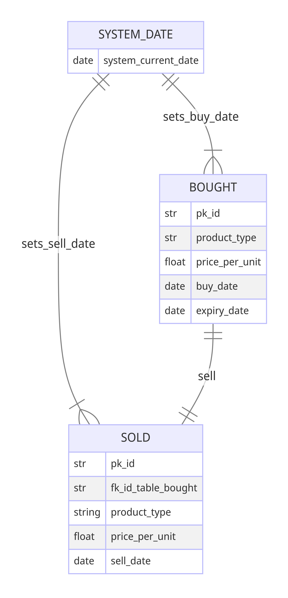

## TABLE OF CONTENTS: click link to goto chapter: (press CTRL-key)
### INTRO
### INSTALLATION
### DEFINITIONS
### DATA-MODEL
### USAGE
### EXAMPLES-SCENARIOS-WORKFLOWS
### TESTING-THE-APPLICATION-IN-PYTEST
### TROUBLE-SHOOTING
### FAQ
### SUPPORT 

# INTRO
[goto Table of Contents at start of this markdown file: ](#INTRO) 

Application Superpy can be used to buy and sell products. In addition to that
all kinds of reports can be created: revenue, cost,  profit, inventory, expired_products, etc.

To learn superpy faster, the following 2 features can be used via the cli:
1. quickly create mock data for bought.csv and sold.csv
2. quickly delete all data in bought.csv and sold.csv 

The target group of this usage guide are Winc students. Winc students are familiar with python, vsCode 
and running applications via argparse cli.


Comprehensive info about all argparse (subparser) arguments from this manual is also available via:

```python
py super.py -h
```

# INSTALLATION
[goto Table of Contents at start of this markdown file: ](#INSTALLATION)

1. The latest version of Superpy is in Github: https://github.com/davidjfk/David_Sneek_Superpy . Check if there is a newer version.
2. In Powershell navigate into folder Superpy 
3. create a virtual environment:
```python
    py -m venv env
``` 
4. activate virtual environment: 


    in Powersell:
```python
    .\env\Scripts\activate
``` 
    or in Git Bash:
```python
    source ./env/Scripts/activate
``` 
    To verify that the virtual environment is active, you should see  the name of the   
    virtual environment in parentheses at the beginning of your command prompt.

5. install all dependencies:
```python
   pip install -r requirements.txt
``` 

6. Ready to use Superpy. See next chapter Usage

7. To deactivate virtual environment (in Powershell or Git Bash), enter 'deactivate'  
    in cli and press enter.


# DEFINITIONS
[goto Table of Contents at start of this markdown file: ](#DEFINITIONS) <br />

    business task = activity that is carried out in Superpy, e.g. buy a product, show 
       an overview of profit in a certain time interval.
       A business task is in pyton argparse technically a subparser. 

    date == calendar day == date object with string representation in format: '%Y-%m-%d', e.g. '2025-10-15'. --> 
        system_date is a date with a special purpose. See system_date below. 


    inventory == list of items, goods, or materials that a business or individual has in stock in a certain time_interval.
        inventory depends on the system_date (see def of system_date below).
    

    markup is the amount of money a business adds to the cost of a product or service in order to make a profit.
        In super.py markup is calculated as a factor:
        cost-of-product   markup   sell_price
            1               3         3
            2               3         6
            3               3         9
            2.5             2         5
        (used in fn create_data_for_csv_files_bought_and_sold() )


    product_range == product_assortment == the amount of different products in a shop .
        e.g. ['apple', 'cabbage', 'beetroot'], or e.g. ['coffee', 'potato', 'orange']
        product_range is an operand in fn product from module itertools.
        So more products in product_range lead to more rows in bought.csv and sold.csv.
        (used in fn create_data_for_csv_files_bought_and_sold() )


    profit == total revenue minus total expenses in a certain time_interval
        ex: time_interval == from 23-09-12 until 23-12-15 (included)
        revenue    expenses     profit
        115.500     80.000      35.500
   

    record == transaction ==  line of text (i.e. the "transaction" ) in bought.csv or sold.csv that depicts 
        the act of buying or selling a product (1 in each transaction) by the supermarket.  


    revenue == sum of each individual product * sales price of that product in a certain time_interval. 
        --> each product is bought and sold 1-unit-at-a-time, so revenue == sum of all sales prices of all sold proudcts
        in a certain time_interval. 
        So this definition deviates from the general definition of revenue: "average sales price * number of units sold".


    sales_volume == (Dutch: afzet) == the quantity of items a business sells during a given period, such as a year or fiscal quarter. 
        It is a measure of the total number of units sold, regardless of the type or category of the product.


    shelf_life == shelf_time == number of days between buying a product and its expiry_date.
        ex: buy an apple:
        buy_date    expiry_date     shelf_life
        23-09-12     23-09-19         7
        23-09-12     23-09-20         8
        (used in fn create_data_for_csv_files_bought_and_sold() )


    system_date is a date (see def of date above) that is perceived as "today" in the system. system_date is saved
        in file 'system_date.txt' in directory data_directory. 
        If you buy a product without explicitly setting a buy_date, then system_date will be used instead as default value. 
        Same for selling a product. 
        Variable system_date is a configurable can be used to timetravel. 


    time_interval == amount of time (e.g. 3 days, or 4 months and 2 weeks, etc.) between lower boundary and  
        higher boundary.
        (used in fn create_data_for_csv_files_bought_and_sold() )   


    turnover time == inventory turnover == the number of days between buying and selling a product  
        ex: sell an apple:
        buy_date    sell_date     turnover_time
        23-09-12     23-09-14         2
        23-09-12     23-09-15         3
        (used in fn create_data_for_csv_files_bought_and_sold() )

# LOCATION OF IMPORTANT DIRECTORIES AND FILES
bought.csv      :  ...\superpy\date_used_in_superpy\bought.csv
create_testdata_for_csv_files_bought_and_sold   :  ...\superpy\data_pytest_create_boughtcsv_and_soldcsv_for_pytestcases_here\
                                                   create_testdata_for_csv_files_bought_and_sold
erd             :  ...\superpy\erd  (entity relationship diagram)
readme_files    :  ...\superpy\readme_files
sold.csv        :  ...\superpy\date_used_in_superpy\sold.csv
super.py        :  ...\superpy\super.py 
system_date     :  ...\superpy\date_used_in_superpy\system_date.txt
test_utils      :  ...\superpy\test_utils   (regression testcases, run in pytest)
utils.py        :  ...\superpy\test_utils   (functions)


# DATA-MODEL
[goto Table of Contents at start of this markdown file: ](#data-model)
Before moving on, please have a look at the data model. This provides some context to  
better understand the business tasks of Superpy in next chapter Usage.





# Usage 
[goto Table of Contents at start of this markdown file: ](#USAGE)
This chapter explains how to use Superpy's command-line interface.  
Three questions are answered:
1. Which functions (fns) does Superpy fulfill? (e.g. buy product, sell product, etc.)
2. What is the exact goal of each Superpy fn?
3. How to use each Superpy fn as a Superpy-user? 

List of superpy functionality with goals:

|Nr | Superpy functionality | Goal                                                            |
|---|-----------------------|-----------------------------------------------------------------|
|1  | buy                   | buy 1 product and add this product to bought.csv                |
|2  | create_mock_data      | fill bought.csv and sold.csv with mockdata.                     |
|3  | delete                | delete all transaction records in bought.csv and sold.csv       |
|4  | reset_system_date     | reset to current date on device Superpy is running on           |
|5  | sell                  | buy 1 product and add this product to bought.csv                |
|6  | set_system_date       | set system_date  in system_date.txt                             |
|7  | show_bought_csv       | show contents of bought.csv as a table                          |
|8  | show_cost             | calculate and display cost of a time interval                   |
|9  | show_expired_products | calculate and display expired products on a date                | 
|10 | show_inventory        | calculate and display inventory on a date                       |
|11 | show_profit           | calculate and display profit of a time interval                 |
|12 | show_revenue          | calculate and display revenue of a time interval                |
|13 | show_sales_volume     | calculate and display sales volume of a time interval           |
|14 | show_sold_csv         | show contents of bought.csv as a table                          |
|15 | show_system_date      | show system date from system_date.txt                           |
|16 | time_travel           | change the system_date by adding or subtracing a nr of days     |

## click link to goto respective paragraph with superpy functionality: (press CTRL-key)
### buy
### create_mock_data
### delete
### reset_system_date
### sell
### set_system_date
### show_bought_csv
### show_cost
### show_expired_products
### show_inventory
### show_profit
### show_revenue
### show_sales_volume
### show_sold_csv
### time_travel


- ----------------------------------------------------------------------------------------------
<br /> 
<br /> 
<br />
1. SUPERPY FUNCTIONALITY: BUY PRODUCTS 

[goto chapter Usage --> overview with business tasks ](#buy) <br />
- goal: buy product and add to file bought.csv 

- ex1: 

```
    py super.py buy apple 1.75 -bd 23-09-15 -sd 23-09-27 
```

-   product: apple,  price: &euro; 1.75, buy_date: 23-09-15, expiry_date: 23-09-27   

- ex2: 
```
    py super.py buy linseed 3.00 -exd 23-09-28 
```
-   product: linseed, price: &euro; 3.00, buy_date: system_date as default, expiry_date: 23-09-28   

- ex3: 
```
    py super.py buy cabbage 0.73 
```
-   product: cabbage, price: &euro; 0.73, buy_date: system_date as default, expiry_date:  'does not expire' as default 

- arg1: positional argument product: e.g. apple, potato, milk
- arg2: positional argument price, in euros: e.g. 1.24, 0.3, 0.35   
- arg3: optional argument -buy_date, -bd (ex: 2023-09-15) with default value system_date 
- arg4: optional argument -expiry_date, -exd (ex: 2023-10-03) with default value 'does not expire' 


<br /> 
<br /> 
- -----------------------------------------------------------------------------------------------
<br /> 
<br /> 
2. SUPERPY FUNCTIONALITY: CREATE_MOCK_DATA

[goto chapter Usage --> overview with business tasks ](#create_mock_data) <br />
- goal: create mock data for bought.csv and sold.csv
- Of 8 arguments the default values can be changed in (...\superpy\super.py --> goto section 'CONFIGURATION' at start of main.py())
- Quick summary: 
- All 11 arguments are optional, so you can do this:
```
    py super.py create_mock_data
```
-   result: bought.csv and sold.csv are filled with mockdata that has been created with default values. 
<br/>
<br/>

- arg1: product_range
    - flags: -pr, -product_range
    - product_range == product_assortment == the amount of different products in Superpy.
    - minimum value: 1 (generates 8 transactions in bought.csv) 
    - maximum value: 40 (generates 280 transactions in bought.csv)
    - ex1:
    ```
    py super.py create_mock_data -pr 3
    ```
    - product_range: 3 random products: e.g. 'apple', 'cabbage' and 'beetroot' as input to create mock data
    <br />
    - ex2:
    ```
    py super.py create_mock_data -pr 2
    ```
    - product_range: 2 random products: e.g. 'coffee' and 'potato' as input to create mock data.
<br/>
-----------------------------------------------------------------------------------------------------
<br/>

- arg2: delete_every_nth_row
    - delete_every_nth_row == delete every nth row in sold.csv
    - Purpose: deleting rows makes them expire while time travelling:
    - after creating mock data for bought.csv, a copy is made to create sold.csv.
    - Then rows are deleted from sold.csv (e.g. every 3rd row).
    - By time travelling to the future these bought_products (e.g. every 3rd row) will expire.
    - flags: -del_row, -delete_every_nth_row

    - ex1:
    ```
    py super.py create_mock_data -del_row 3
    ```
    - delete_every_nth_row: 3 
    
<br />
-----------------------------------------------------------------------------------------------------
<br/>

- arg3: delete_every_nth_row
    - shelf_life == shelf_time == number of days between buying a product and its expiry_date
    - flags: -sl, -shelf_life

    - ex1:
    ```
    py super.py create_mock_data -del_row 3
    ```
    - shelf_life: 10 days
    - result: a bought product will expire after 10 days.
<br />
-----------------------------------------------------------------------------------------------------
<br/>

- arg4: turnover_time
    - turnover_time == inventory turnover == the number of days between buying a product in bought.csv  
        and selling a product in sold.csv.
    - flags: -turnover_time, -tt

    - ex1:
    ```
    py super.py create_mock_data -tt 4
    ```
    - turnover_time: 4 days
    - result: a bought product will expire after 10 days.
<br />
-----------------------------------------------------------------------------------------------------
<br/>

- arg5: markup
    - markup = the amount of money a business adds to the cost of a product or service in order to make a profit.
    - In super.py markup is calculated as a factor: ex: if buy_price is 3 euro and sell_price is 4 euro,  
        then markup is 4/3 = 1.33 . 
    - flags: -mu, -markup

    - ex1:
    ```
    py super.py create_mock_data -mu 3
    ```
    - markup: factor 3
    - result: if buy_price in bought.csv is 3 euro, then sell_price will be 9 euro in sold.csv.
<br />
-----------------------------------------------------------------------------------------------------
<br/>

- arg6: lower_boundary_year
    - lower_boundary_year == lower_boundary_year_of_time_interval_in_which_to_create_random_testdata.
    - flags: -lby, -lower_boundary_year 

    - ex1:
    ```
    py super.py create_mock_data -lby 2024
    ```
    - lower_boundary_year: 2024

<br />
-----------------------------------------------------------------------------------------------------
<br/>

- arg7: lower_boundary_month
    - lower_boundary_month == lower_boundary_month_of_time_interval_in_which_to_create_random_testdata.
    - flags: -lbm, -lower_boundary_month 

    - ex1:
    ```
    py super.py create_mock_data -lbm 10
    ```
    - lower_boundary_month: October

<br />
-----------------------------------------------------------------------------------------------------
<br/>

- arg8: lower_boundary_day
    - lower_boundary_day == lower_boundary_day_of_time_interval_in_which_to_create_random_testdata.
    - flags: -lbd, -lower_boundary_day 

    - ex1:
    ```
    py super.py create_mock_data -lbd 15
    ```
    - lower_boundary_day: 15th day of  the  month

<br />
-----------------------------------------------------------------------------------------------------
<br/>

- arg9: nr_of_months_to_calculate_upper_boundary_month
    - flags: -ubmnr, -upper_boundary_month_nr

    - ex1:
    ```
    py super.py create_mock_data -ubmnr 3
    ```
    - nr_of_months_to_calculate_upper_boundary_month: 3 months
    - result: upper boundary month of time interval in which to create data is 3 months in the future

<br />
-----------------------------------------------------------------------------------------------------
<br/>

- arg10: nr_of_weeks_to_calculate_upper_boundary_week
    - flags: -ubwnr, -upper_boundary_weeknr

    - ex1:
    ```
    py super.py create_mock_data -ubwnr 8
    ```
    - nr_of_weeks_to_calculate_upper_boundary_month: 3 weeks
    - result: upper boundary week of time interval in which to create data is 8 weeks in the future

<br />
-----------------------------------------------------------------------------------------------------
<br/>

- arg11: nr_of_days_to_calculate_upper_boundary_day
    - flags: -ubwnr, -upper_boundary_weeknr

    - ex1:
    ```
    py super.py create_mock_data -ubdnr 3
    ```
    - nr_of_days_to_calculate_upper_boundary_day: 3 weeks
    - upper boundary day of time interval in which to create data is 3 days in the future

<br />
-----------------------------------------------------------------------------------------------------
<br/>


---------------------------------------------------
------------------------------------------------
----------------------------------------------

```
    py super.py show_profit -ed 2023-10-05
```
-   start_date: start of financial  year of system_date. e.g. if system_date 23-06-08, then: 23-01-01
-   end_date: 2023-10-05
-   result in terminal:  
    'profit from start_date: 2023-01-01 to end_date: 2023-10-05 inclusive: Euro 18.6'


- ex3: 
```
    py super.py show_profit -sd 2023-07-01
```
-   start_date: 2023-07-01
-   end_date: end_date is by default system_date (here, e.g. 2023-09-17) 
-   result in terminal:  
    'Profit from start_date: 2023-07-01 to end_date: 2023-09-17 inclusive: Euro 9.9'  


- arg1: optional argument start_date in format 'YYYY-MM-DD'. ex: -sd 2023-09-01, or: -start_date 2023-09-01  
    default value is january 1st of year from system_date: e.g. if system_date is 23-06-28, then default value is 23-01-01.  
    reason: often you want to know the cost of the current financial year until today inclusive.  

- arg2: optional argument end_date in format 'YYYY-MM-DD'. ex: -ed 2023-10-15, or: -end_date 2023-10-15  
    default value is system_date, because often you want to know the cost of the current financial year until today  inclusive.


<br /> 
<br /> 
- -----------------------------------------------------------------------------------------------
<br /> 
<br /> 
3. SUPERPY FUNCTIONALITY: DELETE

[goto chapter Usage --> overview with business tasks ](#delete) <br />
- goal: delete all data in bought.csv and sold.csv

- ex1: 

```
    py super.py delete 
```

- result: all transaction records in bought.csv and sold.csv have been deleted


<br /> 
<br /> 
- -----------------------------------------------------------------------------------------------
<br /> 
<br /> 
4. SUPERPY FUNCTIONALITY: RESET_SYSTEM_DATE

[goto chapter Usage --> overview with business tasks ](#reset_system_date) <br />
- goal: reset system_date in system_date.txt (...\superpy\data_used_in_superpy\system_date.txt) to   
    current date on the device Superpy is running on.

- ex1: 

```
    py super.py reset_system_date 
```

- result: system_date.txt now contains current system_date from the  device Superpy is running on.


<br /> 
<br /> 
- -----------------------------------------------------------------------------------------------
<br /> 
<br /> 
5. SUPERPY FUNCTIONALITY: SELL

[goto chapter Usage --> overview with business tasks ](#sell) <br />

- goal: goal: sell product and add to file sold.csv 

- ex1: 

```
    py super.py b_15 3.75 -sd 2023-11-15 
```

-   product: row with id b_15 in bought.csv is sold, price: &euro; 3.75, sell_date: 23-11-15

- ex2: 
```
    py super.py b_16 5.15
```
-   product: row with id b_15 in bought.csv is sold, price: &euro; 5.15, sell_date: system_date as default     

- ex3: 
```
    py super.py b_128 2.42 
```
-   product: row with id b_128 in bought.csv is sold, price: &euro; 2.42, sell_date: system_date as default

- arg1: positional argument buy_id: e.g. b_7, b_18, etc. See bought.csv for buy_ids
- arg2: positional argument price, in euros: e.g. 1.24, 0.3, 0.35  
- arg3: optional argument -sell_date, -sd (ex: -sd 2023-09-15) with default value system_date 

<br /> 
<br /> 
- -----------------------------------------------------------------------------------------------
<br /> 
<br /> 
6. SUPERPY FUNCTIONALITY: SET_SYSTEM_DATE

[goto chapter Usage --> overview with business tasks ](#set_system_date) <br />
- goal: set_system_date_to a specific date in the file system_date.txt 

- ex1: 

```
    py super.py set_system_date 2025-01-01
```

- system_date: 2025-01-01   
- result: 'Superpy system_date is set to date: 2025-01-01'

- ex2: 

```
    py super.py set_system_date 2023-09-20 
```

- system_date: 2023-09-20
- result: 'Superpy system_date is set to date: 2023-09-20'

- arg1: positional argument system_date, e.g. 2023-10-11 --> string representation in format 'yyy-mm-dd'<br/>


<br /> 
<br /> 
- -----------------------------------------------------------------------------------------------
<br /> 
<br /> 

7. SUPERPY FUNCTIONALITY: SHOW_BOUGHT_CSV

[goto chapter Usage --> overview with business tasks ](#show_bought_csv) <br />

- goal: show all data from bought.csv in a table in the terminal

- ex1: 

```
    py super.py show_bought_csv
```

- result: bought.csv is shown in the terminal as a table 


<br /> 
<br /> 
- -----------------------------------------------------------------------------------------------
<br /> 
<br /> 

8. SUPERPY FUNCTIONALITY: SHOW_COST

[goto chapter Usage --> overview with business tasks ](#show_cost) <br />
- goal: show cost in time range between start_date and end_date inclusive

- ex1: 

```
    py super.py show_cost -sd 2023-09-01 -ed 2023-10-10 
```
-   start_date: 2023-09-01, 
-   end_date: 2023-10-10
-   result in terminal:  
    'Cost from start_date: 2023-09-01 to end_date: 2023-10-10 inclusive: Euro 27.9'   

- ex2: 
```
    py super.py show_cost -ed 2023-10-05
```
-   start_date is by default start of financial  year of system_date. e.g. if system_date 23-06-08, then: 23-01-01.  
-   end_date: 2023-10-05
-   result in terminal:  
    'Cost from start_date: 2023-01-01 to end_date: 2023-10-05 inclusive: Euro 18.6'  


- ex3: 
```
    py super.py show_cost -sd 2023-07-01
```
-   start_date: 2023-07-01 
-   end_date is by default system_date (here, e.g. 2023-09-17) 
-   result in terminal:  
    'Cost from start_date: 2023-07-01 to end_date: 2023-09-17 inclusive: Euro 9.9'  


- arg1: optional argument start_date in format 'YYYY-MM-DD'. ex: -sd 2023-09-01, or: -start_date 2023-09-01  
    default value is january 1st of year from system_date: e.g. if system_date is 23-06-28, then default value is 23-01-01.  
    reason: often you want to know the cost of the current financial year until today inclusive.  

- arg2: optional argument end_date in format 'YYYY-MM-DD'. ex: -ed 2023-10-15, or: -end_date 2023-10-15  
    default value is system_date, because often you want to know the cost of the current financial year until today  inclusive.
    
 
<br /> 
<br /> 
- -----------------------------------------------------------------------------------------------
<br /> 
<br /> 
9. SUPERPY FUNCTIONALITY: SHOW_EXPIRED_PRODUCTS

[goto chapter Usage --> overview with business tasks ](#show_expired_products) <br />
- goal: calculate expired products on a day in format 'YYYY-MM-DD' (e.g. 2023-09-18)

- ex1: 

```
    py super.py show_expired_products -d 23-09-28
```
-   date: 2023-09-28, 
-   result is displayed in table in the terminal:  
 

- ex2: 
```
    py super.py show_expired_products -ed 2023-10-05
```
-   date: by default system_date
-   end_date: 2023-10-05
-   result is displayed in table in the terminal:    


- arg1: optional argument date in following format: 'YYYY-MM-DD'. ex: -d 2026-10-21, or: -date 2026-10-21 
    default value is system_date
    reason: often you want to know which products expire today. 


<br /> 
<br /> 
- -----------------------------------------------------------------------------------------------
<br /> 
<br /> 
10. SUPERPY FUNCTIONALITY: SHOW_INVENTORY

[goto chapter Usage --> overview with business tasks ](#show_inventory) <br />
- goal: calculate inventory on a day in format 'YYYY-MM-DD' (e.g. 2023-09-18)

- ex1: 

```
    py super.py show_inventory -d 23-09-28
```
-   date: 2023-09-28, 
-   result is displayed in table in the terminal:  
 

- ex2: 
```
    py super.py show_inventory -ed 2023-10-05
```
-   date: by default system_date
-   end_date: 2023-10-05
-   result is displayed in table in the terminal:    


- arg1: optional argument date in following format: 'YYYY-MM-DD'. ex: -d 2026-10-21, or: -date 2026-10-21 
    default value is system_date
    reason: often you want to know which products expire today. 


<br /> 
<br /> 
- -----------------------------------------------------------------------------------------------
<br /> 
<br /> 
11. SUPERPY FUNCTIONALITY: SHOW_PROFIT

[goto chapter Usage --> overview with business tasks ](#show_profit) <br />
- goal: show profit in time range between start_date and end_date inclusive

- ex1: 

```
    py super.py show_profit -sd 2023-09-01 -ed 2023-10-10
```
-   start_date: 2023-09-01, 
-   end_date: 2023-10-10
-   result in terminal:  
    'Profit from start_date: 2023-09-01 to end_date: 2023-10-10 inclusive: Euro 27.9'   

- ex2: 
```
    py super.py show_profit -ed 2023-10-05
```
-   start_date: start of financial  year of system_date. e.g. if system_date 23-06-08, then: 23-01-01
-   end_date: 2023-10-05
-   result in terminal:  
    'profit from start_date: 2023-01-01 to end_date: 2023-10-05 inclusive: Euro 18.6'


- ex3: 
```
    py super.py show_profit -sd 2023-07-01
```
-   start_date: 2023-07-01
-   end_date: end_date is by default system_date (here, e.g. 2023-09-17) 
-   result in terminal:  
    'Profit from start_date: 2023-07-01 to end_date: 2023-09-17 inclusive: Euro 9.9'  


- arg1: optional argument start_date in format 'YYYY-MM-DD'. ex: -sd 2023-09-01, or: -start_date 2023-09-01  
    default value is january 1st of year from system_date: e.g. if system_date is 23-06-28, then default value is 23-01-01.  
    reason: often you want to know the cost of the current financial year until today inclusive.  

- arg2: optional argument end_date in format 'YYYY-MM-DD'. ex: -ed 2023-10-15, or: -end_date 2023-10-15  
    default value is system_date, because often you want to know the cost of the current financial year until today  inclusive.


<br /> 
<br /> 
- -----------------------------------------------------------------------------------------------
<br /> 
<br /> 
12. SUPERPY FUNCTIONALITY: SHOW_REVENUE

[goto chapter Usage --> overview with business tasks ](#show_revenue) <br />
- goal: show revenue in time range between start_date and end_date inclusive

- ex1: 

```
    py super.py show_revenue -sd 2023-09-01 -ed 2023-10-10
```
-   start_date: 2023-09-01, 
-   end_date: 2023-10-10
-   result in terminal:  
    'Cost from start_date: 2023-09-01 to end_date: 2023-10-10 inclusive: Euro 27.9'   

- ex2: 
```
    py super.py show_revenue -ed 2023-10-05
```
-   start_date: start of financial  year of system_date. e.g. if system_date 23-06-08, then: 23-01-01
-   end_date: 2023-10-05
-   result in terminal:  
    'Revenue from start_date: 2023-01-01 to end_date: 2023-10-05 inclusive: Euro 18.6'


- ex3: 
```
    py super.py show_revenue -sd 2023-07-01
```
-   start_date: 2023-07-01
-   end_date: end_date is by default system_date (here, e.g. 2023-09-17) 
-   result in terminal:  
    'Cost from start_date: 2023-07-01 to end_date: 2023-09-17 inclusive: Euro 9.9'  


- arg1: optional argument start_date in format 'YYYY-MM-DD'. ex: -sd 2023-09-01, or: -start_date 2023-09-01  
    default value is january 1st of year from system_date: e.g. if system_date is 23-06-28, then default value is 23-01-01.  
    reason: often you want to know the cost of the current financial year until today inclusive.  

- arg2: optional argument end_date in format 'YYYY-MM-DD'. ex: -ed 2023-10-15, or: -end_date 2023-10-15  
    default value is system_date, because often you want to know the cost of the current financial year until today  inclusive.


<br /> 
<br /> 
- -----------------------------------------------------------------------------------------------
<br /> 
<br /> 

13. SUPERPY FUNCTIONALITY: SHOW_SALES_VOLUME

[goto chapter Usage --> overview with business tasks ](#show_sales_volume) <br />
- goal: show sales_volume in time range between start_date and end_date inclusive

- ex1: 

```
    py super.py show_sales_volume -sd 2023-09-01 -ed 2023-10-10
```
-   start_date: 2023-09-01, 
-   end_date: 2023-10-10
-   result in terminal:  
    'Profit from start_date: 2023-09-01 to end_date: 2023-10-10 inclusive: Euro 27.9'   

- ex2: 
```
    py super.py show_sales_volume -ed 2023-10-05
```
-   start_date: start of financial  year of system_date. e.g. if system_date 23-06-08, then: 23-01-01
-   end_date: 2023-10-05
-   result in terminal:  
    'Sales volume from start_date: 2023-01-01 to end_date: 2023-10-05 inclusive: Euro 18.6'


- ex3: 
```
    py super.py show_sales_volume -sd 2023-07-01
```
-   start_date: 2023-07-01
-   end_date: end_date is by default system_date (here, e.g. 2023-09-17) 
-   result in terminal:  
    'Profit from start_date: 2023-07-01 to end_date: 2023-09-17 inclusive: Euro 9.9'  


- arg1: optional argument start_date in format 'YYYY-MM-DD'. ex: -sd 2023-09-01, or: -start_date 2023-09-01  
    default value is january 1st of year from system_date: e.g. if system_date is 23-06-28, then default value is 23-01-01.  
    reason: often you want to know the cost of the current financial year until today inclusive.  

- arg2: optional argument end_date in format 'YYYY-MM-DD'. ex: -ed 2023-10-15, or: -end_date 2023-10-15  
    default value is system_date, because often you want to know the cost of the current financial year until today  inclusive.


<br /> 
<br /> 
- -----------------------------------------------------------------------------------------------
<br /> 
<br /> 
14. SUPERPY FUNCTIONALITY: SHOW_SOLD_CSV

[goto chapter Usage --> overview with business tasks ](#show_sold_csv) <br />

- goal: show all data from sold.csv in a table in the terminal.

- ex1: 

```
    py super.py show_sold_csv
```

- result: sold.csv is shown in the terminal as a table  


<br /> 
<br /> 
- -----------------------------------------------------------------------------------------------
<br /> 
<br /> 
16. SUPERPY FUNCTIONALITY: TIME_TRAVEL

[goto chapter Usage --> overview with business tasks ](#time_travel) <br />

- goal: change system_date by adding or subtracting nr of day(s)

- ex1: 

```
    py super.py time_travel 3
```
-  nr_of_days: 3
- result: you travel with 3 days to the future. So if system_date is 2020-03-10, then  
  new date becomes 2020-03-13 in the future.

- ex2: 
```
    py super.py time_travel -3
```
-  nr_of_days: -3
- result: you travel with 3 days to the past. So if system_date is 2020-03-10, then  
  new date becomes 2020-03-07 in the past.  

- arg1: positional argument days to add or subtract from system_date: e.g. 9, -8, etc.


<br /> 
<br /> 
# EXAMPLES-SCENARIOS-WORKFLOWS

[goto Table of Contents at start of this markdown file: ](#EXAMPLES-SCENARIOS-WORKFLOWS)
- This chapter provides some examples of common Superpy usage scenarios, demonstrating how to  
    combine different business tasks, command-line options and arguments.

    The examples start easy with subparsers (i.e. create_mock_data, buy_product, etc.) only
    using their default values. Gradually the scenarios get more complex and more and more
    default values are replaced by using custom values.

- Examples-scenarios-workflows: 
1. get familiar with the data
    
    - step 1: create_mock_data
    - step 2: show_bought_csv
    - step 3: show_sold_csv
    - step 4: show_system_date 
    - step 5: reset_system_date
    - step 6: show_system_date   --> notice that system_date is now equal to that on the device  
                                     you are running superpy on. 

    - 2do: add copy-pastable code snippet for each step, e.g. py super.py create_mock_data

2. buy and sell a product
    - step 1: create_mock_data
    - step 2: buy_product
    - step 3: sell_product


3. show all management reports
    - step 1: create_mock_data
    - step 2: show_cost
    - 2do: add all the other reports

4. time_travel and see how the data (inventory, expired products, profit, etc.) on  
    the management reports changes
    - step 1: create_mock_data    

5. create a lot of profit


6. create a loss 


7. create a lot of inventory


8. create a lot of expired products 


# TESTING-THE-APPLICATION-IN-PYTEST
[goto Table of Contents at start of this markdown file: ](#TESTING-THE-APPLICATION-IN-PYTEST)

## 1of2: run regression testcases:

There are 2 options to run the regression testcases in pytest:

Option 1of2: run them all (this is usually what you want):
1. navigate into (...\superpy) or (...\superpy\test_utils)
2. enter following command:
```python
    pytest
```
3. all 23 testcases should pass. If not then investigate the failing testcase(s).
<br/>
<br/>

Option 2of2: run only the testcase(s) that test a specific function:
1. navigate into (...\superpy) or (...\superpy\test_utils)
2. navigate into the folder that contains the testcases of the fn that you want to test.
    - ex: to test fn buy_product, navigate into directory 'fn_buy_product_testcases'.
    - or: 
    - ex: to test fn calculate_profit_in_time_range_between_start_date_and_end_date_inclusive,  
        navigate into directory 'fn_calculate_profit_in_time_range_between_start_date_and_end_date_inclusive'  
    etc.
3. now enter following command:
```python
    pytest
```
4. all testcases of this fn (e.g. fn buy_product) should pass.  
    If not then investigate the failing testcase(s).
<br/>
<br/>

## 2of2: create testdata for additional testcases:
Creating testdata involves creating testdata for bought.csv and sold.csv.

1. navigate into (...\superpy\data_pytest_create_boughtcsv_and_soldcsv_for_pytestcases_here)
2. run the following script:
```python
    py create_testdata_for_csv_files_bought_and_sold.py
```
3. bought.csv and sold.csv have now been created. You can find them in the same location
    as the script: (...\superpy\data_pytest_create_boughtcsv_and_soldcsv_for_pytestcases_here)

- Inside this script at the beginning of main() in section 'CONFIGURATION', the following variables  
    (actually fn-arguments) can be assigned another value to your liking:
    - product_range
    - delete_every_nth_row_in_soldcsv_so_every_nth_row_in_boughtcsv_can_expire_when_time_travelling
    - shelf_life
    - turnover_time
    - markup
    - lower_boundary_year_of_time_interval_in_which_to_create_random_testdata
    - lower_boundary_month_of_time_interval_in_which_to_create_random_testdata
    - lower_boundary_week_of_time_interval_in_which_to_create_random_testdata
    - upper_boundary_nr_of_months_to_add_to_calculate
    - upper_boundary_nr_of_weeks_to_add_to_calculate
    - upper_boundary_nr_of_days_to_add_to_calculate 

     - Chapter USAGE --> paragraph create_mock_data explains exactly what these variables mean and  
        how they can be used to create testdata.
     - Chapter EXAMPLES shows them "in action".  
        ex: if you create 10 rows in bought.csv (these are automatically copied into 10 rows in sold.csv) and then  
        delete every 2nd row in sold.csv AND THEN time travel to the future, then more products will expire, compared  
        to when you only let every tenth row in sold.csv expire.  
        Setting the shelf_life (e.g. 4 days or 25 days) also make a difference in how many products will expire, or
        or still  be part of the inventory, etc.


<br/>
<br/>


# Troubleshooting
[goto Table of Contents at start of this markdown file: ](#trouble-shooting)
If you encounter a problem, first run the pytest regression testcases.
1. navigate into (...\superpy) or (...\superpy\test_utils)
2. enter following command:
```python
    pytest
```
3. all 23 testcases should pass. If not then investigate the failing testcase(s).


# FAQ
[goto Table of Contents at start of this markdown file: ](#faq)
1. Can I export data from bought.csv or sold.csv as a pdf?
    - no

2. Do I need a licence to use this application?
    - Unlicence applies to Superpy. Unlicense is a public domain dedication that allows anyone to  
    use your code for any purpose without restriction. 


# Support
[goto Table of Contents at start of this markdown file: ](#support)
For support please send an email to noreply@really.com or call  
0011-2233-4455 during business hours GMT+2. 

foo_bar


# comes from here:
click on this link
### foo


# goes here:
[Custom foo description](#foo)