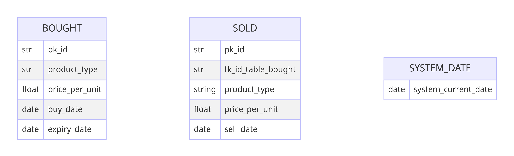

# Table of  contents
[table of contents at the start of markdown file](#table-of-contents)
- Introduction
- Installation
- Definitions
- Data model
- Usage:
- Examples
- Troubleshooting
- FAQ
- Support 

- click link to goto chapter in table of contents above:
### introduction
### installation
### definitions
### data-model
### usage
### examples
### trouble-shooting
### faq
### support 


# Introduction
[goto Table of Contents at start of markdown file: ](#introduction) 
Application Superpy can be used to buy and sell products. In addition to that
all kinds of reports can be created: revenue, cost,  profit, inventory, expired_products, etc.

To learn superpy faster, the following 2 features can be used via the cli:
1. quickly create mock data for bought.csv and sold.csv
2. quickly delete all data in bought.csv and sold.csv 

The target group of this usage guide are Winc students. Winc students are familiar with python, vsCode 
and running applications via argparse cli.

# Installation
[goto Table of Contents at start of markdown file: ](#installation)
1. The latest version of Superpy is in Github: https://github.com/davidjfk/David_Sneek_Superpy . Check if there is a newer version.
2. In Powershell navigate into folder Superpy 
3. create a virtual environment:
```python
    py -m venv env
``` 
4. activate virtual environment: 
```python
    \env\Scripts\activate
``` 
    or in e.g. git bash:
```python
    /env/Scripts/activate
``` 

5. install all dependencies:
```python
   pip install -r requirements.txt
``` 

6. Ready to use Superpy. See next chapter Usage

7. (To deactivate virtual environment, enter 'deactivate' in cli and press enter. )


# DEFINITIONS:
[goto Table of Contents at start of markdown file: ](#definitions) <br />

    business task = activity that is carried out in Superpy, e.g. buy a product, show 
       an overview of profit in a certain time interval.
       A business task is in pyton argparse technically a subparser. 

    date == calendar day == date object with string representation in format: '%Y-%m-%d', e.g. '2025-10-15'. --> 
        system_date is a date with a special purpose. See system_date below. 


    inventory == list of items, goods, or materials that a business or individual has in stock in a certain time_interval.
        inventory depends on the system_date (see def of system_date below).
    

    markup is the amount of money a business adds to the cost of a product or service in order to make a profit.
        In super.py markup is calculated as a factor:
        cost-of-product   markup   sell_price
            1               3         3
            2               3         6
            3               3         9
            2.5             2         5
        (used in fn create_data_for_csv_files_bought_and_sold() )


    product_range == product_assortment == the amount of different products in a shop .
        e.g. ['apple', 'cabbage', 'beetroot'], or e.g. ['coffee', 'potato', 'orange']
        product_range is an operand in fn product from module itertools.
        So more products in product_range lead to more rows in bought.csv and sold.csv.
        (used in fn create_data_for_csv_files_bought_and_sold() )


    profit == total revenue minus total expenses in a certain time_interval
        ex: time_interval == from 23-09-12 until 23-12-15 (included)
        revenue    expenses     profit
        115.500     80.000      35.500
   

    record == transaction ==  line of text (i.e. the "transaction" ) in bought.csv or sold.csv that depicts 
        the act of buying or selling a product (1 in each transaction) by the supermarket.  


    revenue == sum of each individual product * sales price of that product in a certain time_interval. 
        --> each product is bought and sold 1-unit-at-a-time, so revenue == sum of all sales prices of all sold proudcts
        in a certain time_interval. 
        So this definition deviates from the general definition of revenue: "average sales price * number of units sold".


    sales_volume == (Dutch: afzet) == the quantity of items a business sells during a given period, such as a year or fiscal quarter. 
        It is a measure of the total number of units sold, regardless of the type or category of the product.


    shelf_life == shelf_time == number of days between buying a product and its expiry_date.
        ex: buy an apple:
        buy_date    expiry_date     shelf_life
        23-09-12     23-09-19         7
        23-09-12     23-09-20         8
        (used in fn create_data_for_csv_files_bought_and_sold() )


    system_date is a date (see def of date above) that is perceived as "today" in the system. system_date is saved
        in file 'system_date.txt' in directory data_directory. 
        If you buy a product without explicitly setting a buy_date, then system_date will be used instead as default value. 
        Same for selling a product. 
        Variable system_date is a configurable can be used to timetravel. 


    time_interval == amount of time (e.g. 3 days, or 4 months and 2 weeks, etc.) between lower boundary and  
        higher boundary.
        (used in fn create_data_for_csv_files_bought_and_sold() )   


    turnover time == inventory turnover == the number of days between buying and selling a product  
        ex: sell an apple:
        buy_date    sell_date     turnover_time
        23-09-12     23-09-14         2
        23-09-12     23-09-15         3
        (used in fn create_data_for_csv_files_bought_and_sold() )


# Data model
[goto Table of Contents at start of markdown file: ](#data-model)
Before moving on, please have a look at the data model. This provides some context to  
better understand the business tasks of Superpy in next chapter Usage.





# Usage 
[goto Table of Contents at start of markdown file: ](#usage)
This chapter explains how to use Superpy's command-line interface. Three questions are answered:
1. Which business tasks does Superpy fulfill? (e.g. buy product, sell product, etc.)
2. What is the exact goal of each business task?
3. How to use each business task as a Superpy-user? 

List of superpy business tasks with their goals:


|Nr | Business task         | Goal                                                              |
|---|-----------------------|-------------------------------------------------------------------|
|1  | buy                   | buy 1 product and add this product to bought.csv                  |
|2  | create_mock_data      | fill bought.csv and sold.csv with mockdata.                       |
|3  | delete                | delete all transaction records in bought.csv and sold.csv         |
|4  | sell                  | buy 1 product and add this product to bought.csv                  |
|5  | set_date              | set system_date                                                   |
|6  | show_bought_csv       | show contents of bought.csv as a table                            |
|7  | show_cost             | calculate and display cost of a time interval                     |
|8  | show_expired_products | calculate and display expired products on a date                  | 
|9  | show_inventory        | calculate and display inventory on a date                         |
|10 | show_profit           | calculate and display profit of a time interval                   |
|11 | show_revenue          | calculate and display revenue of a time interval                  |
|12 | show_sales_volume     | calculate and display sales volume of a time interval             |
|13 | show_sold_csv         | show contents of bought.csv as a table                            |
|14 | time_travel           | change the system_date by adding or subtracing a nr of days       |

- click link to goto business task:
### buy
### create_mock_data
### delete
### sell
### set_date
### show_bought_csv
### show_cost
### show_expired_products
### show_inventory
### show_profit
### show_revenue
### show_sales_volume
### show_sold_csv
### time_travel


- ----------------------------------------------------------------------------------------------
<br /> 
<br /> 
<br />
1. BUSINESS TASK: BUY PRODUCTS 

[goto chapter Usage --> overview with business tasks ](#buy) <br />
- goal: buy product and add to file bought.csv 

- ex1: 

```
    py super.py buy apple 1.75 -bd 23-09-15 -sd 23-09-27 
```

- buy_date is 23-09-15,   expiry_date is 23-09-27   

- ex2: 
```
    py super.py buy apple 3.00 -exd 23-09-28 
```
- system_date is default buy_date. expiry_date is 23-09-28   

- ex3: 
```
    py super.py buy cabbage 0.73 
```
- system_date is default sell_date. 'does not expire' is default expiry_date

- arg1: positional argument product: e.g. apple, potato, milk
- arg2: positional argument price, in euros: e.g. 1.24, 0.3, 0.35   
- arg3: optional argument -buy_date, -bd (ex: 2023-09-15) with system_date as default value. 
- arg4: optional argument -expiry_date, -exd (ex: 2023-10-03) with default value 'does not expire' 


<br /> 
<br /> 
- -----------------------------------------------------------------------------------------------
<br /> 
<br /> 
2. BUSINESS TASK: CREATE_MOCK_DATA

[goto chapter Usage --> overview with business tasks ](#create_mock_data) <br />


<br /> 
<br /> 
- -----------------------------------------------------------------------------------------------
<br /> 
<br /> 
3. BUSINESS TASK: DELETE

[goto chapter Usage --> overview with business tasks ](#delete) <br />
- goal: delete all data in bought.csv and sold.csv

- ex1: 

```
    py super.py delete 
```

- result: all transaction records in bought.csv and sold.csv have been deleted.


<br /> 
<br /> 
- -----------------------------------------------------------------------------------------------
<br /> 
<br /> 
4. BUSINESS TASK: SELL

[goto chapter Usage --> overview with business tasks ](#sell) <br />

- goal: goal: sell product and add to file sold.csv 

- ex1: 

```
    py super.py b_15 3.75 -sd 2023-11-15 
```

- sell_date is 2023-11-15

- ex2: 
```
    py super.py b_16 5.15
```
- system_date is default sell_date   

- ex3: 
```
    py super.py b_128 2.42 
```
- ssystem_date is default sell_date

- arg1: positional argument buy_id: e.g. b_7, b_18, etc. See bought.csv for buy_ids
- arg2: positional argument price, in euros: e.g. 1.24, 0.3, 0.35  
- arg3: optional argument -sell_date, -sd (ex: -sd 2023-09-15) with system_date as default value 

<br /> 
<br /> 
- -----------------------------------------------------------------------------------------------
<br /> 
<br /> 
5. BUSINESS TASK: SET_DATE

[goto chapter Usage --> overview with business tasks ](#set_date) <br />
- goal: set_system_date_to a specific date in the file system__date.txt 

- ex1: 

```
    py super.py set_date 2025-01-01
```

- result: system_date is set to 2025-01-01 in file system_date.txt   

- ex2: 

```
    py super.py set_date 2023-09-20 
```

- result: system_date is set to 2023-09-20 in file system_date.txt  

- arg1: positional argument system_date, e.g. 2023-10-11 --> string representation in format 'yyy-mm-dd'<br/>


<br /> 
<br /> 
- -----------------------------------------------------------------------------------------------
<br /> 
<br /> 
6. BUSINESS TASK: SHOW_BOUGHT_CSV

[goto chapter Usage --> overview with business tasks ](#show_bought_csv) <br />

- goal: show all data from bought.csv in a table in the terminal

- ex1: 

```
    py super.py show_bought_csv
```

- result: bought.csv is shown in the terminal as a table 


<br /> 
<br /> 
- -----------------------------------------------------------------------------------------------
<br /> 
<br /> 
7. BUSINESS TASK: SHOW_COST

[goto chapter Usage --> overview with business tasks ](#show_cost) <br />


<br /> 
<br /> 
- -----------------------------------------------------------------------------------------------
<br /> 
<br /> 
8. BUSINESS TASK: SHOW_EXPIRED_PRODUCTS

[goto chapter Usage --> overview with business tasks ](#show_expired_products) <br />


<br /> 
<br /> 
- -----------------------------------------------------------------------------------------------
<br /> 
<br /> 
9. BUSINESS TASK: SHOW_INVENTORY

[goto chapter Usage --> overview with business tasks ](#show_inventory) <br />


<br /> 
<br /> 
- -----------------------------------------------------------------------------------------------
<br /> 
<br /> 
10. BUSINESS TASK: SHOW_PROFIT

[goto chapter Usage --> overview with business tasks ](#show_profit) <br />


<br /> 
<br /> 
- -----------------------------------------------------------------------------------------------
<br /> 
<br /> 
11. BUSINESS TASK: SHOW_REVENUE

[goto chapter Usage --> overview with business tasks ](#show_revenue) <br />


<br /> 
<br /> 
- -----------------------------------------------------------------------------------------------
<br /> 
<br /> 
12. BUSINESS TASK: SHOW_SALES_VOLUME

[goto chapter Usage --> overview with business tasks ](#show_sales_volume) <br />


<br /> 
<br /> 
- -----------------------------------------------------------------------------------------------
<br /> 
<br /> 
13. BUSINESS TASK: SHOW_SOLD_CSV

[goto chapter Usage --> overview with business tasks ](#show_sold_csv) <br />

- goal: show all data from sold.csv in a table in the terminal.

- ex1: 

```
    py super.py show_sold_csv
```

- result: sold.csv is shown in the terminal as a table  


<br /> 
<br /> 
- -----------------------------------------------------------------------------------------------
<br /> 
<br /> 
14. BUSINESS TASK: TIME_TRAVEL

[goto chapter Usage --> overview with business tasks ](#time_travel) <br />

- goal: goal: change system_date by adding or subtracting nr of day(s)

- ex1: 

```
    py super.py time_travel 3
```

- result: you travel with 3 days to the future. So if system_date is 2020-03-10, then  
  new date becomes 2020-03-13 in the future.

- ex2: 
```
    py super.py time_travel -3
```
- result: you travel with 3 days to the past. So if system_date is 2020-03-10, then  
  new date becomes 2020-03-07 in the past.  

- arg1: positional argument days to add or subtract from system_date: e.g. 9, -8, etc.


<br /> 
<br /> 
# Examples

[goto Table of Contents at start of markdown file: ](#examples)
This chapter provides some examples of common Superpy usage scenarios, demonstrating how to  
combine different business tasks, command-line options and arguments.


# Troubleshooting
[goto Table of Contents at start of markdown file: ](#trouble-shooting)
If you encounter a problem, first run the pytest regression testcases.
1. navigate into (...\superpy) or (...\superpy\test_utils)
2. enter following command:
```python
    pytest
```
3. all 21 testcases should pass. If not then investigate the failing testcase(s).


# FAQ
[goto Table of Contents at start of markdown file: ](#faq)
1. Can I export data from bought.csv or sold.csv as a pdf?
    - no

2. Do I need a licence to use this application?
    - Unlicence applies to Superpy. Unlicense is a public domain dedication that allows anyone to  
    use your code for any purpose without restriction. 


# Support
[goto Table of Contents at start of markdown file: ](#support)
For support please send an email to noreply@really.com or call  
0011-2233-4455 during business hours GMT+2. 

foo_bar


# comes from here:
click on this link
### foo


# goes here:
[Custom foo description](#foo)