Important !!  
Please read this document in Open Preview: Ctrl+Shift+V, or Right-click 'README_USAGE_GUIDE.md'  
in the vsCode Explorer and then select the first option 'Open Preview'.

## Table of contents
- [INTRO](#intro)
- [SUPERPY FUNCTIONALITY](#superpy-functionality)
  - [Intro](#intro-1)
  - [Buy Product](#buy-product)
    - [uc 1: buy date and expiry date in format YYYY-MM-DD](#uc-1-buy-date-and-expiry-date-in-format-yyyy-mm-dd)
    - [uc 2: buy a multi-word product (e.g. full fat milk)](#uc-2-buy-a-multi-word-product-eg-full-fat-milk)
    - [uc 3: buy product using words (e.g. tomorrow, next\_wednesday) as start and end date](#uc-3-buy-product-using-words-eg-tomorrow-next_wednesday-as-start-and-end-date)
    - [uc 4: buy product that does not expire](#uc-4-buy-product-that-does-not-expire)
  - [Create mock data](#create-mock-data)
    - [practical](#practical)
    - [theory](#theory)
    - [setting the arguments](#setting-the-arguments)
  - [Delete all transactions in bought.csv and sold.csv](#delete-all-transactions-in-boughtcsv-and-soldcsv)
  - [Reset system date](#reset-system-date)
  - [Sell Product](#sell-product)
    - [uc 1: sell a product by its name.](#uc-1-sell-a-product-by-its-name)
    - [uc 2: sell a product with a long name by its buy id.](#uc-2-sell-a-product-with-a-long-name-by-its-buy-id)
    - [uc 3: sell an expired product by its product name.](#uc-3-sell-an-expired-product-by-its-product-name)
    - [uc 4: sell a product at a loss (by its product name)](#uc-4-sell-a-product-at-a-loss-by-its-product-name)
    - [uc 5: sell a product that is not in Superpy product range altogether](#uc-5-sell-a-product-that-is-not-in-superpy-product-range-altogether)
    - [uc 6: sell a product that is not in inventory nor list with expired products, but does exist in product range](#uc-6-sell-a-product-that-is-not-in-inventory-nor-list-with-expired-products-but-does-exist-in-product-range)
    - [uc 7: sell a product that has already been sold](#uc-7-sell-a-product-that-has-already-been-sold)
  - [Set system date](#set-system-date)
    - [uc 1: set SYSTEM\_DATE to a custom date](#uc-1-set-system_date-to-a-custom-date)
    - [uc 2: travel from end to start of year](#uc-2-travel-from-end-to-start-of-year)
  - [Show bought csv](#show-bought-csv)
  - [Show cost](#show-cost)
    - [prep for all ucs:](#prep-for-all-ucs)
    - [uc 1: show cost with default values](#uc-1-show-cost-with-default-values)
    - [uc 2: show cost in custom interval](#uc-2-show-cost-in-custom-interval)
    - [uc 3: show cost from start of financial year up until next Tuesday](#uc-3-show-cost-from-start-of-financial-year-up-until-next-tuesday)
    - [uc 4: show cost from custom date until system date](#uc-4-show-cost-from-custom-date-until-system-date)
    - [uc 5: show cost with custom interval in words](#uc-5-show-cost-with-custom-interval-in-words)
  - [Show expired products](#show-expired-products)
    - [prep for all ucs:](#prep-for-all-ucs-1)
    - [uc 1: show expired products with default value](#uc-1-show-expired-products-with-default-value)
    - [uc 2: show expired products with custom date](#uc-2-show-expired-products-with-custom-date)
    - [uc 3: show expired products with custom date in words](#uc-3-show-expired-products-with-custom-date-in-words)
  - [Show inventory](#show-inventory)
    - [prep for all ucs:](#prep-for-all-ucs-2)
    - [uc 1: show inventory with default value](#uc-1-show-inventory-with-default-value)
    - [uc 2: show inventory with custom date](#uc-2-show-inventory-with-custom-date)
    - [uc 3: show inventory with custom date in words](#uc-3-show-inventory-with-custom-date-in-words)
  - [Show profit](#show-profit)
    - [prep for first 5 ucs:](#prep-for-first-5-ucs)
    - [uc 1: show profit with default values](#uc-1-show-profit-with-default-values)
    - [uc 2: show profit in custom interval](#uc-2-show-profit-in-custom-interval)
    - [uc 3: show profit from start of financial year up until next Tuesday](#uc-3-show-profit-from-start-of-financial-year-up-until-next-tuesday)
    - [uc 4: show profit from custom date until system date](#uc-4-show-profit-from-custom-date-until-system-date)
    - [uc 5: show profit with custom interval in words](#uc-5-show-profit-with-custom-interval-in-words)
    - [uc 6: suffer a considerable loss](#uc-6-suffer-a-considerable-loss)
    - [uc 7: make a huge profit](#uc-7-make-a-huge-profit)
  - [Show revenue](#show-revenue)
    - [prep for all ucs:](#prep-for-all-ucs-3)
    - [uc 1: show revenue with default values](#uc-1-show-revenue-with-default-values)
    - [uc 2: show revenue in custom interval](#uc-2-show-revenue-in-custom-interval)
    - [uc 3: show revenue from start of financial year up until next Tuesday](#uc-3-show-revenue-from-start-of-financial-year-up-until-next-tuesday)
    - [uc 4: show revenue from custom date until system date](#uc-4-show-revenue-from-custom-date-until-system-date)
    - [uc 5: show revenue with custom interval in words](#uc-5-show-revenue-with-custom-interval-in-words)
  - [Show sales volume](#show-sales-volume)
    - [prep for all ucs:](#prep-for-all-ucs-4)
    - [uc 1: show sales volume with default values](#uc-1-show-sales-volume-with-default-values)
    - [uc 2: show sales volume in custom interval](#uc-2-show-sales-volume-in-custom-interval)
    - [uc 3: show sales volume from  start of financial year up until next Tuesday](#uc-3-show-sales-volume-from--start-of-financial-year-up-until-next-tuesday)
    - [uc 4: show sales volume from custom date until system date](#uc-4-show-sales-volume-from-custom-date-until-system-date)
    - [uc 5: show sales volume with custom interval in words](#uc-5-show-sales-volume-with-custom-interval-in-words)
  - [Show sold csv](#show-sold-csv)
  - [Show system date](#show-system-date)
    - [uc 1: show system date after reset of system date](#uc-1-show-system-date-after-reset-of-system-date)
    - [uc 2: show system date after creating mock data](#uc-2-show-system-date-after-creating-mock-data)
    - [uc 3: set SYSTEM\_DATE to custom date](#uc-3-set-system_date-to-custom-date)
  - [Travel time](#travel-time)
    - [uc 1: update SYSTEM\_DATE to a custom date](#uc-1-update-system_date-to-a-custom-date)
    - [uc 2: travel from start to end of year](#uc-2-travel-from-start-to-end-of-year)
- [DEFINITIONS](#definitions)
  - [argument in argparse](#argument-in-argparse)
  - [command in argparse](#command-in-argparse)
  - [cost](#cost)
  - [date](#date)
  - [default values](#default-values)
    - [uc 1: buy a product](#uc-1-buy-a-product)
    - [uc 2: create mock data](#uc-2-create-mock-data)
  - [expired products](#expired-products)
  - [inventory](#inventory)
  - [logistic task](#logistic-task)
  - [markup](#markup)
  - [optional argument](#optional-argument)
  - [positional argument](#positional-argument)
  - [price range](#price-range)
  - [product range](#product-range)
  - [profit](#profit)
  - [revenue](#revenue)
  - [shelf life](#shelf-life)
  - [start date of current financial year](#start-date-of-current-financial-year)
  - [task](#task)
  - [supporting task](#supporting-task)
  - [system date](#system-date)
  - [task in Superpy](#task-in-superpy)
  - [time interval](#time-interval)
    - [uc 1: create mock data](#uc-1-create-mock-data)
    - [uc 2: create mock data with custom lower boundary](#uc-2-create-mock-data-with-custom-lower-boundary)
  - [transaction](#transaction)
  - [turnover](#turnover)
  - [upper boundary of time interval](#upper-boundary-of-time-interval)
  - [use case (uc)](#use-case-uc)
- [INSTALLATION](#installation)
- [DATA-MODEL](#data-model)
- [TESTING SUPERPY IN PYTEST](#testing-superpy-in-pytest)
  - [1of2: run regression testcases:](#1of2-run-regression-testcases)
  - [2of2: create testdata for additional testcases:](#2of2-create-testdata-for-additional-testcases)
- [TROUBLE SHOOTING](#trouble-shooting)
- [FAQ](#faq)
- [SUPPORT](#support)

<br/>

# INTRO
[Table of contents](#table-of-contents)

<br/>
Welcome to Superpy. 

As a Superpy-user you can carry out logistic and supporting tasks.
- A logistic task is carried out in Superpy by an argparse sub-parser that is on the following list:
  - buy (a product)
  - sell (a product)
  - show_bought_csv
  - show_cost
  - show_expired products
  - show inventory 
  - show_profit
  - show_revenue
  - show_sales_volume
  - show_sold_csv

- A supporting task is carried out in Superpy by an argparse sub-parser that is on the following list:  
  - create_mock_data 
  - delete 
  - reset_system_date
  - set_system_date
  - show_system_date
  - travel_time

The first chapter, Superpy Functionality, will explain each of these tasks with use cases (ucs).  
Meanwhile definitions are provided in chapter 2, Definitions.

Other topics, such as how to install Superpy and how to run the pytest regression test cases,  
are explained in the subsequent chapters. 

The target audience of this user manual are Winc Academy students.  
Winc students are familiar with python, vsCode 
and running applications via argparse cli.


In addition to this, an explanation of all subparsers can be found in the help file as well:

```python
py super.py -h
```

Or if you just want to know more about the argument(s) of a subparser, e.g.:
```python
py super.py create_mock_data -h
```

Just for a quick look and feel of Superpy, (goto / go thru chapter Installation and then) run the following commands.  
Tip: copy-paste them one by one into your cli.
```py
    py super.py reset_system_date
    py super.py create_mock_data -denr 2 -hp 9.99 -lp 0.09 -mu 5 -nopro 3 -nopri 2 -sl 10 -tt 3 -ubm 0 -ubw 0 -ubd 3
    py super.py show_inventory 
    py super.py buy newspaper 0.59
    py super.py show_inventory
    py super.py sell newspaper 2.79 
```
Now you have just created some mock data and bougth and sold your first product, congrats. Let's move on. 

<br/>
<br/>


# SUPERPY FUNCTIONALITY

## Intro
quick links: 
-  [Table of contents](#table-of-contents)
<br/><br/>

-   The Superpy functionality is executed with argparse sub-parsers with arguments.  
    Each functionality / task is explained comprehensively in this chapter with use cases (ucs),  
    see the  following  table:

|Nr | Superpy functionality                             | Goal                                                        |
|---|---------------------------------------------------|-------------------------------------------------------------|
|1  | [Buy Product](#buy-product)                       | buy 1 product and add this product to bought.csv            | 
|2  | [Create mock data](#create-mock-data)             | fill bought.csv and sold.csv with mockdata.                 |
|3  | [Delete](#delete)                                 | delete all transaction records in bought.csv and sold.csv   |
|4  | [Reset system date](#reset-system-date)           | reset SYSTEM_DATE to current date on hosting device         |
|5  | [Sell Product](#sell-product)                     | sell 1 product and add this product to sold.csv             |
|6  | [Set system date](#set-system-date)               | set SYSTEM_DATE  in system_date.txt                         |
|7  | [Show bought csv](#show-bought-csv)               | show contents of bought.csv as a table                      |
|8  | [Show cost](#show-cost)                           | calculate and display cost of a time interval               |
|9  | [Show expired products](#show-expired-products)   | calculate and display expired products on a date            | 
|10 | [Show inventory](#show-inventory)                 | calculate and display inventory on a date                   |
|11 | [Show profit](#show-profit)                       | calculate and display profit of a time interval             |
|12 | [Show revenue](#show-revenue)                     | calculate and display revenue of a time interval            |
|13 | [Show sales volume](#show-sales-volume)           | calculate and display sales volume of a time interval       |
|14 | [Show sold csv](#show-sold-csv)                   | show contents of bought.csv as a table                      |
|15 | [Show system date](#show-system-date)             | show system date from system_date.txt                       |
|16 | [Travel time](#travel-time)                      | change the system_date by adding or subtracing a nr of days |

<br/>

- Of each argparse command we  want to know the following:
    1. what does it do? (e.g. buy product, show sales volume, etc.)
    2. how can we use it?
- As a general observation, dates and optional arguments play an important role when executing  
  superpy functionality with sub-parsers.
<br/>
<br/>

- About dates:
  - Date values must be entered in format YYYY-MM-DD as either:
    1. e.g. 2029-02-03, 2026-11-22, etc,  
    or:
    2.  as a word (exhaustive list):  
        today, tomorrow, overmorrow, yesterday, next_monday (...) next_sunday.
    
    Reference point: today == SYSTEM_DATE (see definition of SYSTEM_DATE) 
    <br /> 
    <br /> 
     
    date syntax examples: (just to read, because some of them  need preparational  steps before  
    running them)

        ```python
        py super.py buy cabbage 0.29 # using default values as optional arguments buy date and expiry date
        py super.py buy apple 0.29 -b 2023-09-27 -e 2023-10-04
        py super.py buy bulgur 0.29 -b tomorrow -e next_tuesday
        py super.py sell linseed 0.29 -s next_sunday
        py super.py set_system_date 2023-09-27
        py super.py set_system_date overmorrow
        py super.py set_system_date next_thursday
        py super.py show_inventory -d yesterday
        py super.py show_expired_products # using default value as positional argument
        py super.py show_cost  # using default values as optional arguments start date and end date
        py super.py show_profit -sd 2028-03-10 -ed 2028-04-10
        (etc.)
        ```
        <br/>


- About optional arguments:
All optional arguments in Superpy have a long and a short form. Only the short form is used in the examples in this manual:

        |  short            |  long                                                                                         |
        |-------------------|-----------------------------------------------------------------------------------------------|
        | -b                | -buy_date                                                                                     |          
        | -denr             | -delete_every_nth_row                                                                         |   
        | -e                | -expiry-date                                                                                  |
        | -lbd              | -lower_boundary_day_of_time_interval_in_which_to_create_random_testdata                       |
        | -lbm              | -lower_boundary_month_of_time_interval_in_which_to_create_random_testdatareset_system_date    |
        | -lby              | -lower_boundary_year_of_time_interval_in_which_to_create_random_testdata                      |
        | -mu               | -markup                                                                                       |
        | -pr               | -product_range                                                                                |
        | -s                | -sell_date                                                                                    |
        | -sl               | -shelf_life                                                                                   | 
        | -tt               | -turnover_time                                                                                |
        | -ubd              | -upper_boundary_nr_of_days_to_add_to_calculate                                                |
        | -ubm              | -upper_boundary_nr_of_months_to_add_to_calculate                                              |
        | -ubw              | -upper_boundary_nr_of_weeks_to_add_to_calculate                                               |


<br/>

Tip: copy-paste the code snippets into your cli.  
Ready to Superpy rumble!

<br />
<br /> 


## Buy Product
quick links: 
-  [Table of contents](#table-of-contents)
-  [Superpy-functionality](#superpy-functionality)
<br/><br/>

Goal: buy product and add to file bought.csv 

- intro:  
  You can either buy a product by its name or by its buy_id.

- summary:
  - arg1: positional argument product: e.g. apple, potato, full_fat_milk
  - arg2: positional argument price, in &euro;: e.g. 1.24, 0.3, 0.35   
  - arg3: optional argument -buy_date, -b,  with default value system_date 
  - arg4: optional argument -expiry_date, -e, with default value 'does not expire' 

<br/><br/>
- Date values must be entered in format YYYY-MM-DD as either:
  1. e.g. 2029-02-03, 2026-11-22, etc,  
   or:
  2.  as a word (exhaustive list):  
    today, tomorrow, overmorrow, yesterday, next_monday (...) next_sunday.
<br /> 
<br /> 

### uc 1: buy date and expiry date in format YYYY-MM-DD
quick links: 
-  [Table of contents](#table-of-contents)
-  [Superpy-functionality](#superpy-functionality)
<br/><br/>
   
   - step 1: create mock data: 

    ```py
        py super.py create_mock_data -denr 2 -hp 18.30 -lp 5.23 -mu 5 -nopro 3 -nopri 3 -sl 10 -tt 3 -lby 2028 -lbm 2 -lbd 1 -ubm 3 -ubw 0 -ubd 0
    ```
    - SYSTEM_DATE becomes '2028-03-17' (on a Friday), because it is automatically set to the middle of this interval.  
    <br/>
    <br/>

   - step 2: buy tacos:
    ```py
        py super.py buy tacos 2.22 -b 2028-02-22 -e 2028-03-23 
    ```
- legenda: 
    - product: tacos  
    - buy price: &euro; 2.22
    - buy_date: 2028-02-22
    - expiry_date: 2028-03-23  

- console output e.g.:
- 

<br/>
<br/>

### uc 2: buy a multi-word product (e.g. full fat milk)
quick links: 
-  [Table of contents](#table-of-contents)
-  [Superpy-functionality](#superpy-functionality)
<br/><br/>

   - step 1: create mock data: 

    ```py
        py super.py create_mock_data -denr 2 -hp 8.30 -lp 1.23 -mu 5 -nopro 3 -nopri 3 -sl 10 -tt 3 -lby 2028 -lbm 2 -lbd 1 -ubm 3 -ubw 0 -ubd 0 
    ```
    - SYSTEM_DATE becomes '2028-03-17' (on a Friday), because it is automatically set to the middle of this interval.  
    <br/>
    <br/>

   - step 2: buy full fat milk:
    ```py
        py super.py buy full_fat_milk 1.25 -e 2028-04-02 
    ```
- legenda: 
    - product: full_fat_milk (with underscores)  
    - buy price: &euro; 1.25
    - buy_date: 2028-03-17, because default is SYSTEM_DATE
    - expiry_date: 2028-04-02  

- console output e.g.:
- 

<br/>
<br/>

### uc 3: buy product using words (e.g. tomorrow, next_wednesday) as start and end date
quick links: 
-  [Table of contents](#table-of-contents)
-  [Superpy-functionality](#superpy-functionality)
<br/><br/>
  
   - step 1: preparation: 

    ```py
        py super.py delete
        py super.py set_system_date 2028-03-17
    ```
- console output e.g.:
- 
- 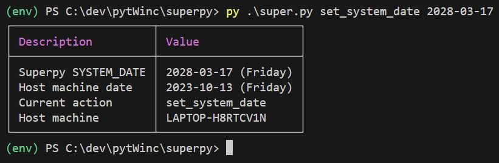
    <br/>
    <br/>

   - step 2: buy bulgur:
    ```py
        py super.py buy bulgur 2.29 -b yesterday -e next_tuesday 
    ```
- legenda:
    - product: bulgur  
    - buy price: &euro; 2.29
    - buy_date: 2028-03-16 equals 'SYSTEM_DATE minus 1 day' 
    - expiry_date: 2028-03-21 equals 'SYSTEM_DATE plus 4 days'   

- console output e.g.:
- 

<br/>
<br/>


### uc 4: buy product that does not expire
quick links: 
-  [Table of contents](#table-of-contents)
-  [Superpy-functionality](#superpy-functionality)
<br/><br/>
   
   - step 1: create mock data: 

    ```py
        py super.py create_mock_data -denr 2 -hp 8.30 -lp 1.23 -mu 5 -nopro 3 -nopri 3 -sl 10 -tt 3 -lby 2028 -lbm 2 -lbd 1 -ubm 3 -ubw 0 -ubd 0 
    ```
    - SYSTEM_DATE becomes '2028-03-17' (on a Friday), because it is automatically set to the middle of this interval.  
    <br/>
    <br/>

   - step 2: buy laundry_detergent:
    ```py
        py super.py buy laundry_detergent 7.77
    ```
- legenda: 
    - product: full_fat_milk --> if 2 or more words, then underscore between the words is mandatory.  
    - buy price: &euro; 7.77
    - buy_date: 2028-03-17, because default is SYSTEM_DATE
    - expiry_date: 'does not expire' as default

- console output e.g.:
- 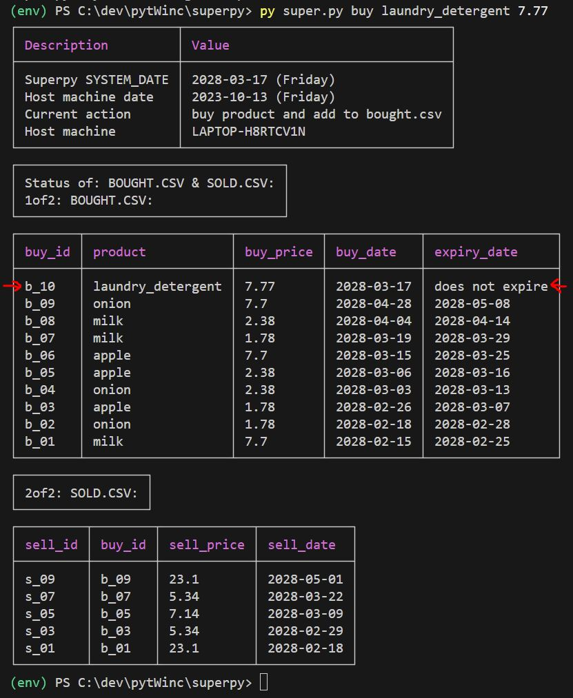

<br/>
<br/>


## Create mock data

quick links: 
-  [Table of contents](#table-of-contents)
-  [Superpy-functionality](#superpy-functionality)
<br/><br/>

### practical 

Goal: use created mock data in bought.csv and sold.csv to quickly show reports (e.g. show_inventory, show_expired_products,    
    show profit, etc. ).
- All 14 arguments are optional, so you can do this:
    ```py
        py super.py create_mock_data
    ```
- result: bought.csv and sold.csv are filled with mockdata that has been created with default values. 
    <br/>
    <br/>

- Use 1 of the following 2 commands to skim through the generated mock data:
    ```py
        py super.py show_bought_csv
        py super.py show_sold_csv
    ```
    <br/>
    <br/>
- Now you can create all reports in Superpy:
    ```py
        py super.py show_bought_csv
        py super.py show_cost
        py super.py show_expired_products
        py super.py show_inventory
        py super.py show_profit
        py super.py show_revenue
        py super.py show_sales_volume
        py super.py show_sold_csv
    ```
<br/>

### theory

This paragraph gives more explanation about the sub-parser create_mock_data.
<br/>
<br/>
Firstly, mock data is created in a time interval (e.g. 2028-02-03 until 2028-04-03 inclusive). The system_date is automatically  
set to the middle of the time interval. Now you can immediately show reports: show_inventory, show_expired_products,    
show profit, etc.
<br/>

Secondly, you can customize the generated mock data by assigning values to the optional arguments:
  - delete_every_nth_row_in_soldcsv
  - highest_price_in_range
  - lowest_price_in_range
  - markup
  - nr_of_products
  - nr_of_prices
  - shelf_life
  - turnover_time
  - upper_boundary_nr_of_months
  - upper_boundary_nr_of_weeks
  - upper_boundary_nr_of_days  
<br/> 

Thirdly, 2 pieces of the mock data are created randomly:
1. the products in the product range. If e.g. number of products, "-nopro" is 8, then 8 products are  
   selected randomly from (...\superpy\data_used_in_superpy\product_list_to_create_product_range.py).
2. the prices in the price range. If e.g. nr of prices, "-nopri" is 12, then 12 prices are created randomly  
   between the lower and upper price boundary, see optional arguments 'lowest_price_in_range' and  
   'highest_price_in_range'.  

   So whenever you create mock data, do not expect the exact same products and prices. 

The next paragraph explains how to set the values to the optional arguments, instead of using their  
default values, like you have done above in previous paragraph 'practical'.
<br/>
<br/>

If you deviate from the default values very often, then you could consider changing the default values themselves.  

* e.g.: suppose you create mock data like this most of the time / very often:
    ```python
        py super.py create_mock_data -denr 3 -hp 1.12 -lp 15.50 -mu 5 -nopro 18 -nopri 12 -sl 15 -tt 3  -ubm 3 -ubw 8 -ubd 6 
    ```
    * legenda: (see paragraph 'Setting the arguments' furter below for more clarity)
      * delete every nth row in sold.csv: 3
      * highest price: 15.50 euro
      * lowest price: 1.12 euro
      * markup: 5
      * nr of prices: 12
      * nr of products: 18
      * shelf life: 15 days
      * turnover time: 3
      * upper boundary in  months: 3
      * upper boundary in weeks: 3
      * upper boundary in days: 6

    * The alternative: first change the default values: (...\superpy\super.py --> goto section 'CONFIGURATION'  
        at start of main.py()):                    
        - DELETE_EVERY_NTH_ROW_IN_SOLDCSV = 3       # -denr 
        - HIGHEST_PRICE_IN_RANGE = 15.50 euro       # -hp
        - LOWEST_PRICE_IN_RANGE = 1.12 euro         # -lp
        - MARKUP = 5                                # -mu
        - NR_OF_PRICES = 12                         # -nopri
        - NR_OF_PRODUCTS = 18                       # -nopro
        - SHELF_LIFE = 15 # days                    # -sl
        - TURNOVER_TIME = 3                         # -tt
        - UPPER_BOUNDARY_NR_OF_MONTHS = 3           # -ubm 
        - UPPER_BOUNDARY_NR_OF_WEEKS = 8            # -ubw 
        - UPPER_BOUNDARY_NR_OF_DAYS = 6             # -ubd  
  
    <br/>

      - Question: how to change the default values of the lower boundary?  
  
      - pitfall: e.g. " -lby 2028 -lbm 2 -lbd 1" as optional arguments  
          to create_mock_data won't change the default values of lower boundary.
      - pitfall: do not assign the following values  
          at the beginning of script super.py: 
          lower_boundary_year = 2028
          lower_boundary_month = 2
          lower_boundary_day = 1

      - Answer: instead do: 

    ```py
    py set_system_date 2028-02-01
    ```  
      <br/>

      Then create mock data with these new default values as follows:

      ```python
          py super.py create_mock_data
      ```
<br/>
<br/>

### setting the arguments
quick links: 
-  [Table of contents](#table-of-contents)
-  [Superpy-functionality](#superpy-functionality)
<br/><br/>

As described in paragraph 'Practical' above, to create reports, you can make do with the default values, so just do:

```py
    py super.py create_mock_data
```

But if you need specific mock data, then this paragraph explains how to assign the optional arguments with specific values.

- e.g.: set a custom value for all optional arguments: run this code in your cli:
    ```py
        py super.py create_mock_data -denr 3 -hp 1.12 -lp 15.50 -mu 5 -nopro 10 -nopri 7 -sl 15 -tt 3 -lby 2028 -lbm 2 -lbd 1 -ubm 3 -ubw 8 -ubd 6 
    ```
- The optional arguments are now explained, one by one. Let's start with 'nr of products':


1. nr of products: -nopro, -nr_of_products:
    - nr of different products in Superpy.
    - minimum value: 1 
    - maximum value: 50 
    - e.g.1:
  
    ```python
    py super.py create_mock_data -nopro 3
    ```
    - product_range: 3 random products: e.g. 'apple', 'cabbage' and 'beetroot' as input to create mock data
    <br />

    - e.g.2:
    ```python
    py super.py create_mock_data -nopro 22
    ```
    - product_range: 22 random products: e.g. 'coffee' and 'potato' as input to create mock data.

<br />
<br/>

2. nr of prices: -nopri, -nr_of_prices:
    - nr of different prices in Superpy.
    - minimum value: 0.00
    - maximum value: N.A.
    - e.g.1:
  
    ```python
    py super.py create_mock_data -nopri 5
    ```
    - legenda: 3 random prices from interval between lower and upper boundary. E.g. [0.79, 3.31, 5,58, 0.21, 1.23]
    <br />

    - e.g.2:
    ```python
    py super.py create_mock_data -nopri 22
    ```
    - legenda: 3 random prices from interval between lower and upper boundary. E.g. [0.79, 3.31, 5,58, 0.21, 1.23, (...)]

<br />
<br/>

3. lowest price in interval: -lp, -lowest_price_in_interval:
    - minimum value: 0.00
    - maximum value: N.A.
    - e.g.1:
  
    ```python
    py super.py create_mock_data -lp 0.49
    ```
    - legenda: lowest price in the mock data is 0.49 euro.
    <br />

    - e.g.2:
    ```python
    py super.py create_mock_data -lp 6.23
    ```
    - legenda: lowest price in the mock data is 6.23 euro.

<br />
<br/>


4. highest price in interval: -hp, -highest_price_in_interval:
    - minimum value: > 0.00
    - maximum value: N.A.
    - e.g.1:
  
    ```python
    py super.py create_mock_data -hp 5.43
    ```
    - legenda: highest price in the mock data is 5.43 euro.
    <br />

    - e.g.2:
    ```python
    py super.py create_mock_data -hp 16.23
    ```
    - legenda: highest price in the mock data is 16.23 euro.

<br />
<br/>


5. delete_every_nth_row: -denr, -delete_every_nth_row:
    - Purpose: deleting rows makes them expire while time travelling:  
        after creating mock data for bought.csv, a copy is made to create sold.csv.  
        Then rows are deleted from sold.csv (e.g. every 3rd row).  
        By time travelling to the future these bought_products (e.g. every 3rd row) will expire.

    - ex1:
    ```python
    py super.py create_mock_data -denr 3
    ```
    - legenda: delete every 3rd row in sold.csv
    
<br />
<br/>

6. shelf_life: -sl, -shelf_life: 

    - e.g.1:
    ```python
    py super.py create_mock_data -sl 10
    ```
    - shelf_life: 10 days
    - result: a bought product will expire after 10 days.
<br />
<br/>

7. turnover_time: -tt, -turnover_time:

    - e.g.1:
    ```python 
    py super.py create_mock_data -tt 4
    ```
    - turnover_time: 4 days
    - result: a a bought product will be sold after 4 days.
<br />
<br/>

8. markup: -mu, -markup:
    - e.g.1:
    ```python
    py super.py create_mock_data -mu 3
    ```
    - markup: factor 3
    - result: if buy_price in bought.csv is 3 euro, then sell_price will be 9 euro in sold.csv.
<br />
<br/>

9. lower boundary year: -lby, -lower_boundary_year:
    - e.g.1:
    ```python
    py super.py create_mock_data -lby 2024
    ```
    - result: lower boundary year of interval is 2024

<br />
<br/>

10. lower boundary month: -lbm, -lower_boundary_month:
    - e.g.1:
    ```python
    py super.py create_mock_data -lbm 10
    ```
    - result: lower boundary month is October

<br />
<br/>

11. lower boundary day: -lbd, -lower_boundary_day:
    - ex1:
    ```python
    py super.py create_mock_data -lbd 15
    ```
    - result: lower boundary day of interval is the 15th day of  the  month

<br />
<br/>

12. upper boundary month: -ubm, -upper_boundary_month:
    - ex1:
    ```python
    py super.py create_mock_data -ubm 3
    ```
    - result: time interval is 3 months, i.e. lower boundary "plus" 3 months.

<br />
<br/>

13. upper boundary week: -ubw, -upper_boundary_week
    - ex1:
    ```python
    py super.py create_mock_data -ubw 8
    ```
    - result: time interval is 8 weeks, i.e. lower boundary "plus" 8 weeks.

<br />
<br/>

14. upper boundary  day: -ubd, -upper_boundary_dayn:
    - ex1:
    ```python
    py super.py create_mock_data -ubd 7
    ```
    - result: time interval is 7 days, i.e. lower boundary "plus" 7 days.

<br/>
<br/>
<br/>


## Delete all transactions in bought.csv and sold.csv

quick links: 
-  [Table of contents](#table-of-contents)
-  [Superpy-functionality](#superpy-functionality)
<br/><br/>
Goal: delete all transaction records in bought.csv and sold.csv

```py
    py super.py delete 
```

- result: all transaction records in bought.csv and sold.csv have been deleted: 
- console output e.g.:
- 

<br /> 
<br /> 
<br /> 

## Reset system date
quick links: 
-  [Table of contents](#table-of-contents)
-  [Superpy-functionality](#superpy-functionality)
<br/><br/>
Goal: reset SYSTEM_DATE to current date of hosting device.

```py
    py super.py reset_system_date 
```

- console output e.g.:
- 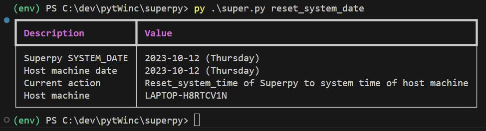 
<br /> 
<br /> 


## Sell Product
quick links: 
-  [Table of contents](#table-of-contents)
-  [Superpy-functionality](#superpy-functionality)
<br/><br/>


- summary:
  - arg1: positional argument product: e.g. apple, potato, full_fat_milk
  - arg2: positional argument price, in &euro;: e.g. 1.24, 0.3, 0.35   
  - arg3: optional argument -sell_date, -s,  with default value SYSTEM_DATE 

<br/><br/>
- Date values must be entered in format YYYY-MM-DD as either:
  1. e.g. 2029-02-03, 2026-11-22, etc,  
   or:
  2.  as a word (exhaustive list):  
    today, tomorrow, overmorrow, yesterday, next_monday (...) next_sunday.
<br /> 
<br /> 


### uc 1: sell a product by its name. 

quick links: 
-  [Table of contents](#table-of-contents)
-  [Superpy-functionality](#superpy-functionality)
<br/><br/>
   
   - step 1: create mock data: 

    ```py
         py super.py create_mock_data -denr 2 -hp 3.29 -lp 0.49 -mu 5 -nopro 6 -nopri 3 -sl 30 -tt 3 -lby 2028 -lbm 1 -lbd 1 -ubm 0 -ubw 4 -ubd 0
    ```
    - SYSTEM_DATE becomes '2028-01-15' (on a Saturday), because it is automatically set to the middle of this interval.  
    <br/>
    <br/>
    - step 2: check the inventory:
    ```py
        py super.py show_inventory -d 2028-01-30
    ```

   - console output e.g.:
   - 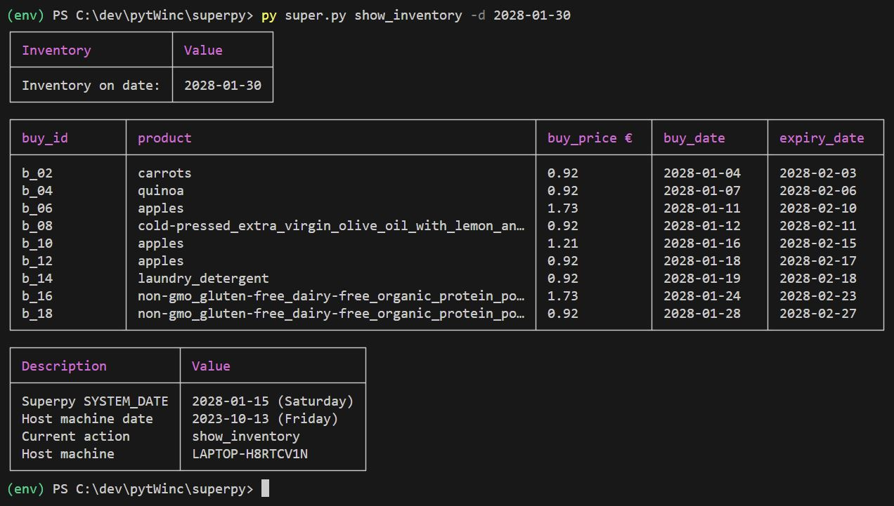

   - step 3: sell a product from the inventory (products different each time you run the code)
    ```py
        py super.py sell quinoa 2.21 -s 2028-01-30
    ```
- legenda: 
    - product: quinoa  
    - sell price: &euro; 2.21
    - sell_date: 2028-01-30

- console output e.g.:
- 

- 

<br/>
<br/>


### uc 2: sell a product with a long name by its buy id. 

quick links: 
-  [Table of contents](#table-of-contents)
-  [Superpy-functionality](#superpy-functionality)
<br/><br/>
   - reason: typing product names such as Cold_Pressed_Extra_Virgin_Olive_Oil_with_Lemon_and_Garlic or  
        Non_GMO_Gluten_Free_Dairy_Free_Organic_Protein_Powder can be time-consuming.  
        If product name is very long, then sell this product with its buy id (e.g. b_08)
   - step 1: create mock data: 

    ```py
        py super.py create_mock_data -denr 2 -hp 3.29 -lp 0.49 -mu 5 -nopro 6 -nopri 3 -sl 30 -tt 3 -lby 2028 -lbm 1 -lbd 1 -ubm 0 -ubw 4 -ubd 0
    ```
    - SYSTEM_DATE becomes '2028-01-15' (on a Saturday), because it is automatically set to the middle of this interval.  
  
  <br/>
  <br/>

    - step 2: check the inventory:

    ```py
        py super.py show_inventory -d 2028-01-30
    ```

   - console output e.g.:
   - 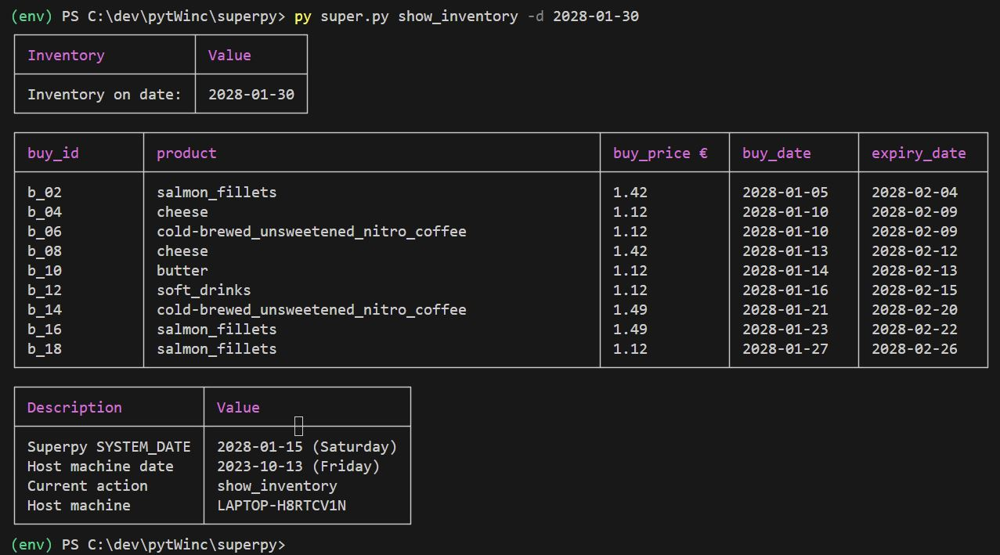

   - step 3: sell a product with a long name from the inventory by its buy id (products different each time you run the code).  
                Choose a sell date between buy date and sell date of the product.
    ```py
        py super.py sell b_14 3.45 -s 2028-01-23
    ```
- legenda: 
    - product: cold-brewed_unsweetened_nitro_coffee  
    - sell price: &euro; 3.45
    - sell_date: 2028-01-23

- console output e.g.:
- 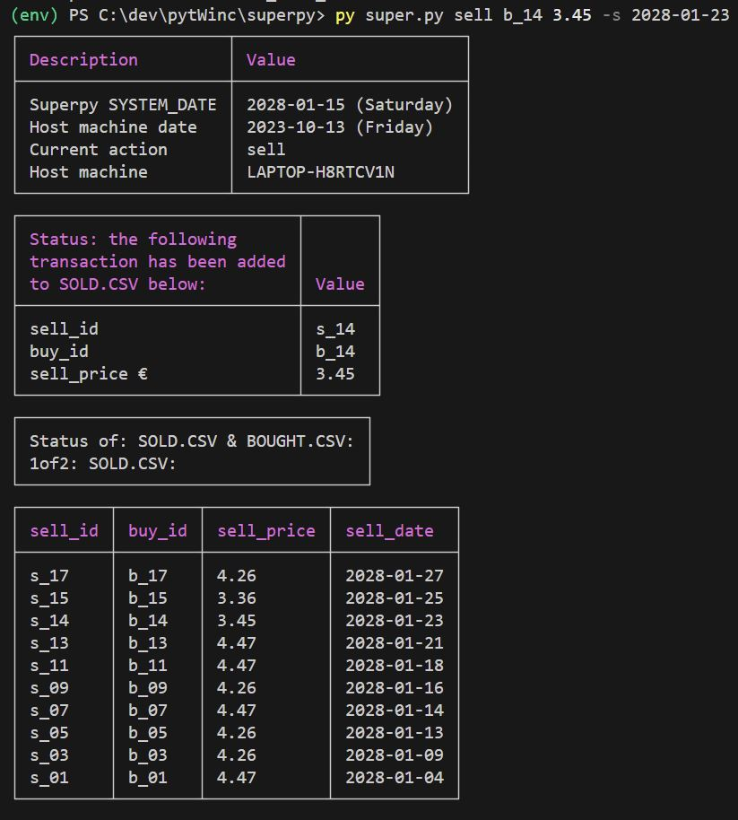

- 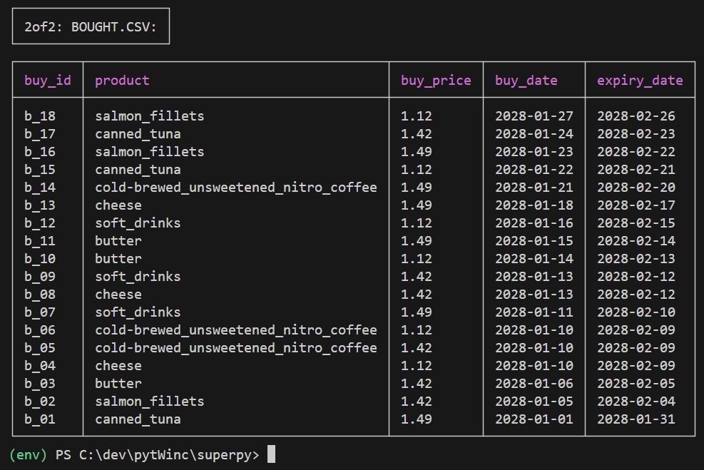

<br/>
<br/>


### uc 3: sell an expired product by its product name. 

quick links: 
-  [Table of contents](#table-of-contents)
-  [Superpy-functionality](#superpy-functionality)
<br/><br/>

   - reason: typing product names such as Cold_Pressed_Extra_Virgin_Olive_Oil_with_Lemon_and_Garlic or  
        Non_GMO_Gluten_Free_Dairy_Free_Organic_Protein_Powder can be time-consuming.  
        If product name is very long, then sell this product with its buy id (e.g. b_08)
   - step 1: create mock data: 

    ```py
        py super.py create_mock_data -denr 2 -hp 3.29 -lp 0.49 -mu 5 -nopro 12 -nopri 10 -sl 30 -tt 3 -lby 2028 -lbm 1 -lbd 1 -ubm 6 -ubw 0 -ubd 0
    ```
    - SYSTEM_DATE becomes '2028-04-01' (on a Saturday), because it is automatically set to the middle of this interval.  
    <br/>
    <br/>
    - step 1: check the inventory and the list  with expired products:
    ```py
        py super.py show_inventory 
        py super.py show_expired_products 
    ```
   - date: default value is SYSTEM_DATE for both.
   - console output e.g.:
   - 
   - 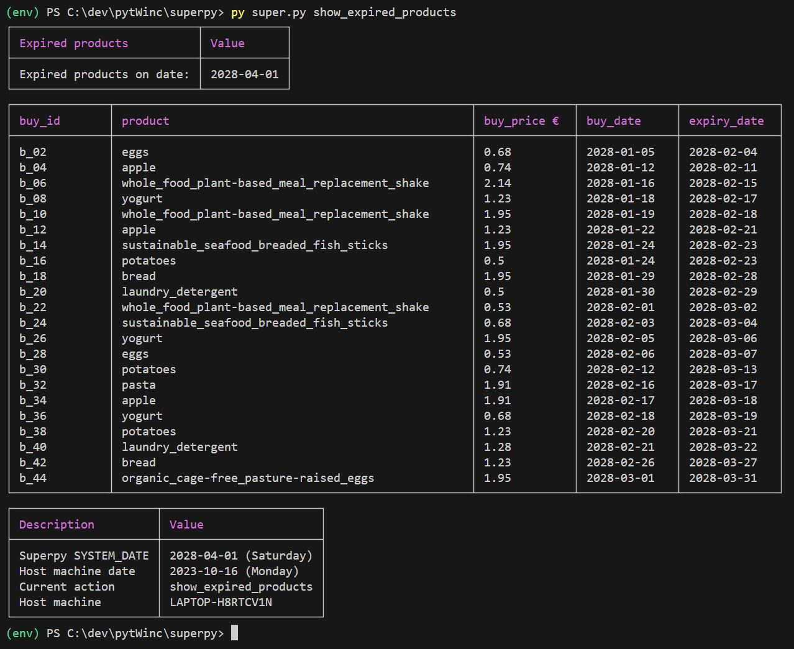


   - step 3: sell a product that is in the list with expired products, but not in the inventory  
        (products different each time you run the code). So here in the screenshots  above you could  choose eggs  or  
        apple. 
    ```py
        py super.py sell eggs -s 3.45 
    ```
- legenda: 
    - product: eggs
    - sell price: &euro; 3.45
    - sell_date: default value is SYSTEM_DATE

- console output e.g.:
- 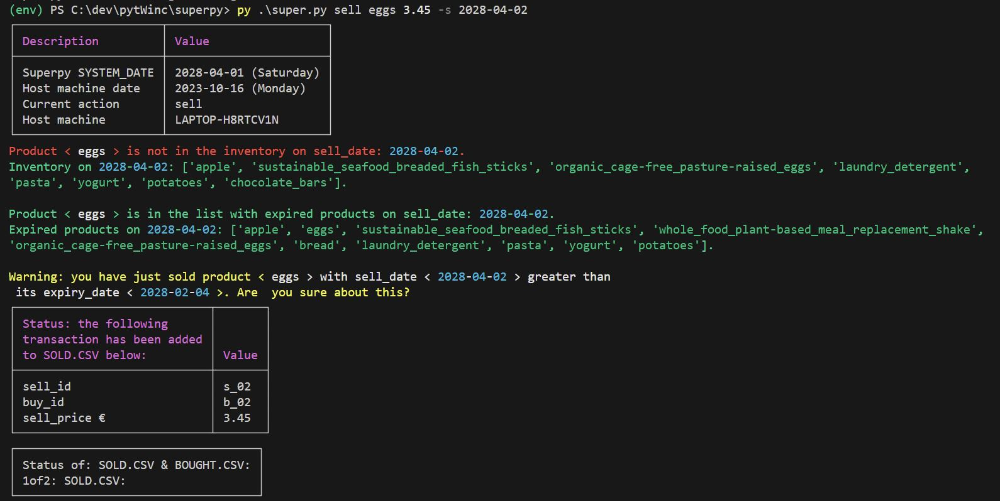

- 
- (...plus rest of sold.csv and beneath it bought.csv)

- Remark: If you try to sell a product with a buy id of a product that has expired, then  
    the sale will proceed and you will see a similar warning message as well. 
<br/>
<br/>


### uc 4: sell a product at a loss (by its product name)

quick links: 
-  [Table of contents](#table-of-contents)
-  [Superpy-functionality](#superpy-functionality)
<br/><br/>
   
   - step 1: create mock data: 

    ```py
        py super.py create_mock_data -denr 2 -lby 2028 -lbm 1 -lbd 1 -lp 0.49 -hp 3.29  -nopro 6 -nopri 3 -sl 30 -ubd 0 -ubw 4
    ```
    - SYSTEM_DATE becomes '2028-01-15' (on a Saturday), because it is automatically set to the middle of this interval.  
    <br/>
    <br/>
    - step 2: check the inventory:
    ```py
        py super.py show_inventory -d 2028-01-30
    ```

   - console output e.g.:
   - 

   - step 3: sell a product from the inventory. Be aware that same product can be in the list multiple times with different prices.  
        Sell price must be lower than each of them. (remark: products different each time you run the code).  
        Select a sell date between buy date and expiry date. 
    ```py
        py super.py sell pasta 0.53 -s 2028-01-20
    ```
- legenda: 
    - product: pasta  
    - sell price: &euro; 0.53
    - sell_date: 2028-01-20

- console output e.g.:
- 

- 

<br/>
<br/>


### uc 5: sell a product that is not in Superpy product range altogether

quick links: 
-  [Table of contents](#table-of-contents)
-  [Superpy-functionality](#superpy-functionality)
<br/><br/>
   
   - step 1: create mock data: 

    ```py
        py super.py create_mock_data -denr 2 -hp 3.29 -lp 0.49 -mu 5 -nopro 8 -nopri 3 -sl 30 -tt 3 -lby 2028 -lbm 1 -lbd 1 -ubm 0 -ubw 4 -ubd 0
    ```
    - SYSTEM_DATE becomes '2028-01-15' (on a Saturday), because it is automatically set to the middle of this interval.  
    <br/>
    <br/>
    - step 2: choose a product that is not in the product range:
    ```py
        py super.py show_bought_csv
    ```

   - console output e.g.:
   - 

   - step 3: sell a product from the inventory that is in the list only once (products different each time you run the code)
    ```py
        py super.py sell Takikomi_gohan 19.73 -s 2028-01-30
    ```
- legenda: 
    - product: Takikomi_gohan --> not in product range: see (...superpy\data_used_in_superpy\product_list_to_create_product_range.py)  
    - sell price: &euro; 19.73
    - sell_date: 2028-01-30

- console output e.g.:
- 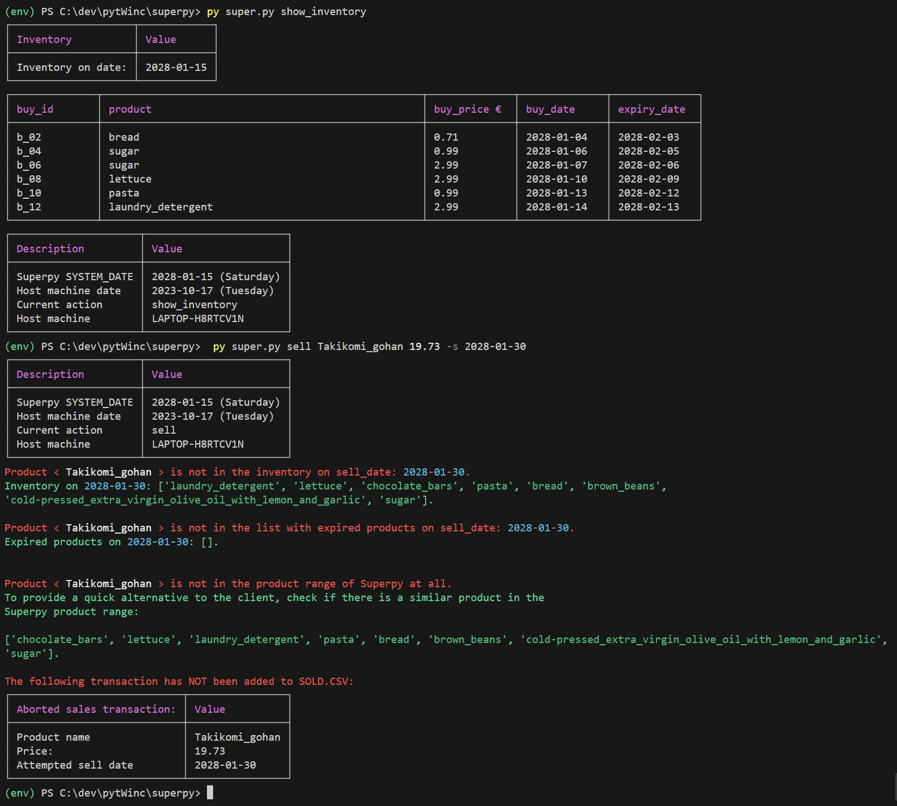

- Remark: If you try to sell a product with a non-existing buy id (e.g. buy_id 1234567891011), then  
    you will see a similar error message. 
<br/>
<br/>


### uc 6: sell a product that is not in inventory nor list with expired products, but does exist in product range

quick links: 
-  [Table of contents](#table-of-contents)
-  [Superpy-functionality](#superpy-functionality)
<br/><br/>
   
   - step 1: create mock data: 

    ```py
        py super.py create_mock_data -denr 2 -hp 3.29 -lp 0.49 -mu 5 -nopro 8 -nopri 3 -sl 30 -tt 3 -lby 2028 -lbm 1 -lbd 1 -ubm 8 -ubw 4 -ubd 0
    ```
    - SYSTEM_DATE becomes '2028-05-16' (on a Saturday), because it is automatically set to the middle of this interval.  
    <br/>
    <br/>
    - step 2: look  for a product that is in bought.csv, but not in the inventory nor in list with expired products:
    ```py
        py super.py show_bought_csv
        py super.py show_inventory
        py super.py show_expired_products
    ```

   - console output e.g.:
   - 
    <br/>

   - 
    <br/>

   - 

   - step 3: In this data e.g. cookies, bulgur or sugar is such a product (products different each time you run the code)
    ```py
        py super.py sell bulgur 5.34 
    ```
- legenda: 
    - product: cheese 
    - sell price: &euro; 7.34
    - sell_date: 2028-05-16, because default value is SYSTEM_DATE

- console output e.g.:
- 


<br/>
<br/>


### uc 7: sell a product that has already been sold

quick links: 
-  [Table of contents](#table-of-contents)
-  [Superpy-functionality](#superpy-functionality)
<br/><br/>
   
   - step 1: create mock data: 

    ```py
        py super.py create_mock_data -denr 2 -hp 3.29 -lp 0.49 -mu 5 -nopro 3 -nopri 3 -sl 30 -tt 3 -lby 2028 -lbm 1 -lbd 1 -ubm 8 -ubw 4 -ubd 0
    ```
    - SYSTEM_DATE becomes '2028-05-16' (on a Saturday), because it is automatically set to the middle of this interval.  
    <br/>
    <br/>
    
   - console output e.g.:
   - 


   - step 2: select a product that as already been sold. In this data all buy ids with uneven numbers  
        have already been sold. (products different each time you run the code)
   - step 3: Try to sell an already sold product again:
    ```py
        py super.py sell b_03 11.34
    ```
- legenda: 
    - product: cheese 
    - sell price: &euro; 11.34
    - sell_date: 2028-05-16, because default value is SYSTEM_DATE

- console output e.g.:
- 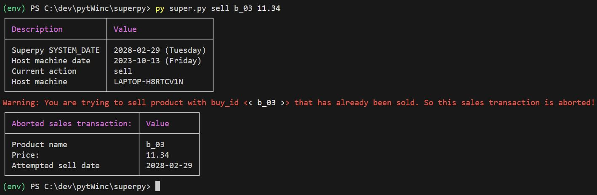

<br/> 
<br /> 
<br /> 


## Set system date
quick links: 
-  [Table of contents](#table-of-contents)
-  [Superpy-functionality](#superpy-functionality)
<br/><br/>

Goal: set_system_date_to a specific date in the file system_date.txt 

- There are 2 ways to set the SYSTEM_DATE to the past or future:
  1. sub-parser travel_time --> see chapter  'Set travel time' further below.
  2. sub-parser set_system_date --> scope of this chapter.


- summary:
  - arg1: positional argument date: e.g. 2028-06-30
  - arg2: positional argument price, in &euro;: e.g. 1.24, 0.3, 0.35   
  - arg3: optional argument -sell_date, -s,  with default value system_date 

- Date values must be entered in format YYYY-MM-DD as either:
  1. e.g. 2029-02-03, 2026-11-22, etc,  
   or:
  2.  as a word (exhaustive list):  
    today, tomorrow, overmorrow, yesterday, next_monday (...) next_sunday.  
    examples:
    ```python
        py super.py set_system_date 2026-09-27
        py super.py set_system_date 2022-10-15
        py super.py set_system_date yesterday
        py super.py set_system_date tomorrow
        py super.py set_system_date next_thursday
    ```
    trick question: what is the problem here?
    ```py
        py super.py set_system_date today
    ```
    Answer: 'today' refers to the current SYSTEM_DATE, so this line of code works,  
    but it does not change anything. 

<br /> 
<br /> 

### uc 1: set SYSTEM_DATE to a custom date
quick links: 
-  [Table of contents](#table-of-contents)
-  [Superpy-functionality](#superpy-functionality)
<br/><br/>

Save the date!...or well...set the SYSTEM_DATE to a custom date: 

```py
    py super.py set_system_date 2028-08-18
```
- result: 'Superpy system_date is set to date: 2028-08-18'

- console output e.g.:
- 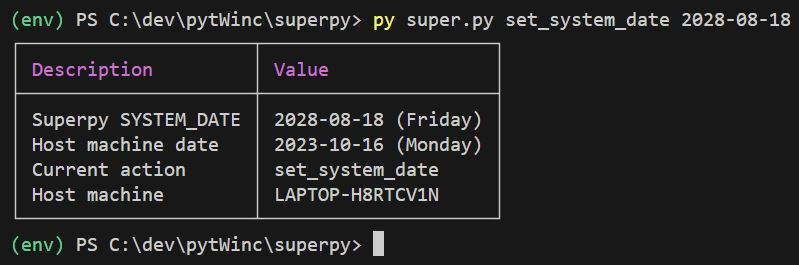 
<br /> 
<br /> 


### uc 2: travel from end to start of year
quick links: 
-  [Table of contents](#table-of-contents)
-  [Superpy-functionality](#superpy-functionality)
<br/><br/>

   - step 1: Create mock data:

    ```py
        py super.py create_mock_data -denr 2 -hp 18.30 -lp 5.23 -mu 19 -nopro 45 -nopri 38 -sl 10 -tt 3 -lby 2028 -lbm 1 -lbd 1 -ubm 12 -ubw 0 -ubd 0
        py super.py show_system_date
    ```
   - SYSTEM_DATE becomes '2028-07-02' (on a Friday), because it is automatically set to the middle of this interval.  
    Advantage: all reports show relevant data.
   - console output e.g.:
   - 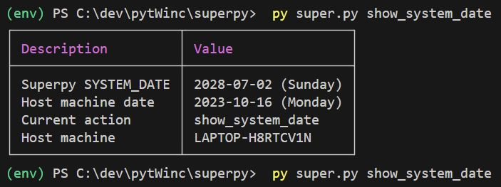 
  <br /> 
  <br /> 

  - step 2: set SYSTEM_DATE:
    ```py
        py super.py set_system_date 2028-12-31
    ```
  - result: SYSTEM_DATE is with value  at the end of the interval on 2028-12-31

  - console output e.g.:
  - 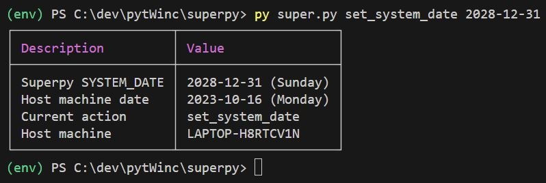 
  <br /> 
  <br /> 

  - step 3: read 1 or more of the reports on New Year's Eve 2028. Make note of the values  
    (e.g. sales volume: 118, profit: Euro 118.000, etc.).  
    No need to look at all of them, 2 or so is enough. In a next steps you will time travel towards New Year's Day 2028  
    and notice that the financial numbers for profit, revenue, cost, sales volume and expired products decrease. Only inventory will  
    remain constant.  
    <br/>

    ```python
        py super.py show_profit
        py super.py show_revenue
        py super.py show_cost
        py super.py show_sales_volume
        py super.py show_expired_products
        py super.py show_inventory
    ```
  - console output e.g.:
  - 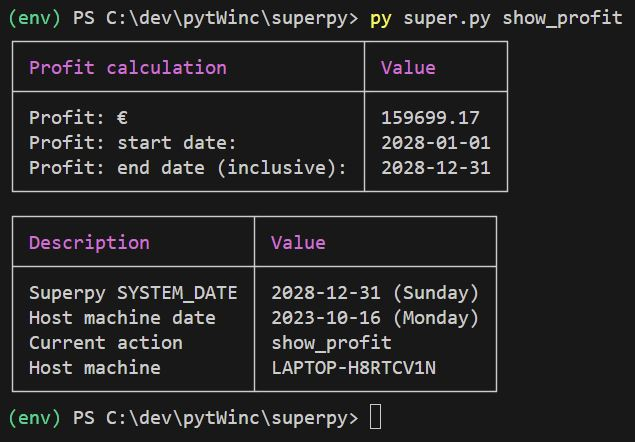 
  <br /> 
  <br /> 

  - step 4: Let's bend time and space, by time traveling 4 months back to the past:
    ```py
        py super.py set_system_date 2028-08-31
    ```

  - step 5: again read (some of) the same reports and make notes, but this time on 2028-08-31:
    ```python
        py super.py show_profit
        py super.py show_revenue
        py super.py show_cost
        py super.py show_sales_volume
        py super.py show_expired_products
        py super.py show_inventory
    ```  
  - result: nr of expired products, cost, sales volume, revenue and profit are lower than on 2028-12-31. But  
    the inventory will be roughly the same. 
  - console output e.g.:
  - 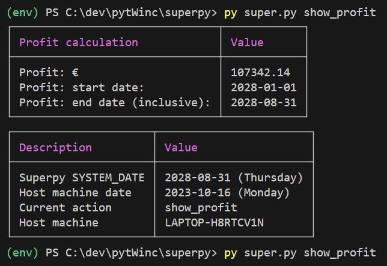 
  <br /> 
  <br /> 


  - step 6: again, travel 4 months back to the past:
    ```py
        py super.py set_system_date 2028-04-30
    ```
  - step 7: read (some of) the reports on 2028-04-30  and make notes.
  - result: all numbers (cost, profit, etc.) lower than on 2028-08-31
  - console output e.g.:
  - 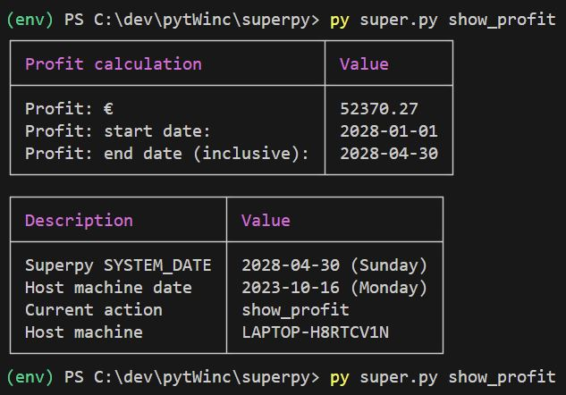 
  <br /> 
  <br /> 

  - step 7: travel 4 months back to the past, to the start of the interval on New Year's Day 2028:
    ```py
        py super.py set_system_date 2028-01-01
    ```
  - step 8: read (some of) the reports on 2028-01-01  and make notes.
  - 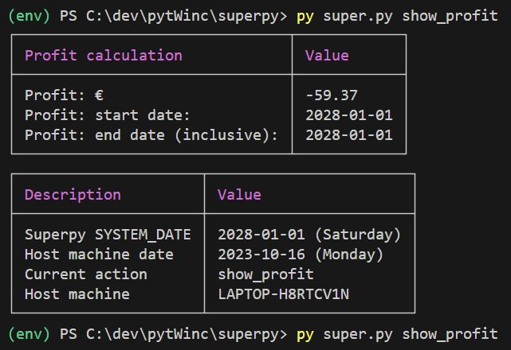 

  - result: on New Year's Day 2028 there is a loss of &euro; 59.37. Reason: sub-parser create_mock_data the turnover time '-tt'  
    is set to 3. That means if a products are bought on day 1 of the interval (they are), then they will be sold on day 4. In  
    other words: no products are sold during the first 3 days of 2028. But owing to the huge markup '-mu' of 19,  
    the products sold on day 4 already create a net profit. From day 4 onwards to New Year's Eve 2028 the profit increases. 
    <br />

  - step 9: (optional) Go back to the  future with trimester-leaps and notice the numbers going up again: e.g.:
    ```python
        py super.py set_system_date 2028-03-31
        py super.py show_profit
        py super.py set_system_date 2028-06-30
        py super.py show_profit
        py super.py set_system_date 2028-09-30
        py super.py show_profit
        py super.py set_system_date 2028-12-31
        py super.py show_profit
    ``` 
<br />
<br />
<br /> 


## Show bought csv
quick links: 
-  [Table of contents](#table-of-contents)
-  [Superpy-functionality](#superpy-functionality)
<br/><br/>

Goal: show all data from bought.csv in the console:

1. step 1: preparation: create mock data: 

    ```py
        py super.py create_mock_data -denr 2 -hp 18.30 -lp 5.23 -mu 19 -nopro 4 -nopri 4 -sl 10 -tt 3 -lby 2028 -lbm 1 -lbd 1 -ubm 3 -ubw 0 -ubd 0 
    ```

2. step 2: 
    ```py
        py super.py show_bought_csv
    ```

- console output e.g.:
- 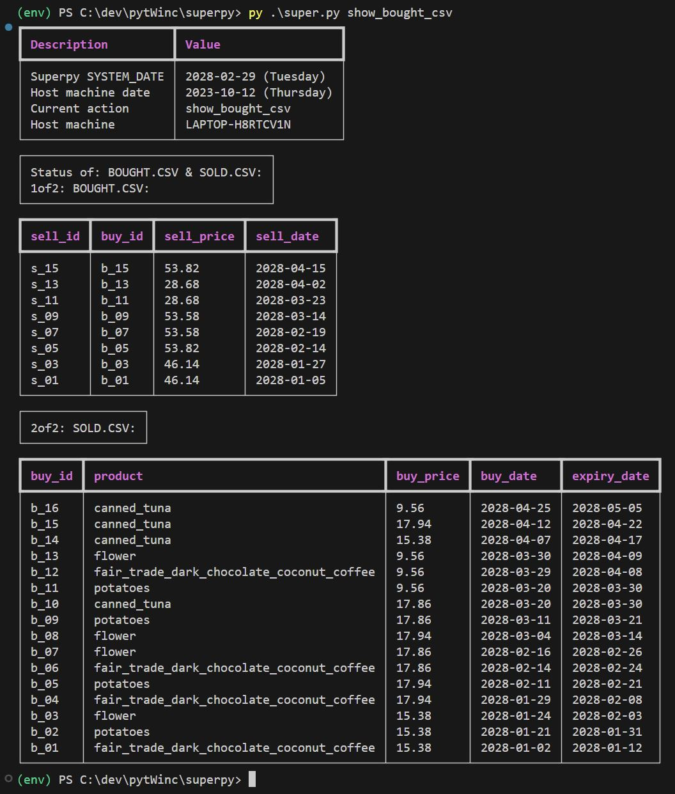 
<br/> 
<br/> 
<br/>

## Show cost
quick links: 
-  [Table of contents](#table-of-contents)
-  [Superpy-functionality](#superpy-functionality)
<br/><br/>

Goal: show cost in time range between start_date and end_date inclusive


### prep for all ucs: 
quick links: 
-  [Table of contents](#table-of-contents)
-  [Superpy-functionality](#superpy-functionality)
<br/><br/>

    - step 1: create mock data:
  
    ```py
        py super.py create_mock_data -denr 2 -hp 18.30 -lp 5.23 -mu 19 -nopro 40 -nopri 25 -sl 10 -tt 3 -lby 2028 -lbm 2 -lbd 1 -ubm 3 -ubw 0 -ubd 0
    ```
    - SYSTEM_DATE becomes '2028-03-17' (on a Friday), because it is automatically set to the middle of this interval.  
        Advantage: all reports show relevant data.
    <br/>
    <br/>

### uc 1: show cost with default values
quick links: 
-  [Table of contents](#table-of-contents)
-  [Superpy-functionality](#superpy-functionality)
<br/><br/>

    - step 1: Do preparation at start of paragraph Show cost.
    - step 2: show cost:

    ```py
        py super.py show_cost
    ```
    - result: start_date: 2028-01-01 --> default value for lower boundary is the start of the  
        financial year. Financial year is January 1st of the year that contains SYSTEM_DATE.  
        reason: often you need to know the cost of the current financial year starting at January 1st.

    - result: end_date: 2028-03-27 --> equal to SYSTEM_DATE, because SYSTEM_DATE is default value.  
        reason: often you need to know the cost until the SYSTEM_DATE inclusive.  
  
   - console output e.g.:
   - 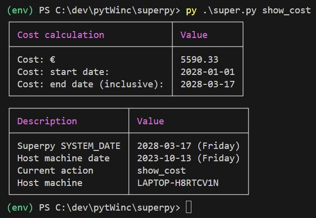 
   <br /> 
   <br /> 

### uc 2: show cost in custom interval
quick links: 
-  [Table of contents](#table-of-contents)
-  [Superpy-functionality](#superpy-functionality)
<br/><br/>

    - step 1: Do preparation at start of paragraph Show cost.
    - step 2: show cost:

    ```py
        py super.py show_cost -sd 2028-02-15 -ed 2028-03-15 
    ```
   -   start_date: 2028-02-15, 
   -   end_date: 2028-03-15
   -   Console output:  e.g.:
   -   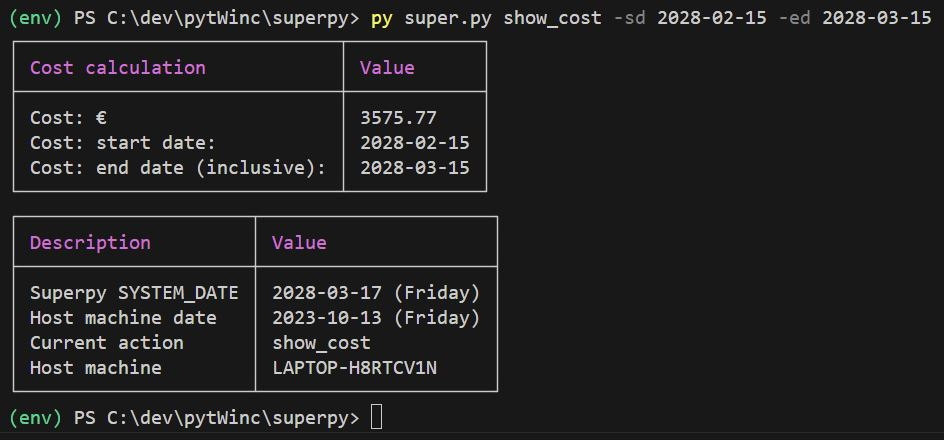 
<br /> 
<br/>


### uc 3: show cost from start of financial year up until next Tuesday
quick links: 
-  [Table of contents](#table-of-contents)
-  [Superpy-functionality](#superpy-functionality)
<br/><br/>

    - step 1: Do preparation at start of paragraph Show cost.
    - step 2: show cost:
  
    ```py
        py super.py show_cost -ed next_tuesday
    ```
   -   start_date: 2028-01-01  --> default is start of the financial that contains the SYSTEM_DATE.   
   -   end_date: 2028-03-21 (Tuesday)
   -    
<br /> 
<br/> 

### uc 4: show cost from custom date until system date
quick links: 
-  [Table of contents](#table-of-contents)
-  [Superpy-functionality](#superpy-functionality)
<br/><br/>

    - step 1: Do preparation at start of paragraph Show cost.
    - step 2: show cost:

    ```py
        py super.py show_cost -sd 2028-03-01
    ```
   -   start_date: 2023-07-01 
   -   end_date: system_date as default value has value 2028-02-17 
   -   Console output:  e.g.:
   -    
<br /> 
<br/>

### uc 5: show cost with custom interval in words
quick links: 
-  [Table of contents](#table-of-contents)
-  [Superpy-functionality](#superpy-functionality)
<br/><br/>

    - step 1: Do preparation at start of paragraph Show cost.
    - step 2: show cost:

    ```py
        py super.py show_cost -sd yesterday -ed next_friday
    ```

   -   start_date: 2028-03-16 equals 'SYSTEM_DATE minus 1 day' 
   -   end_date:  2028-03-24 equals 'SYSTEM_DATE plus 7 days' 
   -   Console output:  e.g.:
   -    
<br /> 
<br /> 
<br /> 


## Show expired products
quick links: 
-  [Table of contents](#table-of-contents)
-  [Superpy-functionality](#superpy-functionality)
<br/><br/>
Goal: calculate expired products on a day in format 'YYYY-MM-DD' (e.g. 2023-09-18)

### prep for all ucs: 
quick links: 
-  [Table of contents](#table-of-contents)
-  [Superpy-functionality](#superpy-functionality)
<br/><br/>

    - step 1: create mock data:

    ```py
        py super.py create_mock_data -denr 2 -hp 18.30 -lp 5.23 -mu 19 -nopro 6 -nopri 8 -sl 10 -tt 3 -lby 2028 -lbm 2 -lbd 1 -ubm 3 -ubw 0 -ubd 0
    ```
    - SYSTEM_DATE becomes '2028-03-17' (on a Friday), because it is automatically set to the middle of this interval.  
        Advantage: all reports show relevant data.
    <br/>
    <br/>

### uc 1: show expired products with default value
quick links: 
-  [Table of contents](#table-of-contents)
-  [Superpy-functionality](#superpy-functionality)
<br/><br/>

    - step 1: Do preparation at start of paragraph 'Show expiry date'.
    - step 2: show expired products:

    ```py
        py super.py show_expired_products 
    ```

    - expiry_date: 2028-03-27 --> because SYSTEM_DATE is default value.  
        reason: often you need to know the expired products on SYSTEM_DATE, in other words: the products  
        that have expired up until today.   
  
   - console output e.g.:
   - 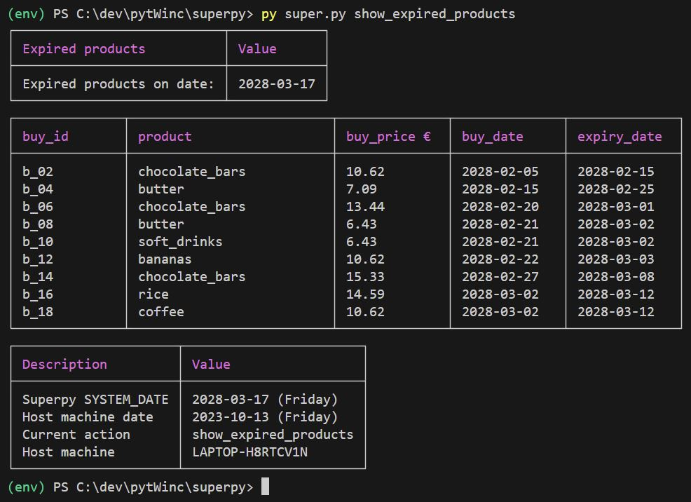 
   <br /> 
   <br /> 

### uc 2: show expired products with custom date
quick links: 
-  [Table of contents](#table-of-contents)
-  [Superpy-functionality](#superpy-functionality)
<br/><br/>

    - step 1: Do preparation at start of paragraph 'Show expiry date'.
    - step 2: show expired products:

    ```py
        py super.py show_expired_products -d 2028-04-10 
    ```
   -   expiry_date: 2028-04-10 
   -   Console output:  e.g.:
   -   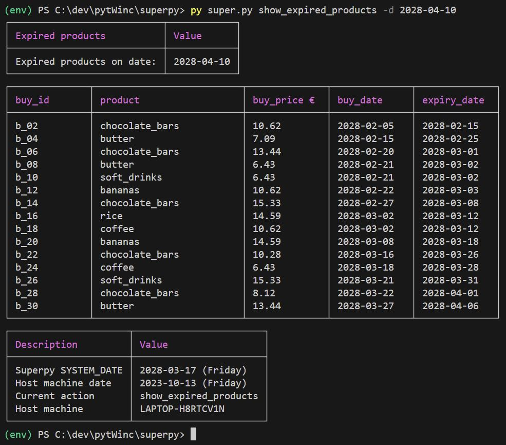 
<br /> 
<br/>

### uc 3: show expired products with custom date in words
quick links: 
-  [Table of contents](#table-of-contents)
-  [Superpy-functionality](#superpy-functionality)
<br/><br/>

    - step 1: Do preparation at start of paragraph 'Show expiry date'.
    - step 2: show expired products:
  
    ```py
        py super.py show_expired_products -d overmorrow
    ```
   -   expiry_date: date: 2028-02-19  --> SYSTEM_DATE is 2028-02-17, so overmorrow equals 'SYSTEM_DATE plus 2 days'.   
   -   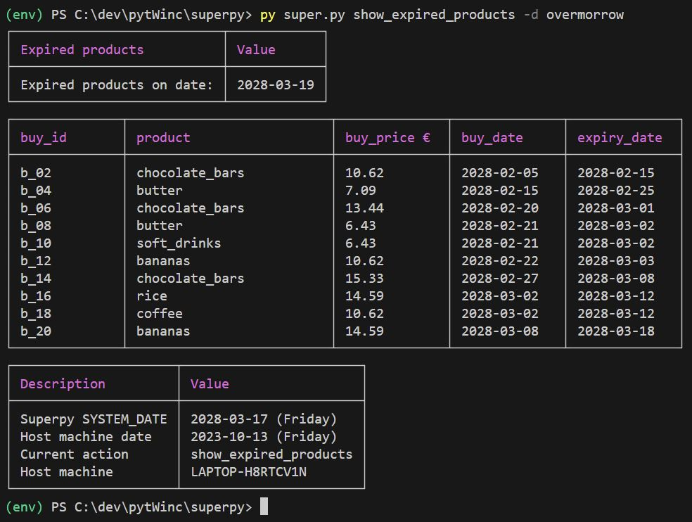 
<br /> 
<br/> 
<br /> 


## Show inventory
quick links: 
-  [Table of contents](#table-of-contents)
-  [Superpy-functionality](#superpy-functionality)
<br/><br/>
Goal: calculate inventory on a day in format 'YYYY-MM-DD' (e.g. 2023-09-18)

### prep for all ucs: 
quick links: 
-  [Table of contents](#table-of-contents)
-  [Superpy-functionality](#superpy-functionality)
<br/><br/>

    - step 1: create mock data:

    ```py
        py super.py create_mock_data -denr 2 -hp 18.30 -lp 5.23 -mu 19 -nopro 26 -nopri 18 -sl 10 -tt 3 -lby 2028 -lbm 2 -lbd 1 -ubm 3 -ubw 0 -ubd 0
    ```
    - SYSTEM_DATE becomes '2028-03-17' (on a Friday), because it is automatically set to the middle of this interval.  
        Advantage: all reports show relevant data.
    <br/>
    <br/>

### uc 1: show inventory with default value
quick links: 
-  [Table of contents](#table-of-contents)
-  [Superpy-functionality](#superpy-functionality)
<br/><br/>

    - step 1: Do preparation at start of paragraph 'Show inventory'.
    - step 2: show inventory:

    ```py
        py super.py show_inventory 
    ```

    - date: 2028-03-17 --> because SYSTEM_DATE is default value.  
        reason: often you need to know the inventory on SYSTEM_DATE, in other words: the products  
        that are in stock today.   
  
   - console output e.g.:
   - 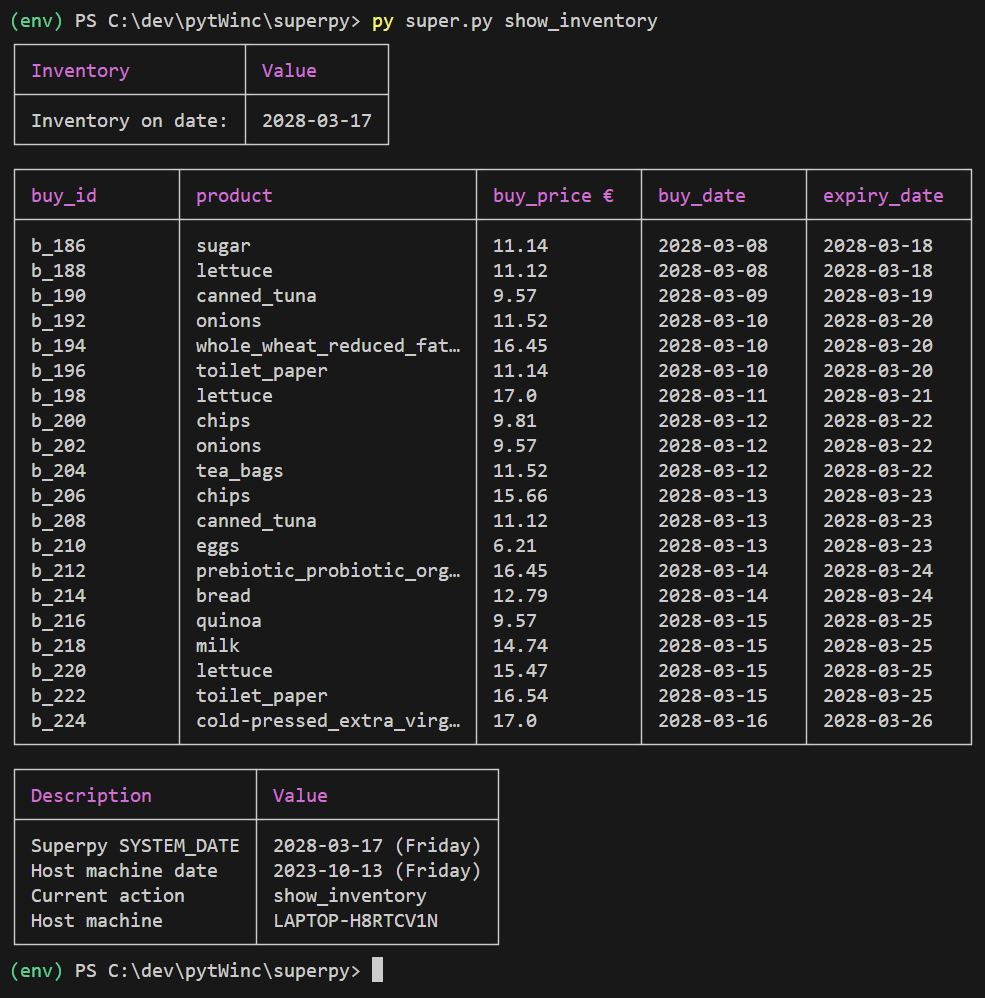 
   <br /> 
   <br /> 

### uc 2: show inventory with custom date
quick links: 
-  [Table of contents](#table-of-contents)
-  [Superpy-functionality](#superpy-functionality)
<br/><br/>

    - step 1: Do preparation at start of paragraph 'Show inventory'.
    - step 2: show inventory:

    ```py
        py super.py show_inventory -d 2028-04-10 
    ```
   -   date: 2028-04-10 
   -   Console output:  e.g.:
   -    
<br /> 
<br/>

### uc 3: show inventory with custom date in words
quick links: 
-  [Table of contents](#table-of-contents)
-  [Superpy-functionality](#superpy-functionality)
<br/><br/>

    - step 1: Do preparation at start of paragraph 'Show inventory'.
    - step 2: show inventory:

    ```py
        py super.py show_inventory -d overmorrow
    ```
   -   date: 2028-02-19  --> SYSTEM_DATE is 2028-02-17, so overmorrow equals 'SYSTEM_DATE plus 2 days'.   
   -    
<br /> 
<br/> 
<br /> 


## Show profit

quick links: 
-  [Table of contents](#table-of-contents)
-  [Superpy-functionality](#superpy-functionality)
<br/><br/>

Goal show profit in time range between start_date and end_date inclusive

### prep for first 5 ucs: 
quick links: 
-  [Table of contents](#table-of-contents)
-  [Superpy-functionality](#superpy-functionality)
<br/><br/>

    - step 1: create mock data:

    ```py
        py super.py create_mock_data -denr 2 -hp 18.30 -lp 5.23 -mu 4 -nopro 26 -nopri 18 -sl 10 -tt 3 -lby 2028 -lbm 2 -lbd 1 -ubm 3 -ubw 0 -ubd 0
    ```
    - SYSTEM_DATE becomes '2028-03-17' (on a Friday), because it is automatically set to the middle of this interval.  
        Advantage: all reports show relevant data.
    <br/>
    <br/>

### uc 1: show profit with default values
quick links: 
-  [Table of contents](#table-of-contents)
-  [Superpy-functionality](#superpy-functionality)
<br/><br/>

    - step 1: Do preparation at start of paragraph 'Show profit'.
    - step 2: show profit:

    ```py
        py super.py show_profit
    ```
    - start_date: 2028-01-01 --> default value for lower boundary is the start of the  
        financial year. Financial year is January 1st of the year that contains SYSTEM_DATE.  
        reason: often you need to know the profit of the current financial year starting at January 1st.

    - end_date: 2028-03-17 --> equal to SYSTEM_DATE, because SYSTEM_DATE is default value.  
        reason: often you need to know the profit until the SYSTEM_DATE inclusive.  
  
   - console output e.g.:
   - 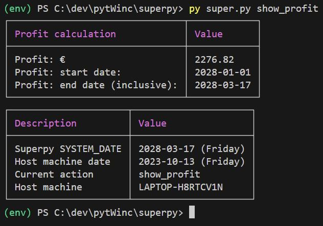 
   <br /> 
   <br /> 

### uc 2: show profit in custom interval
quick links: 
-  [Table of contents](#table-of-contents)
-  [Superpy-functionality](#superpy-functionality)
<br/><br/>

    - step 1: Do preparation at start of paragraph 'Show profit'.
    - step 2: show profit:

    ```py
        py super.py show_profit -sd 2028-02-15 -ed 2028-03-15 
    ```
   -   start_date: 2028-02-15, 
   -   end_date: 2028-03-15
   -   Console output:  e.g.:
   -   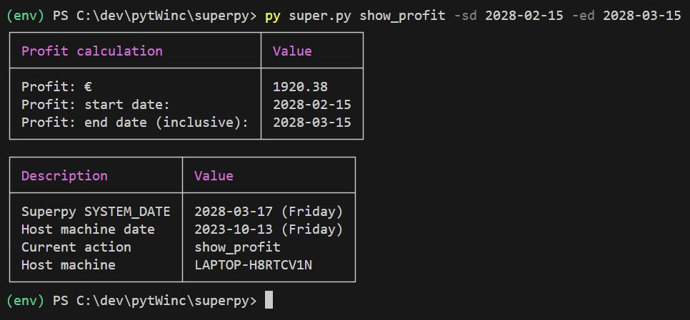 
<br /> 
<br/>

### uc 3: show profit from start of financial year up until next Tuesday
quick links: 
-  [Table of contents](#table-of-contents)
-  [Superpy-functionality](#superpy-functionality)
<br/><br/>

    - step 1: Do preparation at start of paragraph 'Show profit'.
    - step 2: show profit:

    ```py
        py super.py show_profit -ed next_tuesday
    ```
   -   start_date: 2028-01-01  --> default is start of the financial that contains the SYSTEM_DATE.   
   -   end_date: 2028-03-21 (Tuesday)
   -    
<br /> 
<br/> 

### uc 4: show profit from custom date until system date
quick links: 
-  [Table of contents](#table-of-contents)
-  [Superpy-functionality](#superpy-functionality)
<br/><br/>

    - step 1: Do preparation at start of paragraph 'Show profit'.
    - step 2: show profit:

    ```py
        py super.py show_sales_volume -sd 2028-03-01
    ```
   -   start_date: 2023-07-01 
   -   end_date: system_date as default value has value 2028-02-17 
   -   Console output:  e.g.:
   -   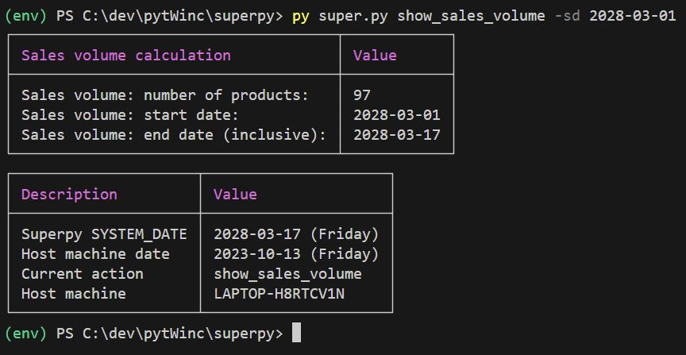 
<br /> 
<br/>

### uc 5: show profit with custom interval in words
quick links: 
-  [Table of contents](#table-of-contents)
-  [Superpy-functionality](#superpy-functionality)
<br/><br/>

    - step 1: Do preparation at start of paragraph 'Show profit'.
    - step 2: show profit:

    ```py
        py super.py show_profit -sd yesterday -ed next_friday
    ```

   -   start_date: 2028-03-16 equals 'SYSTEM_DATE minus 1 day' 
   -   end_date:  2028-03-24 equals 'SYSTEM_DATE plus 4 days' 
   -   Console output:  e.g.:
   -    
<br /> 
<br /> 

### uc 6: suffer a considerable loss
quick links: 
-  [Table of contents](#table-of-contents)
-  [Superpy-functionality](#superpy-functionality)
<br/><br/>

- intro: oh no, financial trouble lies ahead! Competition, inflation,  
        regulation, lack of innovation, no sustainable competitive advantages...
<br />

- step 1: create mock data with a markup of 0.1. that means we are going to have a hard-earned revenue  
        of &euro; 10 for each &euro; 100 of costs that we incur...  
- step 2: create mock data:
```py
    py super.py create_mock_data -denr 2 -hp 18.30 -lp 5.23 -mu 0.1 -nopro 50 -nopri 85 -sl 10 -tt 3 -lby 2028 -lbm 2 -lbd 1 -ubm 4 -ubw 0 -ubd 0
```
- step 3: ...and in these trying times we want to have a solid understanding of our financial position:
```python
    py super.py show_sales_volume -ed 2028-05-31
    py super.py show_revenue -ed 2028-05-31
    py super.py show_cost -ed 2028-05-31
``` 
- step 4: and now the final verdict of 4 months of hard work in the supermarket...
```python
    py super.py show_profit -ed 2028-05-31
```  
- Hang in there...

### uc 7: make a huge profit
quick links: 
-  [Table of contents](#table-of-contents)
-  [Superpy-functionality](#superpy-functionality)
<br/><br/>

- intro: hardship no more, everything our supermarket touches, turns into gold.  
        Finally, profit, cashflow, return on investment and happy shareholders...
<br />

- step 1: create mock data with a markup of 36.7. that means we are going to have a well-deserved royal revenue  
        of &euro; 36.7  for  each euro of costs that we incur... Let the big bucks come rolling in...  
- step 1: create mock data:
```py
    py super.py create_mock_data -denr 2 -hp 18.30 -lp 5.23 -mu 36.7 -nopro 50 -nopri 85 -sl 10 -tt 3 -lby 2028 -lbm 6 -lbd 1 -ubm 4 -ubw 0 -ubd 0
```
- step 2: ... on cloud nine we want to have a solid understanding of our financial position as well:
```python
    py super.py show_sales_volume -sd 2028-06-01 -ed 2028-09-30
    py super.py show_revenue -sd 2028-06-01 -ed 2028-09-30
    py super.py show_cost -sd 2028-06-01 -ed 2028-09-30
``` 
- remark: if you skip the start date of2028-06-01, then the default value 2028-01-01 will be used as start date.  
  However, in this situation, the results will be exactly the same.

- step 3: and again the final verdict about 4 months of hard work in the supermarket...
```python
    py super.py show_profit -sd 2028-06-01 -ed 2028-09-30
``` 

- Let's savor this moment and relish the taste of success...


<br />
<br />

## Show revenue

quick links: 
-  [Table of contents](#table-of-contents)
-  [Superpy-functionality](#superpy-functionality)
<br/><br/>

Goal: show revenue in time range between start_date and end_date inclusive

### prep for all ucs: 
quick links: 
-  [Table of contents](#table-of-contents)
-  [Superpy-functionality](#superpy-functionality)
<br/><br/>

    - step 1: create mock data:

    ```py
        py super.py create_mock_data -denr 2 -hp 18.30 -lp 5.23 -mu 36.7 -nopro 40 -nopri 85 -sl 10 -tt 3 -lby 2028 -lbm 2 -lbd 1 -ubm 3 -ubw 0 -ubd 0
    ```
    - SYSTEM_DATE becomes '2028-03-17' (on a Friday), because it is automatically set to the middle of this interval.  
        Advantage: all reports show relevant data.
    <br/>
    <br/>

### uc 1: show revenue with default values
quick links: 
-  [Table of contents](#table-of-contents)
-  [Superpy-functionality](#superpy-functionality)
<br/><br/>

    - step 1: Do preparation at start of paragraph 'Show revenue'.
    - step 2: show revenue:

    ```py
        py super.py show_revenue
    ```
    - start_date: 2028-01-01 --> default value for lower boundary is the start of the  
        financial year. Financial year is January 1st of the year that contains SYSTEM_DATE.  
        reason: often you need to know the revenue of the current financial year starting at January 1st.

    - end_date: 2028-03-17 --> equal to SYSTEM_DATE, because SYSTEM_DATE is default value.  
        reason: often you need to know the revenue until the SYSTEM_DATE inclusive.  
  
   - console output e.g.:
   -  
   <br /> 
   <br /> 

### uc 2: show revenue in custom interval
quick links: 
-  [Table of contents](#table-of-contents)
-  [Superpy-functionality](#superpy-functionality)
<br/><br/>

    - step 1: Do preparation at start of paragraph 'Show revenue'.
    - step 2: show revenue:

    ```py
        py super.py show_revenue -sd 2028-02-15 -ed 2028-03-15 
    ```
   -   start_date: 2028-02-15, 
   -   end_date: 2028-03-15
   -   Console output:  e.g.:
   -    
<br /> 
<br/>

### uc 3: show revenue from start of financial year up until next Tuesday
quick links: 
-  [Table of contents](#table-of-contents)
-  [Superpy-functionality](#superpy-functionality)
<br/><br/>

    - step 1: Do preparation at start of paragraph 'Show revenue'.
    - step 2: show revenue:

    ```py
        py super.py show_revenue -ed next_tuesday
    ```
   -   start_date: 2028-01-01  --> default is start of the financial that contains the SYSTEM_DATE.   
   -   end_date: 2028-03-21 (Tuesday)
   -    
<br /> 
<br/> 

### uc 4: show revenue from custom date until system date
quick links: 
-  [Table of contents](#table-of-contents)
-  [Superpy-functionality](#superpy-functionality)
<br/><br/>

    - step 1: Do preparation at start of paragraph 'Show revenue'.
    - step 2: show revenue:

    ```py
        py super.py show_revenue -sd 2028-03-01
    ```
   -   start_date: 2023-07-01 
   -   end_date: system_date as default value has value 2028-02-17 
   -   Console output:  e.g.:
   -   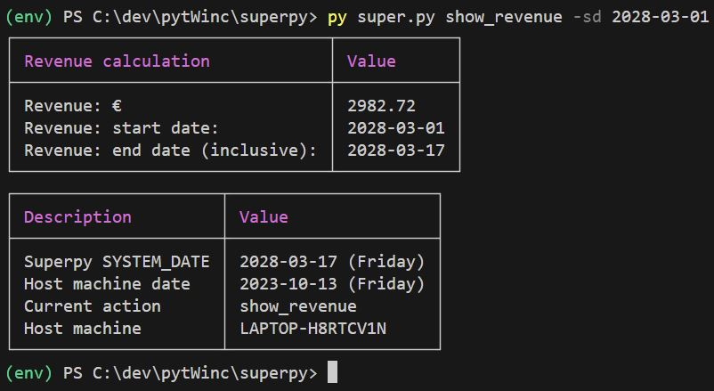 
<br /> 
<br/>

### uc 5: show revenue with custom interval in words
quick links: 
-  [Table of contents](#table-of-contents)
-  [Superpy-functionality](#superpy-functionality)
<br/><br/>

    - step 1: Do preparation at start of paragraph 'Show revenue'.
    - step 2: show revenue:
  
1. uc: :
    ```py
        py super.py show_revenue -sd yesterday -ed next_friday
    ```

   -   start_date: 2028-03-16 equals 'SYSTEM_DATE minus 1 day' 
   -   end_date:  2028-03-24 equals 'SYSTEM_DATE plus 4 days' 
   -   Console output:  e.g.:
   -    
<br /> 
<br /> 
<br /> 


## Show sales volume

quick links: 
-  [Table of contents](#table-of-contents)
-  [Superpy-functionality](#superpy-functionality)
<br/><br/>

Goal: show sales volume in time range between start_date and end_date inclusive

### prep for all ucs: 
quick links: 
-  [Table of contents](#table-of-contents)
-  [Superpy-functionality](#superpy-functionality)
<br/><br/>

    - step 1: create mock data:

    ```py
        py super.py create_mock_data -denr 2 -hp 18.30 -lp 5.23 -mu 36.7 -nopro 40 -nopri 85 -sl 10 -tt 3 -lby 2028 -lbm 2 -lbd 1 -ubm 3 -ubw 0 -ubd 0
    ```
    - SYSTEM_DATE becomes '2028-03-17' (on a Friday), because it is automatically set to the middle of this interval.  
        Advantage: all reports show relevant data.
    <br/>
    <br/>

### uc 1: show sales volume with default values
quick links: 
-  [Table of contents](#table-of-contents)
-  [Superpy-functionality](#superpy-functionality)
<br/><br/>

    - step 1: Do preparation at start of paragraph 'Show sales volume'.
    - step 2: show sales volume:

    ```py
        py super.py show_sales_volume
    ```
    - start_date: 2028-01-01 --> default value for lower boundary is the start of the  
        financial year. Financial year is January 1st of the year that contains SYSTEM_DATE.  
        reason: often you need to know the sales volume of the current financial year starting at January 1st.

    - end_date: 2028-03-17 --> equal to SYSTEM_DATE, because SYSTEM_DATE is default value.  
        reason: often you need to know the sales volume until the SYSTEM_DATE inclusive.  
  
   - console output e.g.:
   -  
   <br /> 
   <br /> 

### uc 2: show sales volume in custom interval
quick links: 
-  [Table of contents](#table-of-contents)
-  [Superpy-functionality](#superpy-functionality)
<br/><br/>

    - step 1: Do preparation at start of paragraph 'Show sales volume'.
    - step 2: show sales volume:

    ```py
        py super.py show_sales_volume -sd 2028-02-15 -ed 2028-03-15 
    ```
   -   start_date: 2028-02-15, 
   -   end_date: 2028-03-15
   -   Console output:  e.g.:
   -    
<br /> 
<br/>

### uc 3: show sales volume from  start of financial year up until next Tuesday
quick links: 
-  [Table of contents](#table-of-contents)
-  [Superpy-functionality](#superpy-functionality)
<br/><br/>

    - step 1: Do preparation at start of paragraph 'Show sales volume'.
    - step 2: show sales volume:

    ```py
        py super.py show_sales_volume -ed next_tuesday
    ```
   -   start_date: 2028-01-01  --> default is start of the financial that contains the SYSTEM_DATE.   
   -   end_date: 2028-03-21 (Tuesday)
   -    
<br /> 
<br/> 

### uc 4: show sales volume from custom date until system date
quick links: 
-  [Table of contents](#table-of-contents)
-  [Superpy-functionality](#superpy-functionality)
<br/><br/>

    - step 1: Do preparation at start of paragraph 'Show sales volume'.
    - step 2: show sales volume:

    ```py
        py super.py show_sales_volume -sd 2028-03-01
    ```
   -   start_date: 2023-07-01 
   -   end_date: system_date as default value has value 2028-02-17 
   -   Console output:  e.g.:
   -    
<br /> 
<br/>

### uc 5: show sales volume with custom interval in words
quick links: 
-  [Table of contents](#table-of-contents)
-  [Superpy-functionality](#superpy-functionality)
<br/><br/>

    - step 1: Do preparation at start of paragraph 'Show sales volume'.
    - step 2: show sales volume:

    ```py
        py super.py show_sales_volume -sd yesterday -ed next_friday
    ```

   -   start_date: 2028-03-16 equals 'SYSTEM_DATE minus 1 day' 
   -   end_date:  2028-03-24 equals 'SYSTEM_DATE plus 4 days' 
   -   Console output:  e.g.:
   -   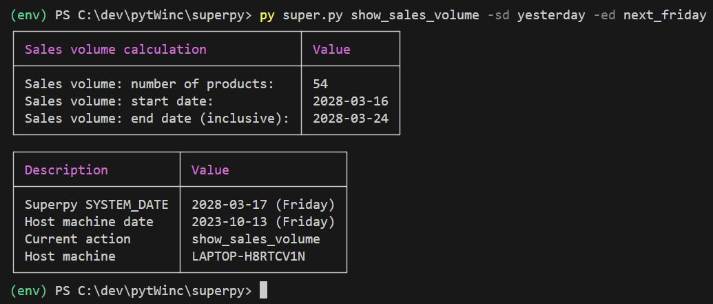 
<br /> 
<br /> 
<br /> 


## Show sold csv

quick links: 
-  [Table of contents](#table-of-contents)
-  [Superpy-functionality](#superpy-functionality)
<br/><br/>

Goal: show all data from sold.csv in the console:

1. step 1: preparation: create mock data: 

    ```py
       py super.py create_mock_data -denr 2 -hp 18.30 -lp 5.23 -mu 3 -nopro 4 -nopri 4 -sl 10 -tt 3 -lby 2028 -lbm 1 -lbd 1 -ubm 3 -ubw 0 -ubd 0 
    ```

2. step 2: 
    ```py
        py super.py show_bought_csv
    ```

- console output e.g.:
- 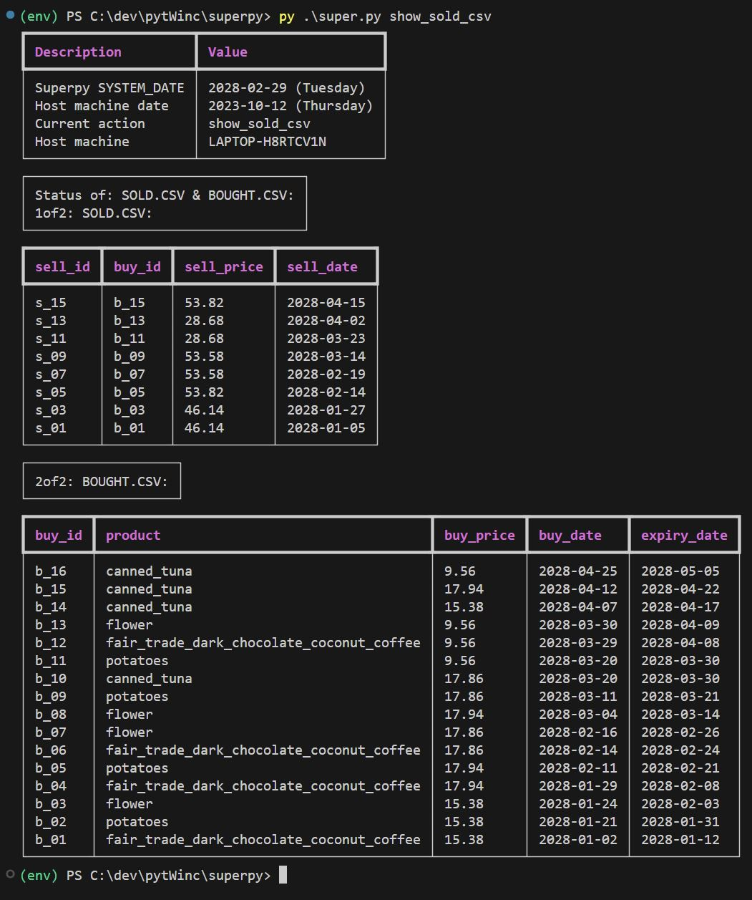 
<br /> 
<br /> 


## Show system date

quick links: 
-  [Table of contents](#table-of-contents)
-  [Superpy-functionality](#superpy-functionality)
<br/><br/>

Goal: show SYSTEM_DATE in the console:


### uc 1: show system date after reset of system date
quick links: 
-  [Table of contents](#table-of-contents)
-  [Superpy-functionality](#superpy-functionality)
<br/><br/>

   - step 1: reset system date: 
   ```py
    py super.py reset_system_date 
   ```
   - console output e.g.:
   - 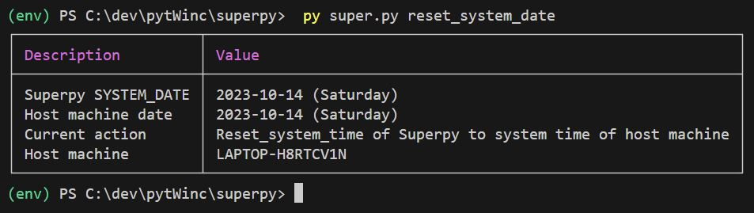 
   - step 2: 
   ```py
    py super.py show_system_date
   ```
   - result: SYSTEM_DATE equal to system_date on host machine.
   - console output e.g.:
   - 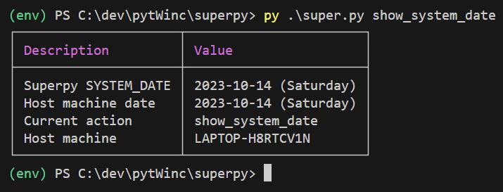 
<br /> 
<br /> 

### uc 2: show system date after creating mock data
quick links: 
-  [Table of contents](#table-of-contents)
-  [Superpy-functionality](#superpy-functionality)
<br/><br/>

   - step 1: reset system date: 

    ```py
        py super.py create_mock_data -denr 2 -hp 18.30 -lp 5.23 -mu 4 -nopro 4 -nopri 2 -sl 10 -tt 3 -lby 2028 -lbm 10 -lbd 1 -ubm 3 -ubw 0 -ubd 0
    ```
   - console output e.g.:
   - 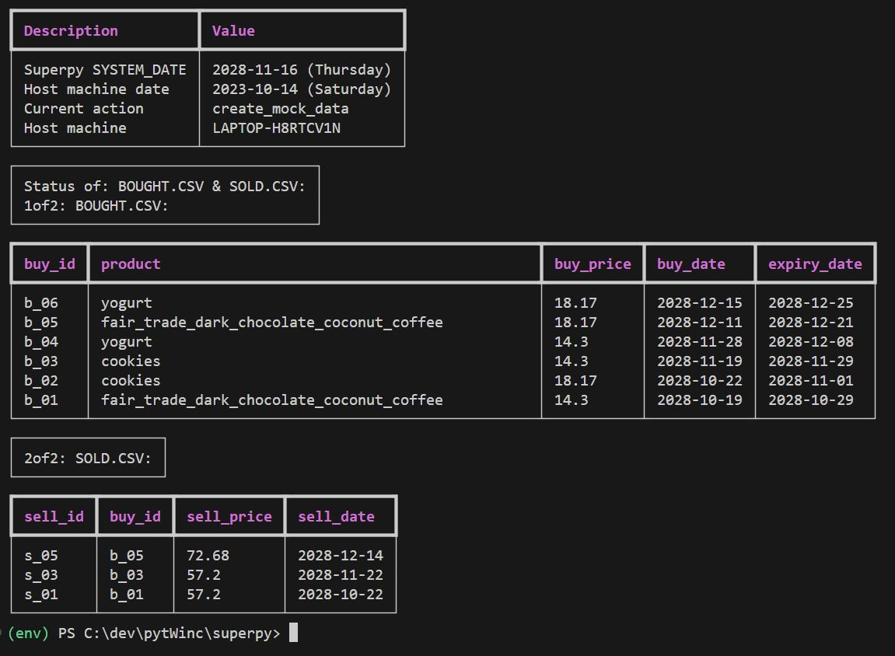
  
    - step 2: 
    ```py
        py super.py show_system_date
    ```
   - console output e.g.:
   - 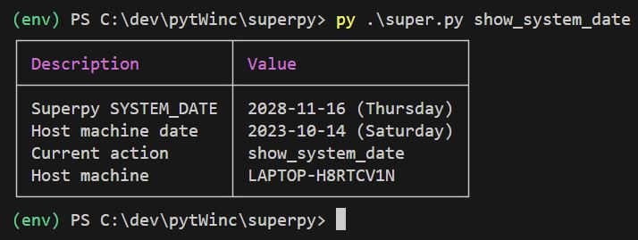     
    - result: SYSTEM_DATE has value '2028-11-16', because SYSTEM_DATE is set to the middle of the interval in which  
        data has been created to fill bought.csv and sold.csv.
<br /> 
<br /> 

### uc 3: set SYSTEM_DATE to custom date
quick links: 
-  [Table of contents](#table-of-contents)
-  [Superpy-functionality](#superpy-functionality)
<br/><br/>

   - step 1: set system date: 

   ```py
     py super.py set_system_date 2029-01-02
   ```
   - console output e.g.:
   - 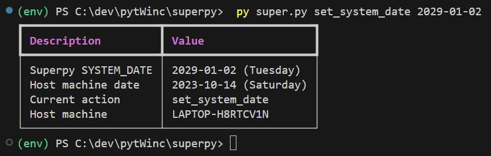  
  
   - step 2: 
   ```py
     py super.py show_system_date
   ```
   - result: 
   - console output e.g.:
   - 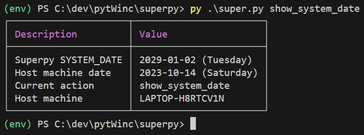 
  
   - step 3: now let's change SYSTEM_DATE to 1 day earlier, i.e. to 2029-01-01 instead:
   ```py
      py super.py set_system_date yesterday
   ```
   - console output e.g.:
   - 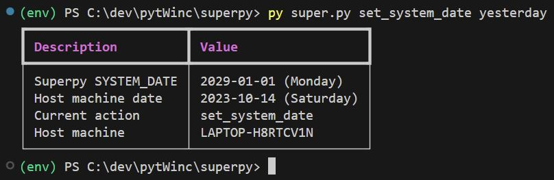 

   - step 2: 
   ```py
      py super.py show_system_date
   ```
   - result: 

   - console output e.g.:
   - 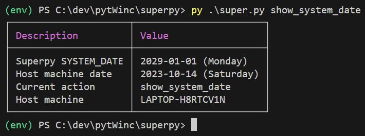 
<br /> 
<br /> 
<br />


## Travel time

quick links: 
-  [Table of contents](#table-of-contents)
-  [Superpy-functionality](#superpy-functionality)
<br/><br/>

- goal: change system_date by adding or subtracting nr of day(s)

- There are 2 ways to set the SYSTEM_DATE to the past or future:
  1. sub-parser travel_time --> scope of this chapter.
  2. sub-parser set_system_date --> see chapter  'Set system date' above.


### uc 1: update SYSTEM_DATE to a custom date
quick links: 
-  [Table of contents](#table-of-contents)
-  [Superpy-functionality](#superpy-functionality)
<br/><br/>

   - step 1: set SYSTEM_DATE: 
  
        ```py
            py super.py set_system_date 2028-03-31
        ```
    - result: 'Superpy system_date is set to date: 2028-03-31

    - console output e.g.:
    - 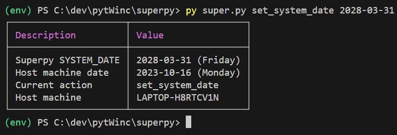 
    <br /> 
    <br /> 

    - step 2: travel 3 weeks into the future:
        ```py
            py super.py travel_time 21
        ```
    - result: 'Superpy system_date is set to date: 2028-04-21 
    - console output e.g.:
    - 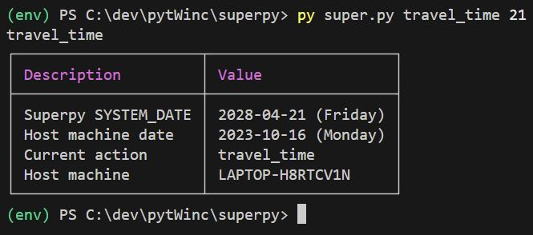 
    <br /> 
    <br /> 

    - step 3: travel 10 days back into the past:
        ```py
            py super.py travel_time -10
        ```
    - result: 'Superpy system_date is set to date: 2028-04-11 
    - console output e.g.:
    - 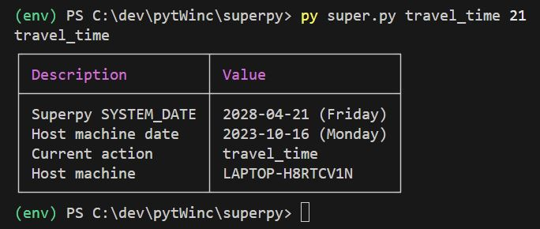 
    <br /> 
    <br /> 

### uc 2: travel from start to end of year

  - step 1: Create mock data:

    ```py
        py super.py create_mock_data -denr 2 -hp 18.30 -lp 5.23 -mu 4 -nopro 50 -nopri 68 -sl 10 -tt 5 -lby 2029 -lbm 1 -lbd 1 -ubm 12 -ubw 0 -ubd 0
        py super.py show_system_date
    ```
  - SYSTEM_DATE becomes '2029-07-02' (on a Friday), because it is automatically set to the middle of this interval.  
    Advantage: all reports show relevant data.
      - console output e.g.:
  - 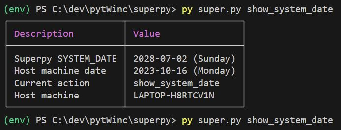 
  <br /> 
  <br /> 

  - step 2: set SYSTEM_DATE:
    ```py
        py super.py set_system_date 2029-01-01
    ```
  - result: SYSTEM_DATE is with value  at the end of the interval on 2029-01-01

  - console output e.g.:
  - 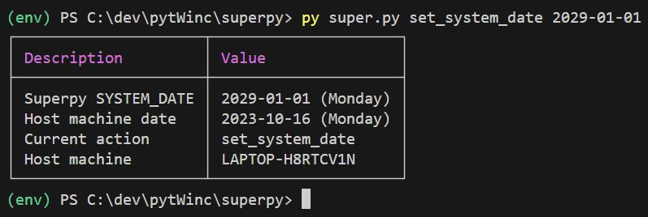 
  <br /> 
  <br /> 

  - step 3: read 1 or more of the reports on New Year's Day 2029. Make note of the values  
    (e.g. sales volume: 118, profit: Euro 118.000, etc.).  
    No need to look at all of them, 2 or so is enough. In a next steps you will time travel towards New Year's Eve 2029  
    and notice that the financial numbers for profit, revenue, cost, sales volume and expired products increase.  
    Only inventory will remain constant.

    ```python
        py super.py show_profit
        py super.py show_revenue
        py super.py show_cost
        py super.py show_sales_volume
        py super.py show_expired_products
        py super.py show_inventory
    ```
  - console output e.g.:
  - 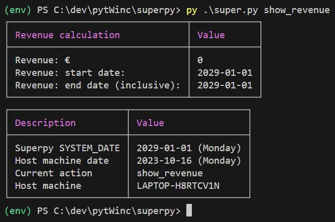 


  - result: on New Year's Day 2029 there is a revenue of &euro; 0. Reason: sub-parser create_mock_data the turnover time '-tt'  
    is set to 5. That means if products are bought on day 1 of the interval, then they will be sold on day 6. In  
    other words: no products are sold during the first 5 days of 2029. From January 6 2029 onwards to New Year's Eve 2029  
    the revenue increases.

  <br /> 
  <br /> 

  - step 4: Let's bend time and space, by time traveling 4 months back to the past:
    ```py
        py super.py travel_time 119 # leap year
    ```

  - step 5: again read (some of) the same reports and make notes, but this time on 2028-04-30:
    ```python
        py super.py show_profit
        py super.py show_revenue
        py super.py show_cost
        py super.py show_sales_volume
        py super.py show_expired_products
        py super.py show_inventory
    ```  
  - result: nr of expired products, cost, sales volume, revenue and profit are higher than on 2029-01-01. But  
    the inventory will be roughly the same. 
  - console output e.g.:
  - 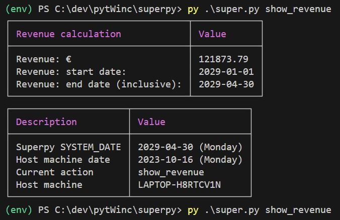 
  <br /> 
  <br /> 


  - step 6: again, travel 4 months into the future:
    ```py
        py super.py travel_time 123
    ```
  - step 7: read (some of) the reports on 2028-08-31  and make notes.
  - result: all numbers (cost, profit, etc.) higher than on 2028-08-31
  - console output e.g.:
  - 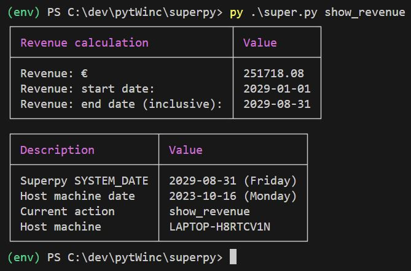 
  <br /> 
  <br /> 

  - step 7: travel another 4 months into the future, to the end of the interval on New Year's Eve 2029:
    ```py
        py super.py travel_time 122  
    ```
  - step 8: read (some of) the reports on 2029-12-31  and make notes.
  - result: The financial numbers (cost, profit, etc.) as well as inventory and expired products  
    of the entire financial year 2029 are now available on New Year's Eve 2029.
  - 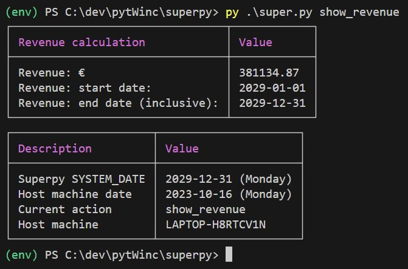 
  <br /> 
  <br /> 

  - step 9: (optional) Go back to the past with semester-leaps and notice the financial  
        numbers going down again: e.g.:
    ```python
        py super.py travel_time -183
        py super.py show_revenue
        py super.py travel_time -183
        py super.py show_revenue
    ``` 
<br />
<br /> 
<br /> 


# DEFINITIONS
[Table of contents](#table-of-contents)
<br/> 

## argument in argparse
[Table of contents](#table-of-contents)
<br/> 
- argument (in argparse) == value that is passed to a command.
    ex: py super.py buy apple 0.39 -bd today -expd 2023-10-12  
        --> arguments: 0.39 , today , 2023-10-12
    ex: py super.py sell b_11 0.79 -sd tomorrow  
        --> arguments: 0.79 , tomorrow
    
    2 types of arguments:  
    - positional arguments --> see positional argument. 
    - optional argument --> see optional argument. 
<br/>
<br/>


## command in argparse
[Table of contents](#table-of-contents)
<br/> 

- command (in argparse) == specific action that the program can perform.  
    ex: py super.py buy apple 0.39 -bd today -expd 2023-10-12  
        --> command is buy
    ex: py super.py sell b_11 0.79 -sd tomorrow  
        --> command is sell   
<br/>
<br/>

## cost
[Table of contents](#table-of-contents)
<br/> 
- cost == sum of all buy prices of all bought products in a certain time_interval. 
    * e.g.: 
    ```python
        py super.py show_cost -sd 2024-03-18 -ed 2024-08-20
    ```
    * legenda: show cost between 2024-03-18 and 2024-08-20 inclusive.
<br/>
<br/>

## date
[Table of contents](#table-of-contents)
<br/> 
- date == calendar day in format YYYY-MM-DD, e.g. 2028-01-18.  
- In Superpy each date is a date object with string representation in  
  format: '%Y-%m-%d', e.g. '2025-10-15'.  
- --> SYSTEM_DATE is a date with a special purpose. See SYSTEM_DATE below. 
<br/>
<br/>


## default values
[Table of contents](#table-of-contents)
<br/> 

All commands use default values: 

### uc 1: buy a product
quick links: 
-  [Table of contents](#table-of-contents)
-  [Superpy-functionality](#superpy-functionality)
<br/><br/>

1. e.g. with default values:
    ```python
    py super.py buy newspaper 0.29 
    ```
- explanation: buy_date (== -bd) has default value SYSTEM_DATE (can be e.g. 2025-11-23).
- explanation: expiry_date (== -expd) has default value 'no expiry date'
<br/>
<br/>

2.  e.g. with 1 default default values:
    ```python
    py super.py buy newspaper 0.29 -b tomorrow 

    ```
- explanation: buy_date (== -b) has value "SYSTEM_DATE + 1 day" (can be e.g. 2025-11-24).
- explanation: expiry_date (== -e) has default value 'no expiry date'
<br/>
<br/>

3. e.g. without default values: 
    ```python
    py super.py buy apple 0.29 -b tomorrow -e next_tuesday
    ```
<br/>
<br/>

4.  e.g. with custom values, but no default values: 
    ```python
    py super.py buy apple 0.29 -b 2026-10-20 -e 2026-11-01
    ```  
- explanation: buy_date (== -b) is tomorrow. Tomorrow == system_date "plus 1 day" (can be e.g. 2025-11-24).
- explanation: expiry_date (== -e) is next_tuesday. If system_date is e.g. 2025-11-23 on a Friday,  
    then next_tuesday is  2025-11-27.  

<br/>
<br/>


### uc 2: create mock data
quick links: 
-  [Table of contents](#table-of-contents)
-  [Superpy-functionality](#superpy-functionality)
<br/><br/>

1. e.g. with default values:
    ```python
    py super.py create_mock_data  
    ```
<br/>

- explanation: create_mock_data with default values.  
2. e.g. with custom values, but without default values:
```python
    py super.py create_mock_data -denr 2 -hp 18.30 -lp 5.23 -mu 4 -nopro 50 -nopri 68 -sl 10 -tt 5 -lby 2029 -lbm 1 -lbd 1 -ubm 12 -ubw 0 -ubd 0
```
- explanation: see chapter 'Superpy Functionality' --> paragraph 'create mock data' --> subparagraph 'setting the arguments'.
<br/>
<br/>


## expired products
[Table of contents](#table-of-contents)
<br/> 

- expired products == list of products that are in stock in Superpy on a certain date, but have  
    expired.  
    * only used to calculate expired products: e.g.: 
    ```python
        py super.py calculate_expired products -d 2026-11-15
    ```
    * legenda: calculate expired products on 2026-11-15.  
<br/>
<br/>

## inventory
[Table of contents](#table-of-contents)
<br/> 

- inventory == list of products that are in stock in Superpy on a certain date and have not  
    yet expired.  
    * only used to calculate inventory: e.g.: 
    ```python
        py super.py calculate_inventory -d 2028-11-15
    ```
    * legenda: calculate inventory on 2026-11-15.  
<br/>
<br/>

## logistic task
[Table of contents](#table-of-contents)
<br/> 

- There are 2 types of tasks in Superpy: logistic tasks and  supporting tasks.
- logistic task = task that is carried out in Superpy by a subparser that is on the following list:
  - buy (a product)
  - sell (a product)
  - show_bought_csv
  - show cost
  - show_expired products
  - show inventory 
  - show_profit
  - show_revenue
  - show_sales_volume
  - show_sold_csv
 
<br/>
<br/>

## markup
[Table of contents](#table-of-contents)
<br/> 

- markup is the amount of money a business adds to the cost of a product or service in  
  order to make a profit. In super.py markup is calculated as a factor:
    ```    
        buy_price   markup   sell_price
            1          3         3
            2          3         6
            3          3         9
            2.5        2         5
            3.0       0.5       1.5
    ```
    * only used as flag to create mock data: e.g.: 
    ```python
        py super.py create_mock_data -mu 3
    ```
    * legenda: create mock data with price range of 12. In general:  
        the more prices, the more mock data is created.  
<br/>
<br/>

## optional argument
[Table of contents](#table-of-contents)
<br/> 

- optional argument (in argparse) == values that modify the behavior of a program.  
    They are usually preceded by a hyphen (-) or two hyphens (--). Options can be used to  
    enable or disable certain features, set configuration values, or provide additional  
    information to the program.  
    ex: py super.py buy apple 0.39 -bd today -expd 2023-10-12  
        --> optional argument: -bd today , expd 2023-10-12
    ex: py super.py sell b_11 0.79 -sd tomorrow  
        --> arguments: -sd tomorrow

    ```python
    ex: py super.py buy apple 0.39 -bd today -e 2023-10-12  
        --> positional argument: 0.39 
    ex: py super.py sell b_11 0.79 -sd tomorrow  
        --> positional arguments: 0.79 
    ```
    * legenda: '-bd today' and '-e 2023-10-12' are optional arguments.'
    * legenda: '-sd tomorrow is optional  argument.'
<br/>
<br/>

## positional argument
[Table of contents](#table-of-contents)
<br/> 

- positional argument (in argparse) == argument specified by its fixed position on the  
    command line. They are required and must be provided in the  
    order in which they are defined in the program.  

    ```python
    ex: py super.py buy apple 0.39 -bd today -expd 2023-10-12  
        --> positional argument: 0.39 
    ex: py super.py sell b_11 0.79 -sd tomorrow  
        --> positional arguments: 0.79 
    ```
    * legenda: 'apple' and '0.39' are positional arguments.
<br/>
<br/>

## price range
[Table of contents](#table-of-contents)
<br/> 

    price range == the range / collection of prices at which a products are sold.  
    - E.g. [0.19, 0.29, 0.39, 0.50, 0.69, 0.79, 1.10, 1.40, 2.50, 3.10, 4.00, 4.99]
    * only used as flag to create mock data: e.g.: 
  
```python
    py super.py create_mock_data -nopri 12
```

    * legenda: create mock data with price range of 12, i.e. 12 different prices. In general:  
        the more prices, the more mock data is created.  
<br/>
<br/>

## product range
[Table of contents](#table-of-contents)
<br/> 

- product_range == product_assortment == the collection of different products in a shop .
    - e.g. ['apple', 'cabbage', 'beetroot'], 
    - or e.g. ['coffee', 'potato', 'orange']

    * only used as flag to create mock data: e.g.: 
    ```python
        py super.py create_mock_data -nopro 12
    ```
    * legenda: create mock data with product range of 12. In general:  
        the more products, the more mock data is created.   
<br/>
<br/>

## profit
[Table of contents](#table-of-contents)
<br/> 

- profit == total revenue minus total expenses in a certain time_interval
    ``` 
        ex: time_interval == from 23-09-12 until 23-12-15 (included)
        revenue    expenses     profit
        115.500     80.000      35.500
    ```
    * e.g.: 
    ```python
        py super.py show profit -sd 2024-03-18 -ed 2024-08-20
    ```
    * legenda: show profit between 2024-03-18 and 2024-08-20 inclusive.
<br/>
<br/>


## revenue
[Table of contents](#table-of-contents)
<br/> 

- revenue == sum of all sales prices of all sold products in a certain time_interval. 
    * e.g.: 
    ```python
        py super.py show revenue -sd 2024-03-18 -ed 2024-08-20
    ```
    * legenda: show revenue between 2024-03-18 and 2024-08-20 inclusive.
<br/>
<br/>

- sales_volume == (Dutch: afzet) == the quantity of items a business sells during  
    a given period, such as a year or fiscal quarter. It is a measure of the total  
    number of units sold, regardless of the type or category of the product.
    * e.g.: 
    ```python
        py super.py show_sales_volume -sd 2024-03-18 -ed 2024-08-20
    ```
    * legenda: show sales volume between 2024-03-18 and 2024-08-20 inclusive.
<br/>
<br/>

## shelf life
[Table of contents](#table-of-contents)
<br/> 

- shelf_life == shelf_time == number of days between buying a product and its expiry_date.
    ```
        ex: buy an apple:
        buy_date    expiry_date     shelf_life
        23-09-12     23-09-19         7
        23-09-12     23-09-20         8
    ```
    * e.g.: only used as flag to create mock data:
    ```python
        py super.py create_mock_data -sl 7
    ```
    * legenda: create mock data with shelf life of 7 days.
<br/>
<br/>

## start date of current financial year
[Table of contents](#table-of-contents)
<br/> 

- START_DATE_OF_CURRENT_FINANCIAL_YEAR
    - If system_date is 2023-10-11, then start date of current financial year is 2023-01-01.
    - If system_date is 2024-06-24, then start date of current financial year is 2024-01-01.
    - If system_date is 2025-09-06, then start date of current financial year is 2025-01-01.
    - The following argparse commands use START_DATE_OF_CURRENT_FINANCIAL_YEAR as the lower  
        boundary of the time interval:
      - show_cost
      - show_profit
      - show_revenue
      - show_sales_volume

    * e.g.:
  
    ```python
        py super.py show_cost -ed 2024-03-12
    ```
    * legenda: show all cost between start date of current financial year and 2024-03-12

    * e.g.: 
  
    ```python
        py super.py show_profit -ed 2023-10-05
    ```
    - legenda:
    - start_date: start of financial  year of system_date. e.g. if system_date 23-06-08, then: 23-01-01
    - end_date: 2023-10-05
    - result in terminal:  
      'profit from start_date: 2023-01-01 to end_date: 2023-10-05 inclusive: Euro 18.6'


    * e.g.: 

    ```python
        py super.py show_profit -sd 2023-07-01
    ```

    - legenda:    
    - start_date: 2023-07-01
    - end_date: end_date is by default system_date (here, e.g. 2023-09-17) 
    - result in terminal:  
      'Profit from start_date: 2023-07-01 to end_date: 2023-09-17 inclusive: Euro 9.9'  

    - arg1: optional argument start_date in format 'YYYY-MM-DD'. ex: -sd 2023-09-01, or: -start_date 2023-09-01  
        default value is january 1st of year from system_date: e.g. if system_date is 23-06-28, then default value is 23-01-01.  
        reason: often you want to know the cost of the current financial year until today inclusive.  

    - arg2: optional argument end_date in format 'YYYY-MM-DD'. ex: -ed 2023-10-15, or: -end_date 2023-10-15  
        default value is system_date, because often you want to know the cost of the current financial year until today  inclusive.

<br /> 
<br /> 

## task
[Table of contents](#table-of-contents)
<br/> 

- There are 2 types of tasks in Superpy:  
  - business task  (see business task.)
  - supporting taskk (see supporting task). 
- Each task in Superpy is carried out by a subparser.
- A sub-parsers, allows you to create a nested parser with its own arguments and options.

- As a Superpy-user you can carry out logistic and supporting tasks:
1. A logistic task is carried out in Superpy by an argparse sub-parser that is on the following list:
  - buy (a product)
  - sell (a product)
  - show_bought_csv
  - show_cost
  - show_expired products
  - show inventory 
  - show_profit
  - show_revenue
  - show_sales_volume
  - show_sold_csv

2. A supporting task is carried out in Superpy by an argparse sub-parser that is on the following list:  
  - create_mock_data 
  - delete 
  - reset_system_date
  - set_system_date
  - show_system_date
  - travel_time

<br/>
<br/>


## supporting task
[Table of contents](#table-of-contents)
<br/> 

- There 2 types of tasks in Superpy: logistic tasks and  supporting tasks.
- supporting task == task that is carried out in Superpy by a subparser that is on the following list:  
  - create_mock_data 
  - delete 
  - reset_system_date
  - set_system_date
  - show_system_date
  - travel_time
 
<br/>
<br/>

- There are 2 types of tasks in Superpy:  
  - business task  (see business task.)
  - supporting taskk (see supporting task). 

<br/>
<br/>

## system date
[Table of contents](#table-of-contents)
<br/> 

- system_date is a date (see def of date above) that is perceived as "today" in the system.  
    system_date is saved in file 'system_date.txt' in directory data_used_in_superpy.  
    If you buy or sell a product without explicitly setting a buy_date, then system_date will be used  
    instead as default value.  

    - The following argparse commands use SYSTEM_DATE as default date:
      - show_expired_products
      - show_inventory
    * e.g.:
    ```python
        py super.py show_expired_products 
        compared to:
        py super.py show_expired_products -d 2024-03-12
    ```
    * legenda: show all cost between start date of current financial year and 2024-03-12
    <br/>

    - The following argparse commands use SYSTEM_DATE as the default upper boundary of the time interval:
      - show_cost
      - show_profit
      - show_revenue
      - show_sales_volume
    * e.g.:
    ```python
        py super.py show_cost
        compared to:
        py super.py show_cost -sd 2023-09-12
    ```
    * legenda: show all cost between start date 2023-09-12 and SYSTEM_DATE  
<br/>
<br/>

## task in Superpy
[Table of contents](#table-of-contents)
<br/> 

- task
- There are 2 types of tasks in Superpy:  
  - business task  (see business task.)
  - supporting taskk (see supporting task). 
- Each task in Superpy is carried out by a subparser.
<br/>
<br/>

## time interval
[Table of contents](#table-of-contents)
<br/> 

- time_interval == amount of time between lower boundary  
    and upper boundary. Time interval is only used to create mock data: 


### uc 1: create mock data
quick links: 
-  [Table of contents](#table-of-contents)
-  [Superpy-functionality](#superpy-functionality)
<br/><br/>

    ```python
        py super.py reset_system_date
        py super.py create_mock_data -ubm 4 -ubw 2 ubd 3
    ```
    * legenda: create mock data with lower boundary SYSTEM_DATE (e.g. 2029-01-01) and upper boundary 4 months, 2 weeks and 3 days  
        into the future from the lower boundary.

<br/>
<br/>

### uc 2: create mock data with custom lower boundary
quick links: 
-  [Table of contents](#table-of-contents)
-  [Superpy-functionality](#superpy-functionality)
<br/><br/>

    ```python
        py super.py create_mock_data -lby 2029 -lbm 1 -lbd 1 -ubm 4 -ubw 2 ubd 3
    ```
    * legenda: create mock data with lower boundary 2029-01-01 and upper boundary 4 months, 2 weeks and 3 days  
        into the future from the lower boundary.

<br/>
<br/>

## transaction
[Table of contents](#table-of-contents)
<br/> 

- transaction == record / line of text in bought.csv or sold.csv that depicts a bought or sold product.  
<br/>
<br/>

## turnover
[Table of contents](#table-of-contents)
<br/> 

- turnover time == inventory turnover == the number of days between buying and selling a product  
    ```
        ex: sell an apple:
        buy_date    sell_date     turnover_time
        23-09-12     23-09-14         2
        23-09-12     23-09-15         3
    ```

    * only used as flag to create mock data: e.g.: 
    ```python
        py super.py create_mock_data -tt 2
    ```
<br/>
<br/>

## upper boundary of time interval
[Table of contents](#table-of-contents)
<br/> 

- upper_boundary_day --> see time_interval
- upper_boundary_month --> see time_interval
- upper_boundary_week --> see time_interval

<br/>
<br/>


## use case (uc)
[Table of contents](#table-of-contents)
<br/> 

Use case is a description of how Superpy will be used by its user to achieve a  
specific goal. A use case describes the interaction between the user and  
Superpy, and the steps that Superpy will take to complete the user's goal.

<br/>
<br/>


# INSTALLATION
[Table of contents](#table-of-contents)
<br/>

1. The latest version of Superpy is in Github: https://github.com/davidjfk/David_Sneek_Superpy . Check if there is a newer version.
2. In Powershell navigate into folder Superpy 
3. create a virtual environment:
    ```python
        py -m venv env
    ```
<br/>

4.  activate virtual environment: 


    in Powersell:
    ```python
        .\env\Scripts\activate
    ``` 
    or in Git Bash:
    ```python
        source ./env/Scripts/activate
    ``` 
    To verify that the virtual environment is active, you should see  the name of the   
    virtual environment in parentheses at the beginning of your command prompt.

5. install all dependencies:
    ```python
    pip install -r requirements.txt
    ``` 

6. Ready to use Superpy. See next chapter Usage

7. To deactivate virtual environment (in Powershell or Git Bash), enter 'deactivate'  
    in cli and press enter.

8. This manual uses 'py' to run a python script, but you can choose between either 'py' or 'python': 
 
- To use py command, you need to have Python installed on your machine and added to your system's PATH  
  environment variable. Once you have done that, you can open the terminal in VS Code  
  and type 'py <filename>.py' to run the script. E.g.:

  ```python
    py super.py buy apple 0.79 -b tomorrow -e next_tuesday
  ```

- To use python command, you need to have Python installed on your machine and added to your system's  
  PATH environment variable as well. Once you have done that, you can open the terminal in VS Code and  
  type 'python <filename>.py' to run the script. E.g.:

  ```python
    python super.py buy apple 0.79 -buy_date 2026-12-01 -expiry_date 2026-12-28 next_tuesday
  ```
 
<br/>
<br/>


# DATA-MODEL
[Table of contents](#table-of-contents)
<br/>

The following datamodel of Superpy has been created and implemented:

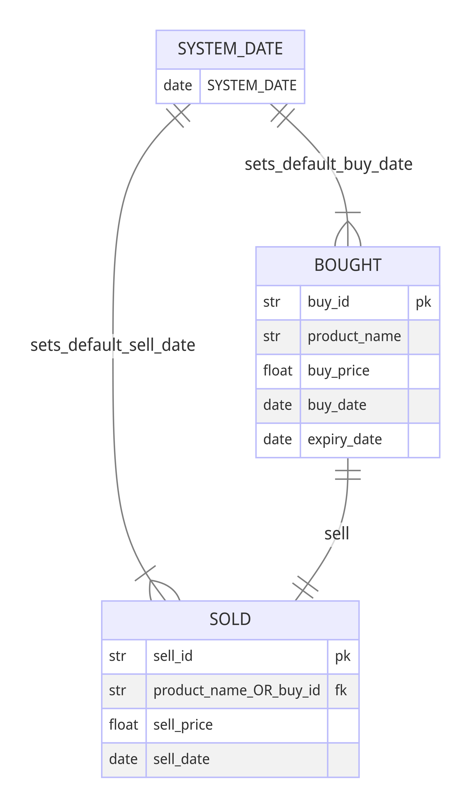

<br/>
<br/>


# TESTING SUPERPY IN PYTEST
[Table of contents](#table-of-contents)
<br/>

## 1of2: run regression testcases:

Application Superpy has partially been developed with TDD.  
This has resulted in a regression testset of 25 testcases.
There are 2 options to run the regression testcases in pytest:

- Option 1of2: run them all (this is usually what you want):

  1. navigate into (...\superpy) or (...\superpy\test_utils)
  2. enter following command:

  ```py
      pytest --cache-clear
  ```
  1. all 25 testcases should pass. If not then investigate the failing testcase(s).
  <br/>
  <br/>

- Option 2of2: run only the testcase(s) that test a specific function:
  1. navigate into (...\superpy) or (...\superpy\test_utils)
  2. navigate into the folder that contains the testcases of the fn that you want to test.
      - e.g.: to test fn buy_product, navigate into directory 'fn_buy_product_testcases'.
      - or: 
      - e.g.: to test fn calculate_profit_in_time_range_between_start_date_and_end_date_inclusive,  
          navigate into directory 'fn_calculate_profit_in_time_range_between_start_date_and_end_date_inclusive'  
      etc.
  3. now enter following command:
  ```py
      pytest --cache-clear
  ```
  1. all testcases of this fn (e.g. fn buy_product) should pass.  
      If not then investigate the failing testcase(s).
  <br/>
  <br/>

## 2of2: create testdata for additional testcases:
[Table of contents](#table-of-contents)

Create testdata involves creating testdata for bought.csv and sold.csv.

1. run the following command:
```py
    py super.py create_mock_data
```
or assign optional arguments with custom values, e.g.:
```py
    py super.py create_mock_data -denr 2 -hp 18.30 -lp 5.23 -mu 4 -nopro 50 -nopri 68 -sl 10 -tt 5 -lby 2029 -lbm 1 -lbd 1 -ubm 12 -ubw 0 -ubd 0
```
2. For more info about create mock data and its the optional arguments (e.g. number of products, prices, etc.),  
   see ch Superpy functionality --> paragraph create mock data --> sub paragraph set the arguments. 
3. bought.csv and sold.csv have now been created. 
4. Copy-paste the created bought.csv and sold.csv into test_utils (...\superpy\test_utils )  
    into the folder where a fn is tested (e.g. folder fn_buy_product_testcases )

<br/>
<br/>


# TROUBLE SHOOTING
[Table of contents](#table-of-contents)
<br/>

If you encounter a problem, first run the pytest regression testcases.
1. navigate into (...\superpy) or (...\superpy\test_utils)
2. enter following command:
```py
    pytest
```
1. Check the testresults. Now investigate the problem. 


# FAQ
[Table of contents](#table-of-contents)
</br>

1. Can I export data from bought.csv or sold.csv as a pdf?
    - no

2. Do I need a licence to use this application?
    - Unlicence applies to Superpy. Unlicense is a public domain dedication that allows anyone to  
    use your code for any purpose without restriction. 


# SUPPORT
[Table of contents](#table-of-contents)
<br/>

For support please send an email to noreply@really.com or call  
0011-2233-4455 during business hours GMT+2. 
